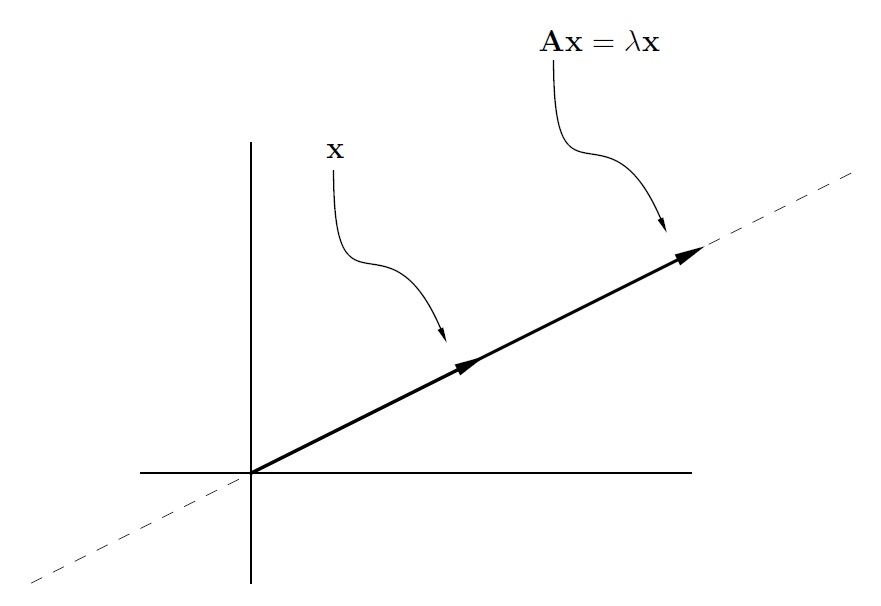
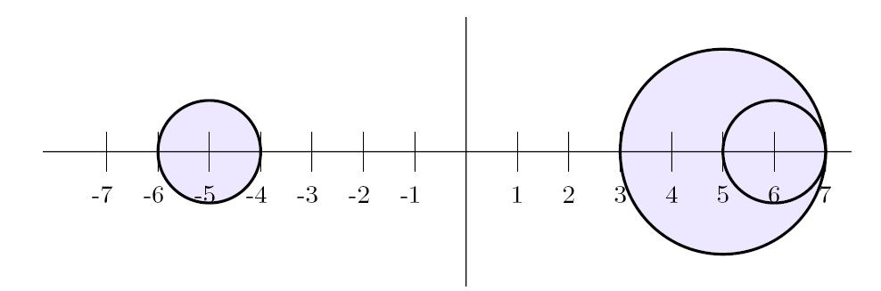
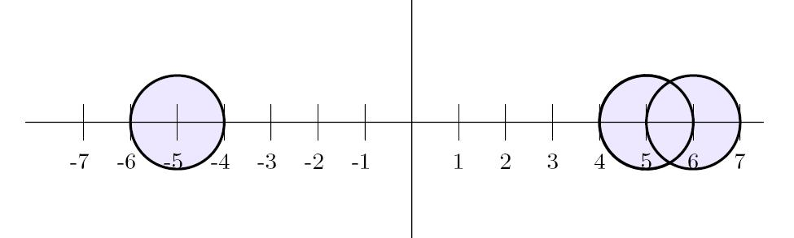

## 特征值与特征向量

### 特征系统的基本性质

- 到目前为止，几乎所有内容都是由线性代数方程系统的研究动机引发或衍生出来的。
- 许多主题将由涉及线性微分方程系统及其离散对应物（差分方程）的应用推动或驱动。
- 例如，考虑求解以下两个一阶线性微分方程组成的系统的问题：
  \[
  \frac{du_1}{dt} = 7u_1 - 4u_2 \quad \text{和} \quad \frac{du_2}{dt} = 5u_1 - 2u_2.
  \]
- 用矩阵表示，此系统可以表示为
  \[
  \begin{pmatrix} u_1' \\ u_2' \end{pmatrix} = \begin{pmatrix} 7 & -4 \\ 5 & -2 \end{pmatrix} \begin{pmatrix} u_1 \\ u_2 \end{pmatrix},
  \]
  或者，写作 \( \mathbf{u}' = A \mathbf{u} \)。
- 因为单个方程 \( mu' = \lambda u \) 的解有形式 \( u = \alpha e^{\lambda t} \)，我们有动机寻找具有以下形式的解：
  \[
  u_1 = \alpha_1 e^{\lambda t} \quad \text{和} \quad u_2 = \alpha_2 e^{\lambda t}.
  \]

- 对这两个表达式求导并代入结果得到 \( A\mathbf{x} = \lambda \mathbf{x} \)，其中 \( \mathbf{x} = (\alpha_1, \alpha_2)^T \)。

  \[
  \alpha_1 \lambda e^{\lambda t} = 7 \alpha_1 e^{\lambda t} - 4 \alpha_2 e^{\lambda t}\\
  \alpha_2 \lambda e^{\lambda t} = 5 \alpha_1 e^{\lambda t} - 2 \alpha_2 e^{\lambda t}
  \]

  这导致：

  \[
  \lambda \alpha_1 = 7 \alpha_1 - 4 \alpha_2\\
  \lambda \alpha_2 = 5 \alpha_1 - 2 \alpha_2
  \]

  因此可以表示为矩阵形式：

  \[
  \begin{pmatrix} 7 & -4 \\ 5 & -2 \end{pmatrix} \begin{pmatrix} \alpha_1 \\ \alpha_2 \end{pmatrix} = \lambda \begin{pmatrix} \alpha_1 \\ \alpha_2 \end{pmatrix}.
  \]

- 我们真正需要的是满足 \( A\mathbf{x} = \lambda \mathbf{x} \) 的标量 \( \lambda \) 和非零向量 \( \mathbf{x} \)。

---

### 特征值和特征向量

对于 \( n \times n \) 矩阵 \( A \)，满足 \( A\mathbf{x} = \lambda \mathbf{x} \) 的标量 \( \lambda \) 和向量 \( \mathbf{x}_{n \times 1} \neq 0 \) 分别称为 \( A \) 的特征值和特征向量。任何这样的对 \( (\lambda, \mathbf{x}) \) 称为 \( A \) 的一个特征对。不同特征值的集合，记作 \( \sigma(A) \)，称为 \( A \) 的谱。

- \( \lambda \in \sigma(A) \iff A - \lambda I \) 是奇异矩阵 \( \iff \det(A - \lambda I) = 0 \)。
- \( \{ \mathbf{x} \neq 0 \mid \mathbf{x} \in N(A - \lambda I) \} \) 是与 \( \lambda \) 相关联的所有特征向量的集合。从现在开始，\( N(A - \lambda I) \) 被称为 \( A \) 的特征空间。
- 满足 \( \mathbf{y}^* (A - \lambda I) = 0 \) 的非零行向量 \( \mathbf{y}^* \) 称为 \( A \) 的左特征向量。
- 从几何上讲，\( A\mathbf{x} = \lambda \mathbf{x} \) 表示在 \( A \) 的变换下，特征向量只在大小或符号上发生变化——向量 \( A\mathbf{x} \) 在 \( \mathbb{R}^n \) 中的方向与 \( \mathbf{x} \) 相同。
- 特征值 \( \lambda \) 简单地表示当特征向量 \( \mathbf{x} \) 被 \( A \) 变换时所受到的“拉伸”或“收缩”程度。

---
### 特征多项式和特征方程

- \( A_{n \times n} \) 的特征多项式为 \( p(\lambda) = \det(A - \lambda I) \)。\( p(\lambda) \) 的次数是 \( n \)，且 \( p(\lambda) \) 的最高次项是 \( (-1)^n \lambda^n \)。
- \( A \) 的特征方程是 \( p(\lambda) = 0 \)。
- \( A \) 的特征值是特征方程的解，或等价地，特征多项式的根。
- 总之，\( A \) 有 \( n \) 个特征值，但其中一些可能是复数（即使 \( A \) 的元素是实数），并且一些特征值可能是重根。
- 如果 \( A \) 的元素都是实数，那么它的复特征值将成共轭对出现，即如果 \( \lambda \in \sigma(A) \)，那么 \( \bar{\lambda} \in \sigma(A) \)。

---

**问题**：求矩阵 \( A = \begin{pmatrix} 1 & -1 \\ 1 & 1 \end{pmatrix} \) 的特征值和特征向量。

**解答**：

特征多项式为

\[
\det(A - \lambda I) = \begin{vmatrix} 1 - \lambda & -1 \\ 1 & 1 - \lambda \end{vmatrix} = (1 - \lambda)^2 + 1 = \lambda^2 - 2 \lambda + 2,
\]

因此特征方程为 \( \lambda^2 - 2 \lambda + 2 = 0 \)。使用求根公式得出

\[
\lambda = \frac{2 \pm \sqrt{-4}}{2} = \frac{2 \pm 2i}{2} = 1 \pm i,
\]

因此 \( A \) 的谱为 \( \sigma(A) = \{1 + i, 1 - i\} \)。注意特征值成共轭对出现——它们互为共轭。对于实系数矩阵，复特征值必须成共轭对出现。接下来找到特征空间。
对于 \( \lambda = 1 + i \)，

\[
A - \lambda I = \begin{pmatrix} -i & -1 \\ 1 & -i \end{pmatrix} \to \begin{pmatrix} 1 & -i \\ 0 & 0 \end{pmatrix} \Rightarrow N(A - \lambda I) = \operatorname{span} \left\{ \begin{pmatrix} i \\ 1 \end{pmatrix} \right\}.
\]

对于 \( \lambda = 1 - i \)，

\[
A - \lambda I = \begin{pmatrix} -i & -1 \\ 1 & i \end{pmatrix} \to \begin{pmatrix} 1 & i \\ 0 & 0 \end{pmatrix} \Rightarrow N(A - \lambda I) = \operatorname{span} \left\{ \begin{pmatrix} -i \\ 1 \end{pmatrix} \right\}.
\]

---

- 正如我们所见，计算特征值归结为求解一个多项式方程。但确定多项式方程的解可能是一项艰巨的任务。
- 已经证明，对于五次或更高次的多项式，不可能用系数的根式来表达其根。
- 这意味着对于四次以上的多项式，不存在类似二次方程求根公式的通用公式。
- 并且，一般的多项式方程无法通过有限次的算术运算（包括 \( +, -, \times, \div, \sqrt[n]{\ } \)）来解出。
- **特征值问题通常需要一个无限的算法，因此所有实用的特征值计算都是通过迭代方法实现的。**
- 回忆一下，\( A_{n \times n} \) 的一个 \( r \times r \) 主子矩阵是一个子矩阵，它位于同一组 \( r \) 行和列上，如果一个 \( r \times r \) 主子矩阵的行列式非零，则称其为 \( r \times r \) 主行列式。
- 与主行列式相关的是特征值的对称函数。
- \( \lambda_1, \lambda_2, \dots, \lambda_n \) 的第 \( k \) 个**对称函数**定义为特征值以 \( k \) 个为一组的乘积之和。即：

  \[
  s_k = \sum_{1 \leq i_1 < \cdots < i_k \leq n} \lambda_{i_1} \cdots \lambda_{i_k}.
  \]

- 例如，当 \( n = 4 \) 时，

\[\begin{aligned}
&s_{1} =\lambda_{1}+\lambda_{2}+\lambda_{3}+\lambda_{4}, \\
&s_{2} =\lambda_1\lambda_2+\lambda_1\lambda_3+\lambda_1\lambda_4+\lambda_2\lambda_3+\lambda_2\lambda_4+\lambda_3\lambda_4, \\
&s_{3} =\lambda_{1}\lambda_{2}\lambda_{3}+\lambda_{1}\lambda_{2}\lambda_{4}+\lambda_{1}\lambda_{3}\lambda_{4}+\lambda_{2}\lambda_{3}\lambda_{4}, \\
&s_{4} =\lambda_{1}\lambda_{2}\lambda_{3}\lambda_{4}. 
\end{aligned}\]

### 特征方程中的系数

如果 \( \lambda^n + c_1 \lambda^{n-1} + c_2 \lambda^{n-2} + \cdots + c_{n-1} \lambda + c_n = 0 \) 是矩阵 \( A_{n \times n} \) 的特征方程，并且 \( s_k \) 是特征值 \( \lambda_1, \lambda_2, \dots, \lambda_n \) 的第 \( k \) 个对称函数，那么

- \( c_k = (-1)^k \sum (\text{所有 } k \times k \text{ 主行列式}) \)
- \( s_k = \sum (\text{所有 } k \times k \text{ 主行列式}) \)
- \( \operatorname{trace}(A) = \lambda_1 + \lambda_2 + \cdots + \lambda_n = -c_1 \)
- \( \det(A) = \lambda_1 \lambda_2 \cdots \lambda_n = (-1)^n c_n \)

---

**问题**：求矩阵 \( A = \begin{pmatrix} -3 & 1 & -3 \\ 20 & 3 & 10 \\ 2 & -2 & 4 \end{pmatrix} \) 的特征值和特征向量。

**解答**：使用主行列式来获得特征方程：

\[
\lambda^3 - 4\lambda^2 - 3\lambda + 18 = 0.
\]
- 初等代数中的一个结果表明，如果多项式 \( \lambda^n + \alpha_{n-1} \lambda^{n-1} + \cdots + \alpha_1 \lambda + \alpha_0 \) 的系数 \( \alpha_i \) 是整数，那么每一个整数解都是 \( \alpha_0 \) 的因子。
  - 这意味着整数特征值必须包含在集合
    \[
    S = \{\pm 1, \pm 2, \pm 3, \pm 6, \pm 9, \pm 18\}
    \]
    中。
  - 计算 \( p(\lambda) = \det(A - \lambda I) \) 对每一个 \( \lambda \in S \)，发现 \( p(3) = 0 \) 和 \( p(-2) = 0 \)，因此 \( \lambda = 3 \) 和 \( \lambda = -2 \) 是矩阵 \( A \) 的特征值。
  - 所以 \( A \) 的谱为 \( \sigma(A) = \{3, -2\} \)，其中 \( \lambda = 3 \) 的代数重数为二。

---

对于 \( \lambda = 3 \)，

\[
A - 3I = \begin{pmatrix} 1 & 0 & 1/2 \\ 0 & 0 & 0 \\ 0 & 0 & 0 \end{pmatrix} \Rightarrow N(A - 3I) = \operatorname{span} \left\{ \begin{pmatrix} -1 \\ 0 \\ 2 \end{pmatrix} \right\}.
\]

对于 \( \lambda = -2 \)，

\[
A + 2I = \begin{pmatrix} 1 & 0 & 1 \\ 0 & 1 & 0 \\ 0 & 0 & 1 \end{pmatrix} \Rightarrow N(A + 2I) = \operatorname{span} \left\{ \begin{pmatrix} -1 \\ 0 \\ 1 \end{pmatrix} \right\}.
\]
- **谱半径** 对于方阵 \( A \)，数值
  \[
  \rho(A) = \max_{\lambda \in \sigma(A)} |\lambda|
  \]
  被称为 \( A \) 的谱半径。
- 很容易观察到 \( \rho(A) \leq \|A\| \) 对于任意矩阵范数都成立。

---

### 格尔什戈林圆盘（Gerschgorin Circles）

- \( A \in \mathbb{C}^{n \times n} \) 的特征值包含在由 \( n \) 个格尔什戈林圆盘的并集 \( G_r \) 内，这些圆盘由下式定义：
  \[
  |z - a_{ii}| \leq r_i, \quad \text{其中} \quad r_i = \sum_{j=1, j \neq i}^n |a_{ij}| \quad \text{对于 } i = 1, 2, \dots, n.
  \]
  换句话说，特征值被限制在以 \( a_{ii} \) 为中心、半径为去掉 \( a_{ii} \) 后 \( A_{i*} \) 中绝对值之和的圆盘中。
  
- 另外，如果 \( k \) 个格尔什戈林圆盘的并集 \( U \) 不与其他 \( n - k \) 个圆相交，那么 \( U \) 中正好有 \( k \) 个特征值（包括重数）。
  
- 因为 \( \sigma(A^T) = \sigma(A) \)，绝对行和可以被绝对列和替代，所以 \( A \) 的特征值也包含在定义为下式的圆盘并集 \( G_c \) 内：
  \[
  |z - a_{jj}| \leq c_j, \quad \text{其中} \quad c_j = \sum_{i=1, i \neq j}^n |a_{ij}| \quad \text{对于 } j = 1, 2, \dots, n.
  \]
- 将上述两个方程结合起来，意味着矩阵 \( A \) 的特征值包含在交集 \( G_r \cap G_c \) 中。

---

**问题**：估计矩阵 \( A = \begin{pmatrix} 5 & 1 & 1 \\ 0 & 6 & 1 \\ 1 & 0 & -5 \end{pmatrix} \) 的特征值。

- 一个粗略的估计由不等式 \( |\lambda| \leq \|A\|_\infty = 7 \) 得出。
- 更精确的估计是通过格尔什戈林圆盘法获得的，格尔什戈林圆盘法保证了一个特征值在以 \(-5\) 为中心的圆内（或在圆上），其余两个特征值在以 \(+5\) 为中心的较大圆内（或在圆上）。

- 通过考虑 \( G_r \cap G_c \)，一个特征值位于以 \(-5\) 为中心的圆内，而另外两个特征值位于以 \(+5\) 为中心的圆的并集内。

### 相似变换对角化

- 正确选择一个坐标系（或基）通常可以简化方程的形式，或简化特定问题的分析。
- 对于有限维空间 \( \mathcal{V} \) 上的线性算子 \( \mathbf{L} \)，目标是找到一个基 \( \mathcal{B} \)，使得 \( \mathbf{L} \) 的矩阵表示尽可能简单。
- 由于 \( \mathbf{L} \) 的不同矩阵表示 \( A \) 和 \( B \) 之间通过相似变换 \( P^{-1} A P = B \) 相关，基本问题就是找到一个非奇异矩阵 \( P \)，使得 \( P^{-1} A P \) 尽可能简单。

---

### 相似性

- 如果存在一个非奇异矩阵 \( P \) 使得 \( P^{-1} A P = B \)，那么两个 \( n \times n \) 矩阵 \( A \) 和 \( B \) 被称为相似矩阵。矩阵 \( P^{-1} A P \) 的操作称为 \( A \) 上的相似变换。
- **一个基本问题**：给定一个方阵 \( A \)，通过相似变换将其化为尽可能简单的形式。
- 对角矩阵具有最简单的形式，因此我们首先问：“每个方阵都与对角矩阵相似吗？”
- 如果这是真的，线性代数和矩阵理论会简单得多，但事实并非如此。
- 幂零矩阵（Nilpotent Matrix）不与对角矩阵相似，而幂零矩阵并不是唯一不能对角化的矩阵。
- 因此，如果并非所有的方阵都能通过相似变换对角化，那么那些可以对角化的矩阵具有什么特性呢？

---

### 对角化（Diagonalizability）

- 当且仅当矩阵 \( A \) 与一个对角矩阵相似时，方阵 \( A \) 被称为可对角化。
- \( A_{n \times n} \) 的完备特征向量集合是 \( A \) 的任意 \( n \) 个线性无关的特征向量的集合。并非所有的矩阵都具有完备的特征向量集合。缺少完备特征向量集合的矩阵有时被称为不足矩阵（deficient matrix）或缺陷矩阵（defective matrix）。
- 当且仅当 \( A \) 具有完备的特征向量集合时，\( A_{n \times n} \) 是可对角化的。此外，当且仅当 \( P^{-1} A P = \operatorname{diag}(\lambda_1, \lambda_2, \dots, \lambda_n) \) 并且 \( P \) 的列构成了一个完备的特征向量集合，其中 \( \lambda_j \) 是相应的特征值时，矩阵 \( A \) 可对角化。即，每个 \( (\lambda_j, P_{*j}) \) 是 \( A \) 的一个特征对。

**问题**：如果可能，使用相似变换对以下矩阵进行对角化：
\[
A = \begin{pmatrix} 1 & -4 & -4 \\ 8 & -11 & -8 \\ 8 & 8 & 5 \end{pmatrix}
\]

**解答**：确定 \( A \) 是否具有一组三个线性无关的特征向量。特征方程可以计算如下：
\[
\lambda^3 + 5\lambda^2 + 3\lambda - 9 = (\lambda - 1)(\lambda + 3)^2 = 0.
\]
因此，\( \lambda = 1 \) 是一个单重特征值，而 \( \lambda = -3 \) 重复两次（代数重数为2）。通过通常的方式可以确定特征空间 \( N(A - I I) \) 和 \( N(A + 3 I) \) 的基为：
\[
N(A - I I) = \operatorname{span} \left\{ \begin{pmatrix} 1 \\ 2 \\ -2 \end{pmatrix} \right\}
\]
和
\[
N(A + 3 I) = \operatorname{span} \left\{ \begin{pmatrix} 1 \\ 1 \\ 0 \end{pmatrix}, \begin{pmatrix} 1 \\ 0 \\ 1 \end{pmatrix} \right\},
\]
并且很容易检查到，这三个特征向量组成了一个线性无关的集合。因此，矩阵 \( A \) 必须是可对角化的。为了明确展示对角化 \( A \) 的相似变换，设
\[
P = \begin{pmatrix} 1 & 1 & 1 \\ 2 & 1 & 0 \\ -2 & 0 & 1 \end{pmatrix},
\]
并验证 \( P^{-1} A P = \begin{pmatrix} 1 & 0 & 0 \\ 0 & -3 & 0 \\ 0 & 0 & -3 \end{pmatrix} = D \)。

### 相似性保持特征值

行简化操作不能保持特征值（可以试一个简单的例子）。然而，相似矩阵具有相同的特征多项式，因此它们具有相同的特征值以及相同的重数。**注意！** 相似矩阵不一定具有相同的特征向量。

---

- 在线性算子的上下文中，这意味着一个算子 \( \mathbf{L} \) 的矩阵表示的特征值在基的变换下保持不变。
- 换句话说，特征值是 \( \mathbf{L} \) 的固有属性，它们与任何坐标表示无关。
- 由于并非所有的方阵都可以对角化，那么每个方阵都可以通过相似变换三角化吗？
- 答案是肯定的！事实上，正如 Issai Schur 在 1909 年意识到的，相似变换总是可以单位化。

---

### 舒尔三角化定理（Schur's Triangularization Theorem）

每个方阵都与一个上三角矩阵单位相似。也就是说，对于每个 \( A_{n \times n} \)，存在一个酉矩阵 \( U \)（不唯一）和一个上三角矩阵 \( T \)（不唯一），使得
\[
U^* A U = T,
\]
并且 \( T \) 的对角线元素是 \( A \) 的特征值。

- 舒尔定理并未完全涵盖通过相似性进行三角化的所有内容。
- 通过允许非酉相似变换，上三角矩阵 \( T \) 的结构可以简化为除了对角线和上对角线以外的所有位置都为零。

---

### 重数 (Multiplicities)

对于 \( \lambda \in \sigma(A) = \{\lambda_1, \lambda_2, \dots, \lambda_s\} \)，我们采用以下定义：

- **代数重数** (Algebraic Multiplicity) \( \lambda \) 的代数重数是其作为特征多项式根的重复次数。换句话说，若 \( (x - \lambda_1)^{a_1} \dots (x - \lambda_s)^{a_s} = 0 \) 是 \( A \) 的特征方程，则 \( \operatorname{alg\ mult}_A(\lambda_i) = a_i \)。
- 当 \( \operatorname{alg\ mult}_A(\lambda) = 1 \) 时，\( \lambda \) 被称为**单特征值**。
- **几何重数** (Geometric Multiplicity) \( \lambda \) 的几何重数是 \( \dim N(A - \lambda I) \)。换句话说，\( \operatorname{geo\ mult}_A(\lambda) \) 是与 \( \lambda \) 相关的线性无关特征向量的最大数量。
- 满足 \( \operatorname{alg\ mult}_A(\lambda) = \operatorname{geo\ mult}_A(\lambda) \) 的特征值被称为 \( A \) 的**半单特征值**。单特征值总是半单的，但反之不然。
### 重数不等式

对于每一个 \( A \in \mathbb{C}^{n \times n} \) 和每个 \( \lambda \in \sigma(A) \)，有：
\[ \operatorname{geo\ mult}_A (\lambda) \leq \operatorname{alg\ mult}_A (\lambda) \]

---

- 确定 \( A \) 是否可对角化等同于确定 \( A \) 是否有一组完备的线性无关特征向量。
- 如果你愿意并能够计算 \( A \) 的所有特征值和特征向量，这可以实现。
- 但是这种暴力方法可能是一个巨大的任务。
- 幸运的是，有一些理论工具可以帮助确定给定矩阵具有多少线性无关的特征向量。

---

### 独立特征向量

设 \( \{\lambda_1, \lambda_2, \dots, \lambda_k\} \) 是 \( A \) 的一组不同特征值。

- 如果 \( \{(\lambda_1, x_1), (\lambda_2, x_2), \dots, (\lambda_k, x_k)\} \) 是 \( A \) 的一组特征对，则 \( S = \{x_1, x_2, \dots, x_k\} \) 是线性无关集。
- 如果 \( B_i \) 是 \( N(A - \lambda_i I) \) 的基，那么 \( B = B_1 \cup B_2 \cup \dots \cup B_k \) 是线性无关集。
- 这些结果导致了以下关于对角化的特征。

### 对角化与重数
一个 \( n \times n \) 矩阵 \( A \) 可对角化当且仅当
\[
\text{geo mult}_A(\lambda) = \text{alg mult}_A(\lambda)
\]
对于 \( A \) 的每个特征值 \( \lambda \) 都满足，即当且仅当每个特征值都是半单的。

#### 问题
确定以下矩阵中是否有对角化的矩阵：
\[
A = \begin{pmatrix} -1 & -1 & -2 \\ 8 & -11 & -8 \\ -10 & 11 & 7 \end{pmatrix}, \quad B = \begin{pmatrix} 1 & -4 & -4 \\ 8 & -11 & -8 \\ -8 & 8 & 5 \end{pmatrix}.
\]

#### 解决方案
每个矩阵都有相同的特征方程：
\[
\lambda^3 + 5\lambda^2 + 3\lambda - 9 = (\lambda - 1)(\lambda + 3)^2 = 0,
\]
因此 \( \sigma(A) = \{1, -3\} = \sigma(B) \)，其中 \( \lambda = 1 \) 的代数重数为 1，而 \( \lambda = -3 \) 的代数重数为 2。因为
\[
\text{geo mult}_A(-3) = \dim N(A + 3I) = 1 < \text{alg mult}_A(-3),
\]
所以 \( A \) 不可对角化。另一方面，
\[
\text{geo mult}_B(-3) = \dim N(B + 3I) = 2 = \text{alg mult}_B(-3),
\]
并且 \( \text{geo mult}_B(1) = 1 = \text{alg mult}_B(1) \)，所以 \( B \) 是可对角化的。

### 不同的特征值
如果矩阵 \( A \) 的特征值不重复，则 \( A \) 可对角化。  
**注意！** 反之不一定成立。

- 一个更优雅且几何化的方式来表达对角化性被提出，以帮助简化后续分析并为扩展铺平道路。

### 可对角化矩阵的谱定理
一个具有谱 \( \sigma(A) = \{\lambda_1, \lambda_2, \dots, \lambda_k\} \) 的矩阵 \( A_{n \times n} \) 可对角化当且仅当存在矩阵集合 \( \{G_1, G_2, \dots, G_k\} \)，使得
\[
A = \lambda_1 G_1 + \lambda_2 G_2 + \dots + \lambda_k G_k,
\]
其中矩阵 \( G_i \) 具有以下性质：
- \( G_i \) 是沿着 \( R(A - \lambda_i I) \) 投射到 \( N(A - \lambda_i I) \) 的投影矩阵。
- 当 \( i \neq j \) 时，\( G_i G_j = 0 \)。
- \( G_1 + G_2 + \dots + G_k = I \)。

这个展开被称为 \( A \) 的**谱分解**，矩阵 \( G_i \) 被称为与 \( A \) 关联的**谱投影矩阵**。
如果 \( A \) 可对角化，并且如果 \( X_i \) 是一个矩阵，其列形成了 \( N(A - \lambda_i I) \) 的基，那么 \( P = (X_1 | X_2 | \dots | X_k) \) 是非奇异的。如果 \( P^{-1} \) 被按相应方式分块，则我们必须有
\[
A = PDP^{-1} = (X_1 | X_2 | \dots | X_k) 
\begin{pmatrix}
\lambda_1 I & 0 & \dots & 0 \\
0 & \lambda_2 I & \dots & 0 \\
\vdots & \vdots & \ddots & \vdots \\
0 & 0 & \dots & \lambda_k I
\end{pmatrix}
\begin{pmatrix}
Y_1^T \\
Y_2^T \\
\vdots \\
Y_k^T
\end{pmatrix}
\]
\[
= \lambda_1 X_1 Y_1^T + \lambda_2 X_2 Y_2^T + \dots + \lambda_k X_k Y_k^T
= \lambda_1 G_1 + \lambda_2 G_2 + \dots + \lambda_k G_k.
\]

对于 \( G_i = X_i Y_i^T \)，等式 \( PP^{-1} = I \) 转换为 \( \sum_{i=1}^k G_i = I \)，且
\[
P^{-1} P = I \implies Y_i^T X_j = \begin{cases} 
I & \text{当 } i = j, \\ 
0 & \text{当 } i \neq j 
\end{cases}
\implies \begin{cases} 
G_i^2 = G_i, \\ 
G_i G_j = 0 & \text{当 } i \neq j. 
\end{cases}
\]

### 简单特征值与投影矩阵
如果 \( x \) 和 \( y^* \) 分别是与 \( A \) 的一个简单特征值 \( \lambda \in \sigma(A) \) 相关联的右特征向量和左特征向量，则
\[
G = \frac{xy^*}{y^* x}
\]
是沿 \( R(A - \lambda I) \) 投射到 \( N(A - \lambda I) \) 的投影矩阵。在谱定理的上下文中，这意味着 \( G \) 是与 \( \lambda \) 关联的谱投影矩阵。
### 对角化总结
对于一个 \( n \times n \) 矩阵 \( A \) ，其谱为 \( \sigma(A) = \{\lambda_1, \lambda_2, \dots, \lambda_k\} \)，以下陈述是等价的。

- \( A \) 与一个对角矩阵相似，即 \( P^{-1}AP = D \)。
- \( A \) 具有一组线性无关的完整特征向量。
- 每个 \( \lambda_i \) 是半单的，即 \( \text{geo mult}_A(\lambda_i) = \text{alg mult}_A(\lambda_i) \)。
- \( A = \lambda_1 G_1 + \lambda_2 G_2 + \dots + \lambda_k G_k \)，其中
  - \( G_i \) 是沿 \( R(A - \lambda_i I) \) 投射到 \( N(A - \lambda_i I) \) 的投影矩阵，
  - \( G_i G_j = 0 \) ，当 \( i \neq j \) 时，
  - \( G_1 + G_2 + \dots + G_k = I \)，
  - \( G_i = \prod_{\substack{j=1 \\ j \neq i}}^k \frac{(A - \lambda_j I)}{(\lambda_i - \lambda_j)} \)，
  - 如果 \( \lambda_i \) 是一个简单特征值，并且与右特征向量 \( x \) 和左特征向量 \( y^* \) 相关联，则 \( G_i = \frac{xy^*}{y^* x} \)。

### 正规矩阵
- 一个矩阵 \( A \) 可对角化当且仅当 \( A \) 具有一组线性无关的完整特征向量，并且如果这样的一组完整特征向量用于 \( P \) 的列，则 \( P^{-1}AP \) 是对角的。
- 但是，没有保证能找到一组完整的正交归一的特征向量。
- 换句话说，没有保证 \( P \) 可以是酉矩阵（或正交矩阵）。
- 何时会产生完整的正交归一特征向量集合？

### 酉对角化
一个 \( A \in \mathbb{C}^{n \times n} \) 酉相似于一个对角矩阵（即，\( A \) 具有一组完整的正交归一特征向量）当且仅当 \( A^*A = AA^* \)，在这种情况下，\( A \) 称为**正规矩阵**。
- 当且仅当 \( U^*AU = D \) ，其中 \( U \) 是酉矩阵而 \( D \) 是对角矩阵，\( U \) 的列必须是 \( A \) 的完整正交归一特征向量集合，而 \( D \) 的对角项是相应的特征值。

- 确实，正规矩阵拥有一组完整的正交归一特征向量。
- 并非所有正规矩阵的线性无关特征向量集合都是正交归一的。

### 正规矩阵的性质
如果 \( A \) 是一个正规矩阵，其谱为 \( \sigma(A) = \{\lambda_1, \lambda_2, \dots, \lambda_k\} \)，则
- \( A \) 是 RPN，即 \( R(A) \perp N(A) \)。
- 对应于不同特征值的特征向量是正交的。换句话说，
\[
N(A - \lambda_i I) \perp N(A - \lambda_j I) \quad \text{对于 } \lambda_i \neq \lambda_j。
\]

- 谱定理依然成立，但谱投影矩阵特殊化为正交投影矩阵，因为 \( R(A - \lambda_i I) \perp N(A - \lambda_i I) \)。
- 一些常见类型的矩阵是正规矩阵。例如，实对称矩阵和厄米矩阵、实反对称矩阵和反厄米矩阵、正交矩阵和酉矩阵都是正规矩阵。
- 实对称矩阵和厄米矩阵具有一些特殊的特征值性质。

## 对称矩阵和厄米矩阵
除了所有正规矩阵固有的性质之外：
- 实对称矩阵和厄米矩阵具有实特征值。
- 当且仅当 \( A \) 正交相似于一个实对角矩阵 \( D \) 时，\( A \) 是实对称的，即 \( P^T A P = D \) 对于某个正交矩阵 \( P \) 成立。
- 实反对称矩阵和反厄米矩阵具有纯虚数的特征值。

### 一些结果：
- **最大和最小特征值：** 由于厄米矩阵 \( A_{n \times n} \) 的特征值是实数，它们可以按照 \( \lambda_1 \geq \lambda_2 \geq \dots \geq \lambda_n \) 排序。
- **特征值扰动：** 假设 \( A \) 被一个具有特征值 \( \epsilon_1 \geq \epsilon_2 \geq \dots \geq \epsilon_n \) 的厄米矩阵 \( E \) 扰动，产生矩阵 \( B = A + E \)，则 \( B \) 也是厄米的。
- **交错特征值：** 对于 \( c \in \mathbb{C}^{n \times 1} \)，令 \( B \) 为带边界的矩阵
  \[
  B = \begin{pmatrix} A & c \\ c^* & \alpha \end{pmatrix}
  \]
  其特征值为
  \[
  \beta_1 \geq \beta_2 \geq \dots \geq \beta_n \geq \beta_{n+1}。
  \]
  矩阵 \( A \) 的特征值与 \( B \) 的特征值交错，即
  \[
  \beta_1 \geq \lambda_1 \geq \beta_2 \geq \lambda_2 \geq \dots \geq \beta_n \geq \lambda_n \geq \beta_{n+1}。
  \]
## 奇异值和特征值
对于一个 \( A \in \mathbb{C}^{m \times n} \) 且 \( \text{rank}(A) = r \)，以下陈述是有效的。

- \( A^*A \) 和 \( AA^* \) 的非零特征值是相等且为正的。
- \( A \) 的非零奇异值是 \( A^*A \)（和 \( AA^* \)）的非零特征值的正平方根。
- 如果 \( A \) 是正规矩阵，且具有非零特征值 \( \{\lambda_1, \lambda_2, \dots, \lambda_r\} \)，则 \( A \) 的非零奇异值为 \( \{|\lambda_1|, |\lambda_2|, \dots, |\lambda_r|\} \)。
- \( A^*A \) 和 \( AA^* \) 的右奇异向量和左奇异向量是特殊的特征向量。
- \( A^*A \) 的任意完整的正交归一特征向量集合 \( v_i \) 可以作为 \( A \) 的右奇异向量的完整集合，并且相应的左奇异向量集合由 \( u_i = \frac{Av_i}{\|Av_i\|_2}, \, i = 1, 2, \dots, r \) 给出，再加上 \( N(A^*) \) 的任意正交归一基 \( \{u_{r+1}, u_{r+2}, \dots, u_m\} \)。类似地，\( AA^* \) 的任意完整的正交归一特征向量集合可以用作 \( A \) 的左奇异向量，而相应的右奇异向量可以以类似的方式构造。
- 厄米矩阵
  \[
  B = \begin{pmatrix} 0_{m \times m} & A \\ A^* & 0_{n \times n} \end{pmatrix}
  \]
  的阶数为 \( m + n \)，它的非零特征值为 \( \{\pm \sigma_1, \pm \sigma_2, \dots, \pm \sigma_r\} \)，其中 \( \{\sigma_1, \sigma_2, \dots, \sigma_r\} \) 是 \( A \) 的非零奇异值。
## 正定矩阵
- 由于矩阵的对称结构使其特征值为实数，额外的性质会强制所有特征值为正吗？
- 如果 \( A \in \mathbb{R}^{n \times n} \) 是对称矩阵，那么存在一个正交矩阵 \( P \)，使得 \( A = PDP^T \)，其中 \( D = \text{diag}(\lambda_1, \lambda_2, \dots, \lambda_n) \) 是实数。
- 如果对每个 \( i \)，都有 \( \lambda_i \geq 0 \)，则 \( D^{1/2} \) 存在，因此
  \[
  A = PDP^T = PD^{1/2} D^{1/2} P^T = B^T B \quad \text{其中} \quad B = D^{1/2} P^T，
  \]
  且当且仅当 \( B \) 非奇异时，\( \lambda_i > 0 \) 对于每个 \( i \) 成立。
- 反之，如果 \( A \) 可以分解为 \( A = B^T B \)，则 \( A \) 的所有特征值都是非负的，因为对于任意特征对 \( (\lambda, x) \)，
  \[
  \lambda = \frac{x^T A x}{x^T x} = \frac{x^T B^T B x}{x^T x} = \frac{\|Bx\|_2^2}{\|x\|_2^2} \geq 0。
  \]
  此外，如果 \( B \) 是非奇异的，那么 \( N(B) = 0 \implies Bx \neq 0 \)，因此 \( \lambda > 0 \)。
- 一个实对称矩阵 \( A \) 当且仅当可以分解为 \( A = B^T B \) 时具有非负特征值，并且当且仅当 \( B \) 非奇异时，所有特征值为正。
- 当一个对称矩阵 \( A \) 的特征值为正时，称 \( A \) 为**正定**的；当特征值为非负时，称 \( A \) 为**半正定**的。

## 正定矩阵
对于实对称矩阵 \( A \)，以下陈述是等价的，且每一个都可以作为正定矩阵的定义：

- 对于每一个非零向量 \( x \in \mathbb{R}^{n \times 1} \)，\( x^T A x > 0 \)（最常用的定义）。
- \( A \) 的所有特征值均为正。
- \( A = B^T B \) 对于某个非奇异矩阵 \( B \) 成立。
  - 虽然 \( B \) 不是唯一的，但存在且仅存在一个带正对角元素的上三角矩阵 \( R \) 使得 \( A = R^T R \)。这就是 \( A \) 的**Cholesky 分解**。
- \( A \) 具有所有主元为正的 LU（或 LDU）分解。
  - LDU 分解的形式为 \( A = LDL^T = R^T R \)，其中 \( R = D^{1/2} L^T \) 是 \( A \) 的 Cholesky 因子。
- \( A \) 的主顺序主子式为正。
- \( A \) 的所有主子式为正。

对于厄米矩阵，将 \( (\star)^T \) 替换为 \( (\star)^* \) 并将 \( \mathbb{R} \) 替换为 \( \mathbb{C} \)。

- 乍一看，很容易认为正定矩阵的性质可以简单地通过将“正”替换为“非负”转化为半正定矩阵的性质，但这并不总是正确的。
- 当 \( A \) 具有零特征值时，没有 LU 分解。

## 半正定矩阵
对于实对称矩阵 \( A_{n \times n} \)，其 \( \text{rank}(A_{n \times n}) = r \)，以下陈述是等价的，因此每一个都可以作为半正定矩阵的定义：

- 对于所有 \( x \in \mathbb{R}^{n \times 1} \)，\( x^T A x \geq 0 \)（最常用的定义）。
- \( A \) 的所有特征值为非负数。
- \( A = B^T B \) 对于某个秩为 \( r \) 的矩阵 \( B \) 成立。
- \( A \) 的所有主子式为非负。

对于厄米矩阵，将 \( (\star)^T \) 替换为 \( (\star)^* \) 并将 \( \mathbb{R} \) 替换为 \( \mathbb{C} \)。

## 二次型
对于向量 \( x \in \mathbb{R}^{n \times 1} \) 和矩阵 \( A \in \mathbb{R}^{n \times n} \)，标量函数由
\[
f(x) = x^T A x = \sum_{i=1}^n \sum_{j=1}^n a_{ij} x_i x_j
\]
定义，称为**二次型**。当且仅当 \( A \) 是正定矩阵时，二次型称为正定的。

- 由于 \( x^T A x = x^T \left( \frac{A + A^T}{2} \right) x \)，并且 \( \frac{A + A^T}{2} \) 是对称的，二次型的矩阵总是可以强制为对称矩阵。
- 因此，假设每个二次型的矩阵都是对称的。
- 当 \( x \in \mathbb{C}^{n \times 1} \)、\( A \in \mathbb{C}^{n \times n} \) 且 \( A \) 是厄米矩阵时，表达式 \( x^H A x \) 称为**复二次型**。

### 二次型的对角化
一个二次型 \( f(x) = x^T D x \) 当 \( D_{n \times n} \) 是对角矩阵时被称为对角形，此时
\[
x^T D x = \sum_{i=1}^n d_{ii} x_i^2。
\]

- 每个二次型 \( x^T A x \) 可以通过变量（坐标）的改变 \( y = Q^T x \) 进行对角化，其中 \( Q \) 是一个正交矩阵，使得 \( Q^T A Q = D = \text{diag}(\lambda_1, \lambda_2, \dots, \lambda_n) \)，其中 \( \lambda_i \in \sigma(A) \)。
- 设置 \( y = Q^T x \) 得到
  \[
  x^T A x = y^T D y = \sum_{i=1}^n \lambda_i y_i^2。
  \]

- 通过这种方式对二次型进行对角化的效果是旋转标准坐标系，使得在新的坐标系中，\( x^T A x = \alpha \) 的图形呈标准形式。

- 如果 \( A \) 是正定的，那么它的所有特征值都是正的，很明显，对于常数 \( \alpha > 0 \)，\( x^T A x \) 的图形是一个以原点为中心的椭球。
- 并不需要通过求解特征值问题来对角化二次型，因为可以找到一个使 \( C^T A C \) 成为对角矩阵的**同余变换**，其中 \( C \) 是非奇异矩阵。
- 一种特别方便的同余变换是通过 \( A \) 的 LDU 分解产生的，其中 \( A = LDL^T \)，因为 \( A \) 是对称的。
- 这种分解相对便宜，且 \( D = \text{diag}(p_1, p_2, \dots, p_n) \) 中的对角元素是高斯消去过程中出现的主元。
- 设置 \( y = L^T x \) 得到
  \[
  x^T A x = y^T D y = \sum_{i=1}^n p_i y_i^2。
  \]
