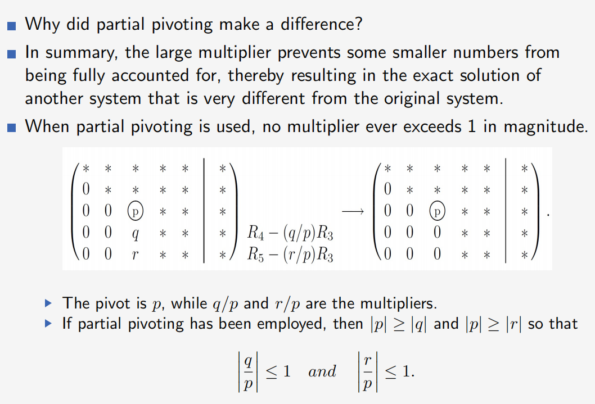
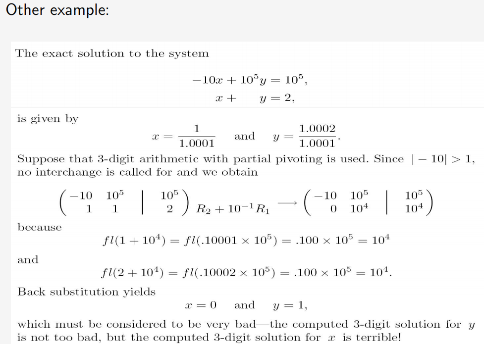

#### 1.传统高斯消元法 Gauss Elimination
   1. 下面是应用于以下简单（但典型的）平方系统的高斯消去的详细描述：
   2. 在每一步中，策略是专注于一个位置，称为主元位置，并使用三个基本操作来消除这个位置以下的所有项。主元位置中的系数称为主元元素（主元），而主元所在的方程则称为主元方程。
   3. 只有非零数才被允许作为主元。如果一个主元位置的系数为0，则主元方程与主元方程下面的一个方程交换，从而产生一个非零主元。除非为0，否则取第一个方程的第一个系数作为第一个主元。
   
$$\begin{array}{rcrcrcr}2x&+&y&+&z&=&1\\6x&+&2y&+&z&=&-1\\-2x&+&2y&+&z&=&7\end{array}$$
$$\begin{array}{rcrcrcr}\textcircled{2}x & + & y & + & z & = & 1,\\ 6x & + & 2y & + & z & = & -1,\\ -2x & + & 2y & + & z & = & 7.\end{array}$$
$$\begin{array}{rrrrrrr}\textcircled{2}x & + & y & + & z & = & 1\\  & - & y & - & 2z & = & -4\\  &  & 3y & + & 2z & = & 8\end{array}$$
$$\begin{array}{rrrrrrrr}2x & + & y & + & z & = & 1, & \\  &  & -\textcircled{1}y & - & 2z & = & -4, & \\  &  &  & - & 4z & = & -4 & (E_3+3E_2)\end{array}$$
   - [ ] 回代求值
   - [ ] Gaussian elimination 复杂度
#### 2.高斯-约旦消元法
   区分高斯-约丹法与标准高斯消去法的两个特征如下。
   **1.在每个步骤中，枢轴元素都被强制设置为1**
   **2.在每一步中，高于轴的所有项以及低于轴的所有项都将被消除。**

$$\left(\begin{array}{cccc|c}a_{11}&a_{12}&\cdots&a_{1n}&b_1\\a_{21}&a_{22}&\cdots&a_{2n}&b_2\\\vdots&\vdots&\ddots&\vdots&\vdots\\a_{n1}&a_{n2}&\cdots&a_{nn}&b_n\end{array}\right)\rightarrow\left(\begin{array}{cccc|c}1&0&\cdots&0&s_1\\0&1&\cdots&0&s_2\\\vdots&\vdots&\ddots&\vdots&\vdots\\0&0&\cdots&1&s_n\end{array}\right)$$
$$\begin{aligned}2x_1~+~2x_2~+~6x_3~&=~4\\2x_1~+~x_2~+~7x_3~&=~6\\-2x_1~-~6x_2~-~7x_3~&=~-1\end{aligned}$$
$\left(\begin{array}{rrr|r}
\textcircled{2}&2&6&4\\
2&1&7&6\\
-2&6&7&-1
\end{array}\right)\rightarrow
\left(\begin{array}{rrr|r}
\textcircled{1}&1&3&2\\
2&1&7&6\\
-2&6&7&-1
\end{array}\right)\rightarrow
\left(\begin{array}{rrr|r}
\textcircled1&1&3&2\\
0&-1&1&2\\
0&-4&-1&-3
\end{array}\right)\rightarrow
\left(\begin{array}{rrr|r}
1&1&3&2\\
0&\textcircled{1}&-1&-2\\
0&-4&-1&-3
\end{array}\right)\rightarrow
\left(\begin{array}{rrr|r}
1&0&4&4\\
0&\textcircled{1}&-1&-2\\
0&0&-5&-5
\end{array}\right)\rightarrow
\left(\begin{array}{rrr|r}
1&0&4&4\\
0&{1}&-1&-2\\
0&0&\textcircled{1}&1
\end{array}\right)$
- [ ] 复杂度计算
  
#### 3.部分主元高斯消元法
程序应用时计算浮点数，将产生一种更可预测的错误：舍入误差
$\begin{aligned}&\text{This means that for }t\text{-digit precision with }\beta=10\text{,we need to look at}~\text{digit }d_{t+1}\text{ in }x=.d_1d_2\cdots d_td_{t+1}\cdots\times10^\epsilon\text{ and then set}\end{aligned}$
$$fl(x)=\left\{\begin{array}{lll}.d_1d_2\cdots d_t\times10^\epsilon&if&d_{t+1}<5,\\([.d_1d_2\cdots d_t]+10^{-t})\times10^\epsilon&if&d_{t+1}\geq5.\end{array}\right.$$
例如，2位的10浮点运算
$fl(3/80)=fl(0.0375)=fl(0.375\times10^{-1})=0.38\times10^{-1}=0.038.$
为了了解如何使用浮点运算来执行高斯消去，让我们比较一下使用精确运算和使用3位碱基-10运算来求解下面的系统:
$$\begin{aligned}47x+28y=19\\89x+53y=36\end{aligned}$$
利用精确算法的高斯消去，将第一个方程乘乘m = 89/47，减去第二个方程的结果，得到精确解x = 1和y=−1;使用3位运算，乘法器是fl (m) = 1.89。应用3位倒置替换，得到3位浮点解y = 1和x=−0.191。
在每一步中，搜索主元位置及其以下位置的系数，以找到具有最大幅值的系数。如有必要，进行适当的行交换，将该最大系数移到主元位置。下图展示了典型情况下的第三步操作：
$$\begin{pmatrix}*&*&*&*&*&*&*\\0&*&*&*&*&*&*\\0&0&\textcircled{s}&*&*&*&*\\0&0&S&*&*&*&*\\0&0&S&*&*&*&*\end{pmatrix}$$
在标记为“S”的第三列中搜索最大幅值的系数，并在必要时交换行，将该系数移到圈定的主元位置。简而言之，此策略是通过仅使用行交换，在每一步中最大化主元的幅值。
从表面上看，部分主元为什么会起到重要作用可能并不明显。下面的例子不仅表明了部分旋转确实可以产生很大的影响，而且还表明了是什么使这种策略有效。
很容易验证该系统的精确解
$$\begin{aligned}-10^{-4}x+y&=1,\\x+y&=2,\end{aligned}$$

$$x=\frac{1}{1.0001}\quad\text{and}\quad y=\frac{1.0002}{1.0001}.$$

如果使用不带部分主元的3位数算术，则结果为

$$\begin{pmatrix}-10^{-4}&1&&1\\1&1&&2\end{pmatrix}\:R_2+10^4R_1\:\longrightarrow\begin{pmatrix}-10^{-4}&1&&1\\0&10^4&&10^4\end{pmatrix}$$

because

$$fl(1+10^4)=fl(.10001\times10^5)=.100\times10^5=10^4$$

and

$$fl(2+10^4)=fl(.10002\times10^5)=.100\times10^5=10^4.$$

回代过程结果：

$$x=0\quad\text{and}\quad y=1.$$

尽管计算得到的 y 的解接近于 y 的精确解，但计算得到的 x 的解却不太接近 x 的精确解——计算得到的 x 的解显然没有达到你所期望的三位有效数字的精度。如果使用带部分选主元的三位数字运算，那么结果为

$$\begin{aligned}\begin{pmatrix}-10^{-4}&1&&1\\1&1&&2\end{pmatrix}&\longrightarrow\begin{pmatrix}1&1&&2\\-10^{-4}&1&&1\end{pmatrix}\:R_2+10^{-4}R_1\\&\longrightarrow\begin{pmatrix}1&1&&2\\0&1&&1\end{pmatrix}\end{aligned}$$

because

$$fl(1+10^{-4})=fl(.10001\times10^1)=.100\times10^1=1$$

and

$$fl(1+2\times10^{-4})=fl(.10002\times10^1)=.100\times10^1=1.$$

此时回代过程结果：

$$x=1\quad\mathrm{and}\quad y=1,$$

合理地期望计算出的解与三个有效数字的精确解一致$x=\frac{1}{1.0001}\quad\text{and}\quad y=\frac{1.0002}{1.0001}.$取三位精度

  - [ ] 理解部分主元法为什么起作用，ppt上这一段很没有说服力
  - [ ] ](image.png)
  - [ ] 
#### 4.完全主元法

1. 定义：如果 \([A|b]\) 是高斯消元法第 \(k\) 步的增广矩阵，那么在 \(A\) 中寻找主元位置时，需检查当前主元位置之下或右侧的所有位置，以找到具有最大数值的系数。如果有必要，进行适当的行和列交换，以将具有最大数值的系数放置在主元位置。下面展示了典型情况下的第三步：
$$\left(\begin{array}{rrrrr|r}* & * & * & * & * & *\\ 0 & * & * & * & * & *\\ 0 & 0 & \textcircled{S} & S & S & *\\ 0 & 0 & S & S & S & *\\ 0 & 0 & S & S & S & *\end{array}\right)$$
在标有“S”的位置中寻找具有最大数值的系数。如果有必要，交换行和列，将该最大系数移到圈出的主元位置。
**问题**：使用三位有效数字的算术和完全主元选择来求解以下方程组：

\[
x - y = -2,
-9x + 10y = 12.
\]

**解答**：由于 10 是在搜索模式中找到的最大系数，交换第一行和第二行，然后交换第一列和第二列：

\[
\begin{pmatrix}
1 & -1 & \vert & -2 \\
-9 & 10 & \vert & 12 \\
\end{pmatrix}
\rightarrow
\begin{pmatrix}
-9 & 10 & \vert & 12 \\
1 & -1 & \vert & -2 \\
\end{pmatrix}
\rightarrow
\begin{pmatrix}
10 & -9 & \vert & 12 \\
-1 & 1 & \vert & -2 \\
\end{pmatrix}
\rightarrow
\begin{pmatrix}
10 & -9 & \vert & 12 \\
0 & 0.1 & \vert & -0.8 \\
\end{pmatrix}.
\]

列交换的效果是将未知数重命名为 \(\hat{x}\) 和 \(\hat{y}\)，其中 \(\hat{x} = y\) 且 \(\hat{y} = x\)。回代得到 \(\hat{y} = -8\) 和 \(\hat{x} = -6\)，因此：

\[
x = \hat{y} = -8 \quad \text{和} \quad y = \hat{x} = -6.
\]
有些系统对小的扰动存在极强的敏感，是病态的系统，最好重新设计。但这意味着你必须能够回答一些额外的问题。

- 例如，如何提前判断一个给定的系统是否病态？
- 如何衡量一个线性系统的病态程度？

一种确定病态程度的方法是通过轻微扰动选定的系数，并观察解的变化情况。

- 如果对于某组系数的微小扰动，观察到解的显著变化，那么你已经发现了一个病态情况。
- 如果给定的扰动没有导致解的显著变化，则无法得出结论——可能你扰动了错误的系数组。

通过对不同的系数组进行多次这样的实验，可以获得对病态程度的直觉（但不能保证）。
