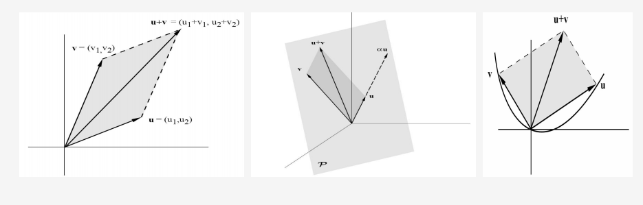
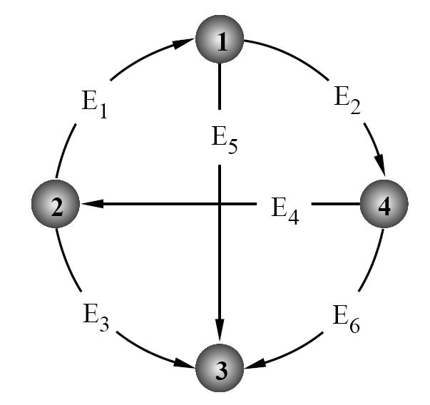
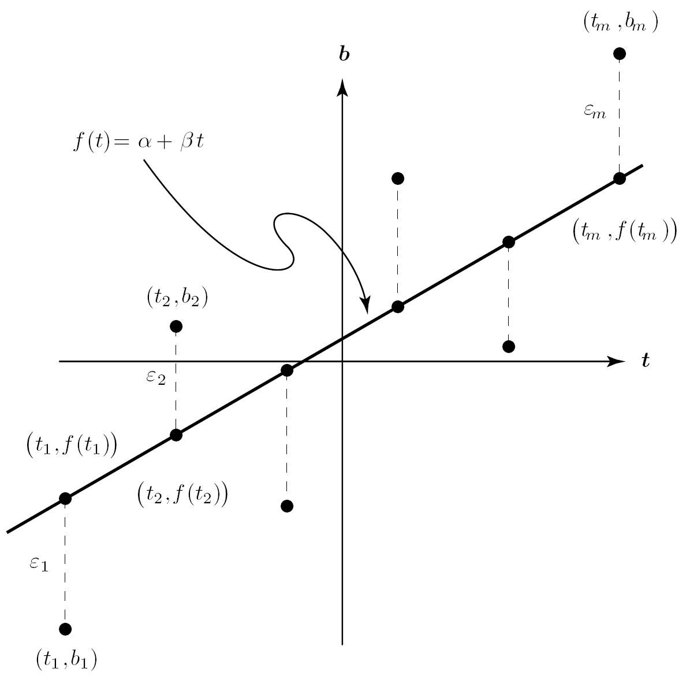
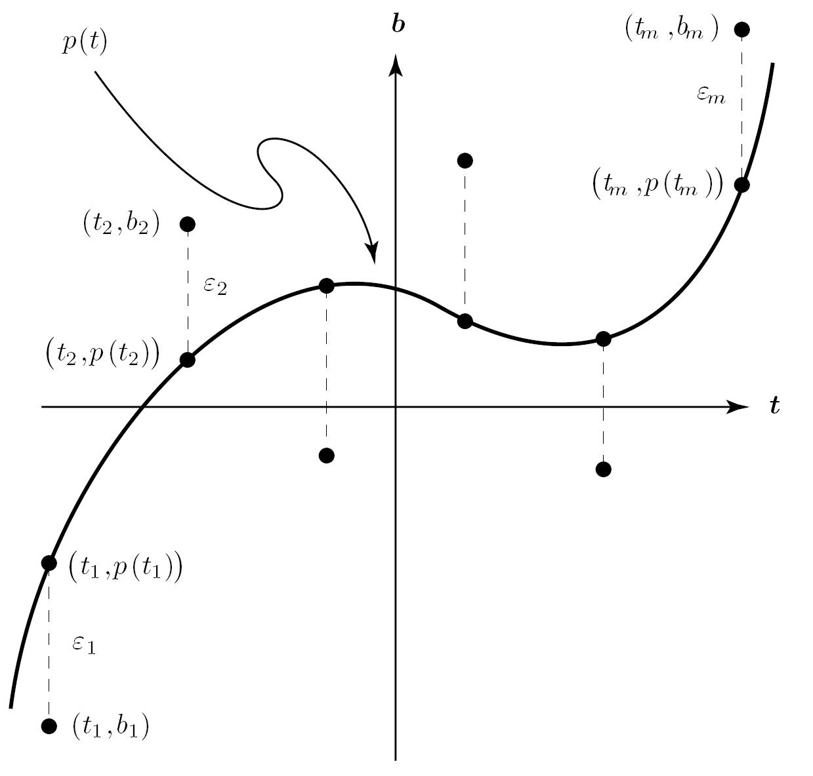

## 重点：向量空间 vector space
许多数学实体，虽然被认为与矩阵完全不同，但实际上却非常相似。例如，平面R2和R3中的点、多项式、连续函数和可微函数都满足与矩阵相同的加法性质和标量乘法性质。**与其分别研究每个主题，不如通过研究它们满足的共同性质来同时研究许多主题，这样更有效、更有成效**。这最终导致了向量空间的公理化定义。向量空间涉及四件事——两个集合V和F，以及两个代数运算，称为向量加法和标量乘法。
- 向量空间定义： 

### 向量空间定义

当向量加法和标量乘法运算满足以下性质时，集合$\mathcal{V}$被称为在$\mathcal{F}$上的向量空间。
  - 向量的加法运算：

    (A1) 对于所有$x, y \in \mathcal{V}$，有$x+y \in \mathcal{V}$。这被称为向量加法的封闭性质。

    (A2) 对于每一个$x, y, z \in \mathcal{V}$，有$(x+y)+z = x+(y+z)$结合律。

    (A3) 对于每一个$x, y \in \mathcal{V}$，有$x+y = y+x$。交换律。

    (A4) 存在一个元素$0 \in \mathcal{V}$，使得对于每一个$x \in \mathcal{V}$，有$x+0 = x$。零元素。

    (A5) 对于每一个$x \in \mathcal{V}$，存在一个元素$(-x) \in \mathcal{V}$，使得$x+(-x) = 0$。
  - 向量的**标量**乘法：（仅要求标量乘法运算满足以下性质）
    (M1) 对于所有$\alpha \in \mathcal{F}$和$x \in \mathcal{V}$，有$\alpha x \in \mathcal{V}$。这是标量乘法的封闭性质。

    (M2) 对于所有$\alpha, \beta \in \mathcal{F}$和每一个$x \in \mathcal{V}$，有$(\alpha\beta)x = \alpha(\beta x)$。

    (M3) 对于每一个$\alpha \in \mathcal{F}$和所有$x, y \in \mathcal{V}$，有$\alpha(x+y) = \alpha x + \alpha y$。

    (M4) 对于所有$\alpha, \beta \in \mathcal{F}$和每一个$x \in \mathcal{V}$，有$(\alpha+\beta)x = \alpha x + \beta x$。

    (M5) 对于每一个$x \in \mathcal{V}$，有$1x = x$。

## 向量空间的正式定义

向量空间的定义规定了这四个组成部分如何相互关联。

- $\mathcal{V}$ 是一个非空的向量集合。尽管 $\mathcal{V}$ 可以非常通用，我们通常会考虑 $\mathcal{V}$ 作为一个n元组的集合或一个矩阵的集合。
- $\mathcal{F}$ 是一个标量域，对于我们来说，$\mathcal{F}$ 要么是实数域 $\mathfrak{R}$，要么是复数域 $\mathcal{C}$。
- 向量加法（记作 $x+y$）：$\mathcal{V}$ 中元素之间的运算。
- 标量乘法（记作 $\alpha x$）：$\mathcal{F}$ 中元素与 $\mathcal{V}$ 中元素之间的运算。

#### 例子

- 例子 1
  - 集合 $\Re^{m\times n}$ 的 $m\times n$ 实矩阵是实数域 $\mathfrak{R}$ 上的向量空间。
  - 集合 $\mathcal{C}^{m\times n}$ 的 $m\times n$ 复矩阵是复数域 $\mathcal{C}$ 上的向量空间。 

- 例子2

$$
\begin{align*}
\mathfrak{R}^{1\times n} &= \left\{ (x_1, x_2, \cdots, x_n), x_i \in \mathfrak{R} \right\} \\
\mathfrak{R}^{n\times 1} &= \left\{ (x_1, x_2, \cdots, x_n)^T, x_i \in \mathfrak{R} \right\}
\end{align*}
$$

1. **$\mathfrak{R}^{1\times n}$**：这是所有1×n实数向量的集合，可以表示为：
   \[
   \mathfrak{R}^{1\times n} = \left\{ (x_1, x_2, \cdots, x_n), x_i \in \mathfrak{R} \right\}
   \]

2. **$\mathfrak{R}^{n\times 1}$**：这是所有n×1实数向量的集合，可以表示为：
   \[
   \mathfrak{R}^{n\times 1} = \left\{ (x_1, x_2, \cdots, x_n)^T, x_i \in \mathfrak{R} \right\}
   \]

- 例子 3
以下集合在定义函数加法和标量乘法如下：
$$(f+g)(x) = f(x) + g(x) \text{ 和 } (\alpha f)(x) = \alpha f(x),$$
函数加法：$(f+g)(x) = f(x) + g(x)$
这意味着两个函数$f$和$g$的和是一个新函数，这个新函数在任何点$x$的值是$f$和$g$在该点的值的和。换句话说，如果你有两个函数，你可以将它们相加，得到一个新的函数，这个新函数在任何输入$x$处的输出是原来两个函数在该点输出的总和。
标量乘法：$(\alpha f)(x) = \alpha f(x)$
这表示一个函数$f$与一个标量$\alpha$的乘积是一个新函数，这个新函数在任何点$x$的值是$f$在该点的值乘以标量$\alpha$。换句话说，如果你有一个函数和一个数字，你可以将这个函数的每个输出值乘以这个数字，得到一个新的函数。
是实数域 $\mathfrak{R}$ 上的向量空间：
  - 将区间 $[0,1]$ 映射到 $\mathfrak{R}$ 的函数集合。
  - 在 $[0,1]$ 上定义的所有实值连续函数的集合。
  - 在 $[0,1]$ 上可微的实值函数的集合。
  - 所有实系数多项式的集合。
### 子空间
设 $\mathcal{S}$ 是向量空间 $\mathcal{V}$ 在 $\mathcal{F}$ 上的一个非空子集（符号表示为 $\mathcal{S} \subseteq \mathcal{V}$）。如果 $\mathcal{S}$ 使用相同的加法和标量乘法运算也是 $\mathcal{F}$ 上的向量空间，那么 $\mathcal{S}$ 被称为 $\mathcal{V}$ 的一个子空间。确定一个子集是否也是子空间时，不需要检查所有10个定义条件，只需考虑封闭条件（A1）和（M1）。也就是说，向量空间 $\mathcal{V}$ 的非空子集 $\mathcal{S}$ 是 $\mathcal{V}$ 的子空间，当且仅当：

(A1) $$x, y \in \mathcal{S} \Longrightarrow x + y \in \mathcal{S}$$

(M1) $$x \in \mathcal{S} \Longrightarrow \alpha x \in \mathcal{S} \text{ 对于所有 } \alpha \in \mathcal{F}.$$
其它条件可以继承父空间的定义（可以轻松得到）。
- Example 

  - 给定一个向量空间 $\mathcal{V}$，只包含零向量的集合 $\mathcal{Z} = \{0\}$ 是 $\mathcal{V}$ 的一个子空间。这个子空间被称为平凡子空间。

  - 在 $\Re^{2}$ 和 $\Re^{3}$ 中，通过原点的直线是子空间。

  - 在 $\mathfrak{R}^{3}$ 中，通过原点的平面也是子空间。
    

#### 子空间的直观解释
子空间是通过原点的平面。

---

## 线性组合和张成
对于来自向量空间 $\mathcal{V}$ 的一组向量 $S = \{v_1, v_2, \cdots, v_r\}$，所有可能的 $v_i$ 的线性组合构成的集合称为 $S$ 的张成，表示为：
\[
\operatorname{span}(S) = \{\alpha_1 v_1 + \alpha_2 v_2 + \cdots + \alpha_r v_r \mid \alpha_i \in \mathcal{F}\}.
\]
注意到 $\operatorname{span}(S)$ 是 $\mathcal{V}$ 的一个子空间。

实际上，所有 $\mathfrak{R}^n$ 的子空间都是 $\operatorname{span}(S)$ 的形式。

- Example 
  - 如果 $u \neq 0$ 是 $\mathfrak{R}^3$ 中的一个向量，那么 $\operatorname{span}\{u\}= \{\alpha_1 u  \mid u \in \mathcal{F}\}$ 是通过原点和 $u$ 的直线。
  - 如果 $S = \{u, v\}$，其中 $u$ 和 $v$ 是 $\mathfrak{R}^3$ 中的非零向量，那么 $\operatorname{span}(S)$ 是通过原点和点 $u$ 和 $v$ 的平面。

### 张成集合

对于一组向量 $\mathcal{S} = \{v_1, v_2, \ldots, v_r\}$，由 $\mathcal{S}$ 中向量的所有线性组合生成的子空间

\[
\operatorname{span}(\mathcal{S}) = \{\alpha_1 v_1 + \alpha_2 v_2 + \cdots + \alpha_r v_r\}
\]

被称为由 $\mathcal{S}$ 张成的空间。

如果向量空间 $\mathcal{V}$ 满足 $\mathcal{V} = \operatorname{span}(\mathcal{S})$，我们说 $\mathcal{S}$ 是 $\mathcal{V}$ 的一个张成集合。换句话说，当 $\mathcal{V}$ 中的每个向量都是 $\mathcal{S}$ 中向量的线性组合时，$\mathcal{S}$ 张成 $\mathcal{V}$。
**首先：$\mathcal{S}$ 是向量空间的一个子空间，是一个集合。它有机会成为张成集合，但不是必然的。**

-  例子
   - 单位向量 $\{e_1, e_2, \cdots, e_n\}$ 构成 $\mathfrak{R}^n$ 的一个张成集合。

   - 有限集合 $\{1, x, x^2, \cdots, x^n\}$ 张成所有次数不超过 $n$ 的多项式空间，无限集合 $\{1, x, x^2, \cdots\}$ 张成所有多项式的空间。

   - **对于来自子空间 $\mathcal{V} \subseteq \mathfrak{R}^{m \times 1}$ 的一组向量 $S = \{a_1, a_2, \cdots, a_n\}$，设 A 是包含 $a_i$ 作为其列的矩阵。S 张成 $\mathcal{V}$ 当且仅当对于每个 $b \in \mathcal{V}$，存在一个列向量 x 使得 $A x = b$。**

这个简单的观察通常非常有用。例如，要测试 $S = \{(1,1,1),(1,-1,-1),(3,1,1)\}$ 是否张成 $\mathfrak{R}^3$。

将这些行作为列放入矩阵 A 中。

检查系统 $A x = b$ 是否对每个 $b \in \mathfrak{R}^3$ 都是一致的？

\[\left.\left(\begin{array}{rrr}1&1&3\\1&-1&1\\1&-1&1\end{array}\right.\right)\left(\begin{array}{r}x_1\\x_2\\x_3\end{array}\right)=\left(\begin{array}{r}b_1\\b_2\\b_3\end{array}\right)\]

我们知道，$A x = b$ 是一致的（consistent|有解）当且仅当 $\operatorname{rank}[A \mid b] = \operatorname{rank}(A)$。在这种情况下，$\operatorname{rank}(A) = 2$，但是 $\operatorname{rank}[A \mid b] = 3$ 对于某些 b（例如，$b_1 = 0$，$b_2 = 1$，$b_3 = 0$），所以 S 不张成 $\mathfrak{R}^3$。

在这种情况下，$\operatorname{rank}(A) = 2$，但是 $\operatorname{rank}[A \mid b] = 3$ 对于某些 b（例如，$b_1 = 0$，$b_2 = 1$，$b_3 = 0$），所以 S 不张成 $\mathfrak{R}^3$。

---

### 子空间的和

如果 $\mathcal{X}$ 和 $\mathcal{Y}$ 是向量空间 $\mathcal{V}$ 的子空间，那么 $\mathcal{X}$ 和 $\mathcal{Y}$ 的和被定义为所有可能的来自 $\mathcal{X}$ 的向量与来自 $\mathcal{Y}$ 的向量的和的集合。即，

\[
\mathcal{X} + \mathcal{Y} = \{x + y \mid x \in \mathcal{X} \text{ 和 } y \in \mathcal{Y}\}.
\]

$\mathcal{X} + \mathcal{Y}$ 也是 $\mathcal{V}$ 的一个子空间。

如果 $S_X, S_Y$ 张成 $\mathcal{X}, \mathcal{Y}$，那么 $S_X \cup S_Y$ 张成 $\mathcal{X} + \mathcal{Y}$。
\[
\operatorname{span}(\mathcal{S_X,S_Y}) = \{\alpha_1 v_1 + \alpha_2 v_2 + \cdots + \alpha_r v_r+\alpha_{r+1} v_{r+1} + \alpha_{r+2} v_{r+2} + \cdots + \alpha_{r+n} v_{r+n}\}
\]
- Eaxample

  - 如果 $\mathcal{X} \subseteq \mathfrak{R}^2$ 和 $\mathcal{Y} \subseteq \mathfrak{R}^2$ 是通过原点的两条不同直线定义的子空间，那么 $\mathcal{X} + \mathcal{Y} = \mathfrak{R}^2$。这是由平行四边形法则得出的。(说得好像有点问题？)
  
---

## 子空间与线性函数

子空间与线性函数有着密切的关系，如下所述。

#### 子空间和线性函数

对于一个将 $\Re^n$ 映射到 $\Re^m$ 的线性函数 $f$，设 $\mathcal{R}(f)$ 表示 $f$ 的值域。也就是说，$\mathcal{R}(f) = \{f(x) \mid x \in \Re^n\} \subseteq \Re^m$ 是所有“像”的集合，当 $x$ 在 $\Re^n$ 中自由变化时。

每一个线性函数 $f: \Re^n \rightarrow \Re^m$ 的值域是 $\Re^m$ 的一个子空间，且 $\Re^m$ 的每一个子空间都是某个线性函数的值域。

**由于这个原因，$\Re^m$ 的子空间有时被称为线性空间。**

**这个结果意味着每一个矩阵 $A \in \mathfrak{R}^{m \times n}$ 通过线性函数 $f(x) = A x$ 的值域生成了 $\Re^m$ 的一个子空间。**

### 证明：子空间与线性函数的关系（随便看看）

如果 $f: \Re^n \rightarrow \Re^m$ 是一个线性函数，那么 $f$ 的值域是 $\Re^m$ 的一个子空间，因为满足封闭性质 (A1) 和 (M1)。

#### 证明 (A1)：
通过展示 $y_1, y_2 \in \mathcal{R}(f) \Rightarrow y_1 + y_2 \in \mathcal{R}(f)$ 来建立 (A1)。如果 $y_1, y_2 \in \mathcal{R}(f)$，那么必然存在向量 $x_1, x_2 \in \Re^n$ 使得 $y_1 = f(x_1)$ 和 $y_2 = f(x_2)$，因此根据 $f$ 的线性：

\[
y_1 + y_2 = f(x_1) + f(x_2) = f(x_1 + x_2) \in \mathcal{R}(f).
\]

#### 证明 (M1)：
通过展示如果 $y \in \mathcal{R}(f)$，那么对于所有标量 $\alpha$，有 $\alpha y \in \mathcal{R}(f)$ 来建立 (M1)，使用值域的定义以及 $f$ 的线性来写出：

\[
y \in \mathcal{R}(f) \Longrightarrow y = f(x) \text{ 对于某些 } x \in \Re^n \Longrightarrow \alpha y = \alpha f(x) = f(\alpha x) \in \mathcal{R}(f).
\]

#### 证明每一个子空间 $\mathcal{V}$ 都是某个线性函数 $f: \Re^n \rightarrow \Re^m$ 的值域：
假设 $\{v_1, v_2, \ldots, v_n\}$ 是 $\mathcal{V}$ 的一个张成集合，使得

\[
\mathcal{V} = \{\alpha_1 v_1 + \cdots + \alpha_n v_n \mid \alpha_i \in \mathcal{R}\}.
\]

将 $v_i$ 作为列堆叠在矩阵 $A_{m \times n} = (v_1 | v_2 | \cdots | v_n)$ 中，并将 $\alpha_i$ 放入一个 $n \times 1$ 列 $x = (\alpha_1, \alpha_2, \ldots, \alpha_n)^T$ 中来写出

\[
\alpha_1 v_1 + \cdots + \alpha_n v_n = (v_1 | v_2 | \cdots | v_n) \begin{pmatrix} \alpha_1 \\ \vdots \\ \alpha_n \end{pmatrix} = A x.
\]

函数 $f(x) = A x$ 是线性的，我们有

\[
\mathcal{R}(f) = \{A x \mid x \in \Re^{n \times 1}\} = \{\alpha_1 v_1 + \cdots + \alpha_n v_n \mid \alpha_i \in \mathcal{R}\} = \mathcal{V}.
\]

---

### 矩阵的转置与子空间

同样地，矩阵 A 的转置定义了 $\Re^n$ 的一个子空间，通过线性函数 $f(x) = A^T x$ 的值域。

这两个“值域空间”是由矩阵定义的四个基本子空间中的两个。

### 值域空间Range Space

矩阵 $A \in \Re^{m \times n}$ 的值域被定义为由 $f(x) = A x$ 的值域生成的 $\Re^m$ 的子空间 $R(A)$。即，

\[
R(A) = \{A x \mid x \in \Re^n\} \subseteq \Re^m.
\]

类似地，$A^T$ 的值域是定义在 $\Re^n$ 中的子空间，

\[
R(A^T) = \{A^T y \mid y \in \Re^m\} \subseteq \Re^n.
\]

因为 $R(A)$ 是所有向量 $x \in \Re^m$ 在 A 变换下的**像的集合**，有些人称 $R(A)$ 为 A 的像空间。

### 列空间和行空间

我们知道，每个矩阵-向量乘积 \(Ax\)（即每个像）是 \(A\) 的列的线性组合，这为值域空间提供了一个有用的特征描述。

因此，\(R(A)\) 无非就是由 \(A\) 的列张成的空间。\(R(A)\) 通常被称为 \(A\) 的列空间。

对于 \(A \in \Re^{m \times n}\)，以下陈述是正确的。

- \(R(A)\) 是由 \(A\) 的列张成的空间（列空间）。
- \(R(A^T)\) 是由 \(A\) 的行张成的空间（行空间）。

- \(
b \in R(A) \Longleftrightarrow b = Ax \text{ 对于某些 } x。
\)

- \(
a \in R(A^T) \Leftrightarrow a^T = y^T A \text{ 对于某些 } y^T。(两边都转置就顺眼了)（行线性组合）
\)

### 零空间

通过考虑线性函数 $f(x) = Ax$ 和 $g(y) = A^T y$，我们可以得到由 $A \in \Re^{m \times n}$ 定义的另外两个基本子空间。它们是 $\mathcal{N}(f) = \{x_{n \times 1} \mid Ax = 0\} \subseteq \Re^n$ 和 $\mathcal{N}(g) = \{y_{m \times 1} \mid A^T y = 0\} \subseteq \Re^m$。

对于一个 $m \times n$ 矩阵 $A$，集合 $N(A) = \{x_{n \times 1} \mid Ax = 0\} \subseteq \Re^n$ 被称为 $A$ 的零空间。换句话说，$N(A)$ 就是**齐次系统 $Ax = 0$ 的所有解的集合**。（列向量线性组合0解

集合 $N(A^T) = \{y_{m \times 1} \mid A^T y = 0\} \subseteq \Re^m$ 被称为 $A$ 的左零空间，因为 $N(A^T)$ 是左手齐次系统 $y^T A = 0^T$ 的所有解的集合。（行向量线性组合0解

### 子空间总结

与 \( A_{m \times n} \) 相关的四个基本子空间如下：
 
1. **值域或列空间：**
   \[ R(A) = \{ Ax \mid x \in \mathbb{R}^n \} \subset \mathbb{R}^m \]

2. **行空间或左手值域：**
   \[ R(A^T) = \{ A^T y \mid y \in \mathbb{R}^m \} \subset \mathbb{R}^n \]

3. **零空间：**
   \[ N(A) = \{ x \mid Ax = 0 \} \subset \mathbb{R}^n \]

4. **左手零空间：**
   \[ N(A^T) = \{ y \mid A^T y = 0 \} \subset \mathbb{R}^m \]

设 \( P \) 为非奇异矩阵（初等变换的矩阵形式都是非奇异的），使得 \( PA = U \)，其中 \( U \) 为行阶梯形式，且假设 \( \text{rank}(A) = r \)。

- \( R(A) \) 的张成集 = \( A \) 中的基本列。
- \( R(A^T) \) 的张成集 = \( U \) 中的非零行。
- \( N(A) \) 的张成集 = \( Ax = 0 \) 的一般解中的 \( \mathbf{h}_{i\cdots r} \in \mathbb{R}^n \)。
- [ ] \( N(A^T) \) 的张成集 = \( P \) 的最后 \( m - r \) 行。(？)

如果 \( A \) 和 \( B \) 具有相同的形状，则：
\[\mathbf{A}\stackrel{\mathrm{row}}{\sim}\mathbf{B}\Longleftrightarrow N\left(\mathbf{A}\right)=N\left(\mathbf{B}\right)\Longleftrightarrow R\left(\mathbf{A}^T\right)=R\left(\mathbf{B}^T\right).\\\mathbf{A}\stackrel{\mathrm{col}}{\sim}\mathbf{B}\Longleftrightarrow R\left(\mathbf{A}\right)=R\left(\mathbf{B}\right)\Longleftrightarrow N\left(\mathbf{A}^T\right)=N\left(\mathbf{B}^T\right).\]

---

## 线性相关、线性无关

一组向量可能存在或不存在的依赖关系，即可能无法将一个向量表示为其他向量的线性组合。

### 线性独立性

一组向量 $\mathcal{S} = \{v_1, v_2, \ldots, v_n\}$ 被称为线性独立|无关，当且仅当在齐次方程
\[
\alpha_1 v_1 + \alpha_2 v_2 + \cdots + \alpha_n v_n = 0
\]
中，标量 $\alpha_i$ 的唯一解是平凡解 $\alpha_1 = \alpha_2 = \cdots = \alpha_n = 0$。

每当存在非平凡解（即至少有一个 $\alpha_i \neq 0$）时，集合 $\mathcal{S}$ 被称为线性相关。

线性独立集合是指不包含任何依赖关系的集合，而线性相关集合是指其中至少有一个向量是其他向量的线性组合。

空集总是线性独立的。

考虑两组向量：

集合 \(\mathcal{A}\)
\[
\mathcal{A} = \left\{ \begin{pmatrix} 1 \\ -1 \\ 2 \end{pmatrix}, \begin{pmatrix} 3 \\ 0 \\ -1 \end{pmatrix}, \begin{pmatrix} 9 \\ -3 \\ 4 \end{pmatrix} \right\}
\]

对于第一组向量，\(v_3 = 3v_1 + 2v_2\)，即 \(3v_1 + 2v_2 - v_3 = 0\)。

集合 \(\mathcal{B}\)
\[
\mathcal{B} = \left\{ \begin{pmatrix} 1 \\ 0 \\ 0 \end{pmatrix}, \begin{pmatrix} 0 \\ 1 \\ 0 \end{pmatrix}, \begin{pmatrix} 0 \\ 0 \\ 1 \end{pmatrix} \right\}
\]

对于第二组向量，在齐次方程 \(\alpha_1 v_1 + \alpha_2 v_2 + \alpha_3 v_3 = 0\) 中，除了平凡解 \(\alpha_1 = \alpha_2 = \alpha_3 = 0\) 外，没有其他解。

- 总结
  - 集合 \(\mathcal{A}\) 中的向量是线性相关的。
  - 集合 \(\mathcal{B}\) 中的向量是线性独立的。

---

### 如何判断一组向量是否线性独立？示例

考虑向量集合 $\mathcal{S}$:
\[
\mathcal{S} = \left\{ v_1 = \begin{pmatrix} 1 \\ 2 \\ 1 \end{pmatrix}, v_2 = \begin{pmatrix} 1 \\ 0 \\ 2 \end{pmatrix}, v_3 = \begin{pmatrix} 5 \\ 6 \\ 7 \end{pmatrix} \right\}
\]

要判断这个集合是否线性独立，我们需要检查以下齐次方程是否存在非平凡解：
\[
\alpha_1 v_1 + \alpha_2 v_2 + \alpha_3 v_3 = \begin{pmatrix} 0 \\ 0 \\ 0 \end{pmatrix}
\]

这等价于求解矩阵方程 $A\alpha = 0$，其中：
\[
A = \begin{pmatrix} 1 & 1 & 5 \\ 2 & 0 & 6 \\ 1 & 2 & 7 \end{pmatrix}, \quad \alpha = \begin{pmatrix} \alpha_1 \\ \alpha_2 \\ \alpha_3 \end{pmatrix}, \quad 0 = \begin{pmatrix} 0 \\ 0 \\ 0 \end{pmatrix}
\]

## 总结
- 如果存在非平凡解（即至少有一个 $\alpha_i \neq 0$），则集合 $\mathcal{S}$ 是线性相关的。
- 如果唯一的解是平凡解（$\alpha_1 = \alpha_2 = \alpha_3 = 0$），则集合 $\mathcal{S}$ 是线性独立的。
- 就是在算N（A）

---

### 线性独立性与矩阵

设 \( A \) 是一个 \( m \times n \) 矩阵。

#### 列向量线性独立性（最主要的|常用的

以下陈述等价于说 \( A \) 的列向量构成一个线性独立集合：
- \( N(A) = \{0\} \)。
- \(\text{rank}(A) = n\)。

#### 行向量线性独立性

以下陈述等价于说 \( A \) 的行向量构成一个线性独立集合：
- \( N(A^T) = \{0\} \)。
- \(\text{rank}(A) = m\)。

#### 方阵与非奇异性

当 \( A \) 是一个方阵时，以下陈述等价于说 \( A \) 是非奇异的：
- \( A \) 的列向量构成一个线性独立集合。
- \( A \) 的行向量构成一个线性独立集合。

---

### 对角占优矩阵

矩阵 $\mathcal{A}_{n \times n}$ 被称为对角占优矩阵，当且仅当对于每个 $i = 1, 2, \cdots, n$，满足以下条件：
\[
|a_{ii}| > \sum_{j=1, j \neq i}^{n} |a_{ij}|
\]
这意味着每个对角线元素的绝对值大于对应行中非对角线元素绝对值的总和。

对角占优矩阵在各种实际应用中自然出现。

1900年，闵可夫斯基发现所有对角占优矩阵都是非奇异的。

证明策略是：如果矩阵 $A$ 是对角占优的，那么
\[
N(A) = \{0\}
\]
即矩阵 $A$ 的零空间只包含零向量，表明 $A$ 是非奇异的。
**没有具体的证明过程**

---

### 范德蒙矩阵

#### 矩阵形式

范德蒙矩阵 $V_{m \times n}$ 的形式如下：

\[
V_{m \times n} = \left(\begin{array}{cccc}
1 & x_1 & x_1^2 & \cdots & x_1^{n-1} \\
1 & x_2 & x_2^2 & \cdots & x_2^{n-1} \\
\vdots & \vdots & \vdots & \cdots & \vdots \\
1 & x_m & x_m^2 & \cdots & x_m^{n-1}
\end{array}\right)
\]

这种矩阵以法国数学家亚历山大·泰奥菲尔·范德蒙德（Alexandre Théophile Vandermonde，1735-1796）的名字命名。

当 $n \leq m$ 时，列向量构成一个线性独立集合。

#### 问题

给定一组 $m$ 个点 $\mathcal{S} = \{(x_1, y_1), (x_2, y_2), \cdots, (x_m, y_m)\}$，其中 $x_i$ 的值互不相同，存在一个唯一的 $m-1$ 次多项式：

\[
l(t) = \alpha_0 + \alpha_1 t + \alpha_2 t^2 + \cdots + \alpha_{m-1} t^{m-1}
\]

该多项式通过 $\mathcal{S}$ 中的每个点。
（拉格朗日多项式可以用插值法展开）多项式 $l(t)$ 必须由以下形式给出：

\[
l(t) = \sum_{i=1}^m \left( y_i \frac{\prod_{j \neq i}^m (t - x_j)}{\prod_{j \neq i}^m (x_i - x_j)} \right).
\]

---

### 矩阵的秩与列向量的线性相关性

如果 $\operatorname{rank}(A_{m \times n}) < n$，则矩阵 $A$ 的列向量必须是线性相关的。

对于这样的矩阵，我们通常希望提取一个最大的线性独立列子集。（再另取一个就会造成线性相关）

也就是说，我们希望找到一个包含尽可能多的来自 $A$ 的列的线性独立集合。

**虽然进行这种选择有几种方法，但 $A$ 中的基本列总是构成一个解决方案。**

### 最大独立子集（最大线性无关组）

如果 $\operatorname{rank}(A_{m \times n}) = r$，则以下陈述成立：

1. 任何来自 $A$ 的最大独立列子集包含恰好 $r$ 列。
2. 任何来自 $A$ 的最大独立行子集包含恰好 $r$ 行。

特别地，$A$ 中的 $r$ 个基本列构成 $A$ 的一个最大独立列子集。

### 线性无关的基本事实

对于空间 $\mathcal{V}$ 中的非空向量集合 $\mathcal{S} = \{u_1, u_2, \ldots, u_n\}$，以下陈述是正确的：

1. 如果 $\mathcal{S}$ 包含一个线性相关的子集，则 $\mathcal{S}$ 本身必须是线性相关的。（不管其他的元素，都赋予系数0，仅对子集进行线性组合
2. **如果 $\mathcal{S}$ 是线性独立的，则 $\mathcal{S}$ 的每个子集也是线性独立的。**
3. **如果 $\mathcal{S}$ 是线性独立的，且 $v \in \mathcal{V}$，则扩展集合 $\mathcal{S}_{\text{ext}} = \mathcal{S} \cup \{v\}$ 是线性独立的当且仅当 $v \notin \operatorname{span}(\mathcal{S})$。**（不然v=……
4. 如果 $\mathcal{S} \subseteq \mathbb{R}^m$ 且 $n > m$，则 $\mathcal{S}$ 必须是线性相关的。

---

### 沃恩斯基矩阵

设 $\mathcal{V}$ 是实变量实值函数的向量空间，且 $\mathcal{S} = \{f_1(x), f_2(x), \cdots, f_n(x)\}$ 是一组可 $n-1$ 次微分的函数。

沃恩斯基矩阵定义为：

\[
W = \left(\begin{array}{cccc}
f_1(x) & f_2(x) & \cdots & f_n(x) \\
f_1'(x) & f_2'(x) & \cdots & f_n'(x) \\
\vdots & \vdots & \ddots & \vdots \\
f_1^{(n-1)}(x) & f_2^{(n-1)}(x) & \cdots & f_n^{(n-1)}(x)
\end{array}\right)
\]

如果存在至少一个点 $x = x_0$ 使得 $W(x_0)$ 是非奇异的，则 $\mathcal{S}$ 必须是线性独立的集合。

例如，要验证多项式集合 $\mathcal{P} = 1, x, x^2, \cdots, x^n$ 是线性独立的，只需观察与之相关的沃恩斯基矩阵。

这里是函数多项式之间的线性相关性，不是常量向量的相关性

---

## 基与维数

**对于向量空间 $\mathcal V $的一个线性独立张成集称为 $\mathcal V $ 的一个基。**

可以证明，每一个向量空间 $\mathcal V $ 都存在一个基。就像张成集的情况一样，一个空间可以拥有许多不同的基。

1. 单位向量集合 \( S = \{e_1, e_2, \ldots, e_n\} \) 在 \( \mathbb{R}^n \) 中是一个基。这被称为 \( \mathbb{R}^n \) 的标准基。

2. 所有不超过 n 次的多项式集合构成一个向量空间，其基可以由 \( \{1, x, x^2, \ldots, x^n\} \) 给出。

3. **无限集合 \( \{1, x, x^2, \ldots\} \) 是所有多项式的向量空间的一个基。**

4. 如果 \( A \) 是一个 \( n \times n \) 非奇异矩阵，那么 \( A \) 中的行向量集合以及 \( A \) 中的列向量集合构成 \( \mathbb{R}^n \) 的一个基。

5. 对于平凡向量空间 \( \mathbb{Z} = \{0\} \)，不存在非空的线性独立张成集。因此，空集被认为是 \( \mathbb{Z} \) 的一个基。

### 无限维空间与有限维空间

拥有包含无限多个向量的基的空间被称为无限维空间。

拥有有限个基向量的空间被称为有限维空间。

### 基的特征

设 $\mathcal{V}$ 是 $\mathbb{R}^m$ 的一个子空间，设 $\mathcal{B} = \{b_1, b_2, \ldots, b_n\} \subseteq \mathcal{V}$。以下陈述是等价的：

1. $\mathcal{B}$ 是 $\mathcal{V}$ 的一个基。
2. $\mathcal{B}$ 是 $\mathcal{V}$ 的最小张成集。
3. $\mathcal{B}$ 是 $\mathcal{V}$ 的最大线性无关子集。

尽管一个空间 $\mathcal{V}$ 可以有许多不同的基，但所有 $\mathcal{V}$ 的基都包含相同数量的向量。

这个数量非常重要，被称为 $\mathcal{V}$ 的**维数**。

1. $\operatorname{dim} \mathbb{R}^3 = 3$，因为三个单位向量 $\{e_1, e_2, e_3\}$ 构成 $\mathbb{R}^3$ 的一个基。

2. 如果 $\mathcal{L}$ 是 $\mathbb{R}^3$ 中通过原点的一条直线，则 $\dim \mathcal{L} = 1$，因为 $\mathcal{L}$ 的一个基由任何非零的沿着 $\mathcal{L}$ 的向量组成。

3. 在 $\mathbb{R}^3$ 中，如果 $\mathcal{P}$ 是通过原点的一个平面，则 $\operatorname{dim} \mathcal{P} = 2$，因为 $\mathcal{P}$ 的一个最小张成集必须包含两个来自 $\mathcal{P}$ 的向量。

4. 如果 $\mathcal{Z} = \{0\}$ 是平凡的子空间，则 $\operatorname{dim} \mathcal{Z} = 0$，因为这个空间的基是空集。

在非严格的意义上，一个空间的维数是衡量空间中“物质”量的指标。

### 维数与自由度的关系

1. 在平凡空间 $\mathcal{Z}$ 中，没有自由度：你无处可动。

2. 对于一条直线，有一个自由度：长度。

3. 在一个平面中，有两个自由度：长度和宽度。

4. 在 $\mathbb{R}^3$ 中，有三个自由度：长度、宽度和高度。

### 向量空间的维数与向量分量的区别

重要的是不要将向量空间 $\mathcal{V}$ 的维数与个别向量中**包含的分量数量**混淆。

例如，$\operatorname{dim} \mathcal{P} = 2$，但 $\mathcal{P}$ 中的个别向量每个都有三个分量。

### 维数与分量的关系

对于向量空间 M 和 N，**如果 $\mathcal{M} \subseteq \mathcal{N}$**，则以下陈述是正确的：

1. $\operatorname{dim} \mathcal{M} \leq \operatorname{dim} \mathcal{N}$。

2. 如果 $\operatorname{dim} \mathcal{M} = \operatorname{dim} \mathcal{N}$，则 $\mathcal{M} = \mathcal{N}$。（要注意条件如果）

---

### 基本子空间 - 维数和基

对于一个 $m \times n$ 的实数矩阵 A，如果 $\operatorname{rank}(A) = r$，则以下维数关系成立：

1. $\operatorname{dim} R(A) = r$
   - A 的值域（列空间）的维数等于 A 的秩。

2. $\operatorname{dim} N(A) = n - r$
   - A 的零空间的维数等于列数 n 减去 A 的秩。

3. $\operatorname{dim} R(A^T) = r$
   - A 的转置的值域（行空间）的维数等于 A 的秩。

4. $\operatorname{dim} N(A^T) = m - r$
   - A 的转置的零空间的维数等于行数 m 减去 A 的秩。

设 P 是一个非奇异矩阵，使得 $P A = U$ 为行阶梯形式，设 $\mathcal{H}$ 是 A x=0 的一般解中出现的 $h_i$ 的集合。

- **A 的基本列构成 $R(A)$ 的一个基。**
- **U 的非零行构成 $R(A^T)$ 的一个基。**
- **集合 $\mathcal{H}$ 是 $N(A)$ 的一个基。**
- P 的最后 $m-r$ 行构成 $N(A^T)$ 的一个基。

对于具有复数项的矩阵，上述陈述仍然有效，只需将 $A^T$ 替换为 $A^*$（A 的共轭转置）。

---

## 秩与连通性(离散数学和计算机学科)

一组点（或节点） $\{N_1, N_2, \cdots, N_m\}$，以及一组连接这些节点的路径（或边） $\{E_1, E_2, \cdots, E_n\}$，被称为一个图。

如果任意一对节点之间都存在一系列边相连，则称这个图为**连通图**。

有向图是指每条边都被指定了方向的图。

图的连通性与矩阵的秩之间有着密切的关系。

与有向图相关的关联矩阵是一个包含 m 个节点和 n 条边的 $m \times n$ 矩阵 E，其元素 $e_{k,j}$ 定义如下：

- 如果边 $E_j$ 指向节点 $N_k$，则 $e_{k,j} = 1$；
- 如果边 $E_j$ 从节点 $N_k$ 出发，则 $e_{k,j} = -1$；
- 如果边 $E_j$ 既不从节点 $N_k$ 开始也不在 $N_k$ 结束，则 $e_{k,j} = 0$。

|   |   | $E_1$ | $E_2$ | $E_3$ | $E_4$ | $E_5$ | $E_6$ |
|---|---|-------|-------|-------|-------|-------|-------|
|   | $N_1$ | 1     | -1    | 0     | 0     | -1    | 0     |
|   | $N_2$ | -1   | 0     | -1    | 1     | 0     | 0     |
| $E=$ | $N_3$ | 0     | 0     | 1     | 0     | 1     | 1     |
|   | $N_4$ | 0     | 1     | 0     | -1    | 0     | -1    |

- 数字 1 表示边指向该节点。
- 数字 -1 表示边从该节点出发。
- 数字 0 表示边与该节点无关。

关联矩阵 E 的每一列必须恰好包含两个非零项：+1 和 -1。因此，所有列的和为零。

\[
\operatorname{rank}(E) = \operatorname{rank}(E^T) = m - \operatorname{dim} N(E^T) \leq m - 1.
\]

### 秩与连通性

设 $\mathcal{G}$ 是一个包含 m 个节点的图。如果 $\mathcal{G}$ 是无向的，任意指定边的方向使其成为有向图，并设 E 是相应的关联矩阵。

如果 $\mathcal{G}$ 是连通的，则 $\operatorname{rank}(E) = m - 1$。

- [ ] 怎么证明这个式子的成立

要证明等式 $\mathcal{G}$ 是连通的当且仅当 $\operatorname{rank}(E) = m - 1$，我们需要理解图的连通性与关联矩阵的秩之间的关系。下面是证明的步骤：

1. 理解关联矩阵
对于一个有向图，关联矩阵 $E$ 是一个 $m \times n$ 矩阵，其中 $m$ 是节点数，$n$ 是边数。矩阵中的每个元素 $e_{ij}$ 定义如下：
$e_{ij} = 1$ 如果边 $E_j$ 指向节点 $N_i$；
$e_{ij} = -1$ 如果边 $E_j$ 从节点 $N_i$ 出发；
$e_{ij} = 0$ 如果边 $E_j$ 与节点 $N_i$ 无关。
2. 列和为零
由于每条边恰好有一个起点和一个终点，因此 $E$ 的每一列的和为零。这意味着 $E$ 的任何列向量都位于 $m$ 维空间中由方程 $\sum_{i=1}^m x_i = 0$ 定义的超平面上。

3. 秩的上界
由于 $E$ 的所有列向量都位于这个超平面上，$E$ 的列空间的维数最多为 $m-1$。因此，$\operatorname{rank}(E) \leq m-1$。**一定存在列线性相关。**

4. 连通图的秩
如果 $\mathcal{G}$ 是连通的：这意味着任意两个节点之间都存在一条路径。**在这种情况下，我们可以找到一个 $m-1$ 维的子空间，其中 $E$ 的列向量是线性独立的**。这是因为在连通图中，除了由列和为零定义的约束外，没有其他线性依赖关系。因此，$\operatorname{rank}(E) = m-1$。

如果 $\operatorname{rank}(E) = m-1$：这意味着 $E$ 的列向量除了由列和为零定义的约束外是线性独立的。这表明图中不存在额外的线性依赖关系，即图中任意两个节点之间都存在路径，因此 $\mathcal{G}$ 是连通的。

结论
通过上述分析，我们证明了 $\mathcal{G}$ 是连通的当且仅当 $\operatorname{rank}(E) = m-1$。这个结果揭示了图的连通性与关联矩阵的秩之间的深刻联系。

---

### 子空间的维数公式和矩阵秩的不等式

如果 $\mathcal{X}$ 和 $\mathcal{Y}$ 是向量空间 $\mathcal{V}$ 的子空间，则以下维数公式成立：

\[
\operatorname{dim}(\mathcal{X} + \mathcal{Y}) = \operatorname{dim} \mathcal{X} + \operatorname{dim} \mathcal{Y} - \operatorname{dim}(\mathcal{X} \cap \mathcal{Y}).
\]

此外，对于任意两个矩阵 A 和 B，以下秩不等式成立：

\[
\operatorname{rank}(A + B) \leq \operatorname{rank}(A) + \operatorname{rank}(B).
\]

#### 证明

观察到：

\[
R(A + B) \subseteq R(A) + R(B).
\]

回顾如果 $\mathcal{M} \subseteq \mathcal{N}$，则 $\operatorname{dim} \mathcal{M} \leq \operatorname{dim} \mathcal{N}$，我们有：

\[
\begin{align*}
\operatorname{rank}(A + B) &= \operatorname{dim} R(A + B) \\
&\leq \operatorname{dim}(R(A) + R(B)) \\
&= \operatorname{dim} R(A) + \operatorname{dim} R(B) - \operatorname{dim}(R(A) \cap R(B)) \\
&\leq \operatorname{dim} R(A) + \operatorname{dim} R(B) \\
&= \operatorname{rank}(A) + \operatorname{rank}(B).
\end{align*}
\]

---

## 秩的性质

**秩在乘以非奇异矩阵时是不变的。**如果 P 和 Q 是非奇异矩阵，并且乘积 PAQ 是定义的，那么：

\[
\operatorname{rank}(A) = \operatorname{rank}(PAQ) = \operatorname{rank}(PA) = \operatorname{rank}(AQ).
\]

然而，乘以矩形或奇异矩阵**可能**会改变秩。

### 矩阵乘积的秩

如果 A 是一个 $m \times n$ 矩阵，B 是一个 $n \times p$ 矩阵，那么：

\[
\operatorname{rank}(AB) = \operatorname{rank}(B) - \operatorname{dim}(N(A) \cap R(B)).
\]

这里，$N(A)$ 表示 A 的零空间，$R(B)$ 表示 B 的值域（列空间）。

### 秩的界限

尽管 $\operatorname{rank}(A)$ 和 $\operatorname{rank}(B)$ 经常可以被估计或计算，**但项 $\operatorname{dim} N(A) \cap R(B)$ 的计算可能代价较高。**

$\operatorname{rank}(AB)$ 的上下界限仅依赖于 $\operatorname{rank}(A)$ 和 $\operatorname{rank}(B)$。

### 乘积秩的界限

如果 A 是一个 $m \times n$ 矩阵，B 是一个 $n \times p$ 矩阵，那么：

1. $\operatorname{rank}(AB) \leq \min\{\operatorname{rank}(A), \operatorname{rank}(B)\}$这意味着乘积 AB 的秩不会超过 A 或 B 的秩。

2. $\operatorname{rank}(A) + \operatorname{rank}(B) - n \leq \operatorname{rank}(AB)$这提供了一个关于乘积 AB 的秩的下界。

---

### 特殊乘积

乘积 $A^T A$ 和 $A A^T$ 以及它们的复数对应形式 $A^* A$ 和 $A A^*$ 应受到特别关注，因为它们在广泛的应用中自然出现。

#### 乘积 $A^T A$ 和 $A A^T$

对于 $A \in \mathbb{R}^{m \times n}$，以下陈述是正确的：

1. $\operatorname{rank}(A^T A) = \operatorname{rank}(A) = \operatorname{rank}(A A^T)$。
   - $A^T A$ 的秩等于 A 的秩，也等于 $A A^T$ 的秩。

2. $R(A^T A) = R(A^T)$ 和 $R(A A^T) = R(A)$。
   - $A^T A$ 的值域（列空间）等于 A 的转置的值域，$A A^T$ 的值域等于 A 的值域。

3. $N(A^T A) = N(A)$ 和 $N(A A^T) = N(A^T)$。
   - $A^T A$ 的零空间等于 A 的零空间，$A A^T$ 的零空间等于 A 的转置的零空间。

对于 $A \in \mathcal{C}^{m \times n}$，转置操作 $(\star)^T$ 必须被替换为共轭转置操作 $(\star)^*$。

考虑一个可能一致也可能不一致的 $m \times n$ 线性方程组 $A x = b$。

在等式左边乘以 $A^T$ 得到 $n \times n$ 的**相关正规方程组**：

\[ A^T A x = A^T b \]

首先，正规方程总是一致的，不管原方程组是否一致，因为：

\( A^T b \in R(A^T) = R(A^T A) \)||||不如看成是Ax=y，两边都是$A^T$的值域空间

---

### 正规方程的解

如果线性方程组 $A x = b$ 恰好是一致的，那么 $A x = b$ 和 $A^T A x = A^T b$ 有相同的解集。

如果 $A x = b$ 是一致的并且有一个唯一解，那么 $A^T A x = A^T b$ 也有相同的唯一解，两个方程组的共同唯一解是：

\[ x = (A^T A)^{-1} A^T b. \]

### 突出问题

**当原方程组 $A x = b$ 不一致时，正规方程 $A^T A x = A^T b$ 的解代表什么？**

最小二乘解

### 数值计算中的使用

不推荐使用乘积 $A^T A$ 或正规方程进行数值计算。

任何在底层矩阵 A 中对小扰动的敏感性，通过形成乘积 $A^T A$ 被放大。

尽管如此，正规方程是一个重要的理论概念，它导致了最小二乘法等具有根本重要性的实用工具。

---

### 正规方程

对于一个 $m \times n$ 线性方程组 $A x = b$，相关的正规方程组被定义为 $n \times n$ 方程组 $A^T A x = A^T b$。即使 $A x = b$ 不一致，$A^T A x = A^T b$ 总是一致的。

当 $A x = b$ 一致时，其解集与 $A^T A x = A^T b$ 相同。正规方程提供了当 $A x = b$ 不一致时的最小二乘解。

$$A^T A x = A^T b \text{ 有唯一解当且仅当 } \operatorname{rank}(A) = n,$$
在这种情况下，唯一解是 $x = (A^T A)^{-1} A^T b$。

当 $A x = b$ 一致且有唯一解时，$A^T A x = A^T b$ 也是如此，两个方程组的唯一解由 $x = (A^T A)^{-1} A^T b$ 给出。

---

### 秩与最大非奇异子矩阵(不重要)

矩阵 $A_{m \times n}$ 的秩正好是 A 的最大方形非奇异子矩阵的阶数。换句话说，说 $\operatorname{rank}(A) = r$ 意味着在 A 中至少存在一个 $r \times r$ 的非奇异子矩阵，并且不存在更大阶数的非奇异子矩阵。

通过矩阵乘法不可能增加秩：$\operatorname{rank}(A E) \leq \operatorname{rank}(A)$。

在某种意义上，对于矩阵加法有一个对偶的陈述，即通过“小”矩阵加法不可能减少秩：每当 E 的项的幅度小的时候，$\operatorname{rank}(A + E) \geq \operatorname{rank}(A)$。

---

### 秩的总结

对于 $A \in \mathbb{R}^{m \times n}$，以下每个陈述都是正确的：

1. $\operatorname{rank}(A) =$ 与 A 行等价的任何行阶梯形中的非零行数。
2. $\operatorname{rank}(A) =$ 使用行操作将 A 化简为行阶梯形时获得的支点数。
3. $\operatorname{rank}(A) =$ A 中的基本列数（以及与 A 行等价的任何矩阵中的基本列数）。
4. $\operatorname{rank}(A) =$ A 中独立列的数量，即 A 中最大独立列集合的大小。
5. $\operatorname{rank}(A) =$ A 中独立行的数量，即 A 中最大独立行集合的大小。
6. $\operatorname{rank}(A) = \operatorname{dim} R(A)$。
7. $\operatorname{rank}(A) = \operatorname{dim} R(A^T)$。
8. $\operatorname{rank}(A) = n - \operatorname{dim} N(A)$。
9. $\operatorname{rank}(A) = m - \operatorname{dim} N(A^T)$。
10. $\operatorname{rank}(A) =$ A 中最大的非奇异子矩阵的大小。

对于 $A \in \mathcal{C}^{m \times n}$，将 $(\star)^T$ 替换为 $(\star)^*$。

## 最小二乘法Least squares problem 

#### 数据点和预测问题

在离散点 $t_i$（通常是时间点），对某些现象进行了观测 $b_i$，并将结果记录为一组有序对：

\[
\mathcal{D} = \left\{ (t_1, b_1), (t_2, b_2), \cdots, (t_m, b_m) \right\}.
\]

问题在于在观测点 $t_i$ 之间或之外的点 $\hat{t}$ 进行估计或预测。一种标准方法是找到一条曲线 $y = f(t)$，使其紧密拟合 $\mathcal{D}$ 中的点。可以使用值 $\hat{y} = f(\hat{t})$ 在任何非观测点 $\hat{t}$ 估计现象。我们首先从拟合一条直线到 $\mathcal{D}$ 中的点开始。

#### 最小二乘拟合直线的策略

策略是确定直线方程 $f(t) = \alpha + \beta t$ 中的系数 $\alpha$ 和 $\beta$，使得这些系数最适合点 $(t_i, b_i)$，具体来说，就是使得垂直误差 $\varepsilon_1, \varepsilon_2, \cdots, \varepsilon_m$ 的平方和最小。点 $(t_i, b_i)$ 到直线 $f(t) = \alpha + \beta t$ 的距离是：

\[
\varepsilon_i = \left| f(t_i) - b_i \right| = \left| \alpha + \beta t_i - b_i \right|
\]

#### 寻找最佳拟合直线的系数

目标是找到 $\alpha$ 和 $\beta$ 的值，使得垂直误差的平方和最小：

\[
\sum_{i=1}^{m} \varepsilon_i^2 = \sum_{i=1}^{m} (\alpha + \beta t_i - b_i)^2 \text{ 是最小的。}
\]

最小化技术告诉我们：

\[
\sum_{i=1}^{m} (\alpha + \beta t_i - b_i) = 0, \quad \sum_{i=1}^{m} (\alpha + \beta t_i - b_i) t_i = 0.
\]

很容易得到矩阵形式 $A^T A x = A^T b$，其中设置：

\[
A = \left( \begin{array}{cccc} 1 & 1 & \cdots & 1 \\ t_1 & t_2 & \cdots & t_m \end{array} \right)^T, \quad b = \left( b_1, b_2, \cdots, b_m \right)^T, \quad x = (\alpha, \beta)^T.
\]

这是与 $A x = b$ 相关的正规方程组。

#### 最小二乘法的正规方程解

假设 $t_i$ 是不同的数字，因此 $\operatorname{rank}(A) = 2$。

正规方程有唯一解，由下式给出：

\[
\begin{align*}
x &= (A^T A)^{-1} A^T b \\
&= \frac{1}{m \sum t_i^2 - \left( \sum t_i \right)^2} \left( \begin{array}{cc} \sum t_i^2 & -\sum t_i \\ -\sum t_i & m \end{array} \right) \left( \begin{array}{c} \sum b_i \\ \sum t_i b_i \end{array} \right) \\
&= \frac{1}{m \sum t_i^2 - \left( \sum t_i \right)^2} \left( \begin{array}{c} \sum t_i^2 \sum b_i - \sum t_i \sum t_i b_i \\ m \sum t_i b_i - \sum t_i \sum b_i \end{array} \right) = \left( \begin{array}{c} \alpha \\ \beta \end{array} \right)
\end{align*}
\]

最后，误差平方和的总和由下式给出：

\[
\sum_{i=1}^{m} \varepsilon_i^2 = (A x - b)^T (A x - b).
\]

### 一般最小二乘问题

对于 $A \in \mathbb{R}^{m \times n}$ 和 $b \in \mathbb{R}^m$，设 $\varepsilon = \varepsilon(x) = Ax - b$。一般最小二乘问题是找到一个向量 $x$，使得量

\[
\sum_{i=1}^{m} \varepsilon_i^2 = \varepsilon^T \varepsilon = (Ax - b)^T(Ax - b)
\]

最小。任何提供这个表达式最小值的向量都被称为最小二乘解。所有最小二乘解的集合正是正规方程组 $A^T A x = A^T b$ 的解集。如果 $\operatorname{rank}(A) = n$，则存在唯一的最小二乘解，由下式给出：

\[
x = (A^T A)^{-1} A^T b
\]

如果 $Ax = b$ 是一致的，那么 $Ax = b$ 的解集与最小二乘解集相同。

### 经典最小二乘问题与线性回归

经典最小二乘问题是更广泛主题——线性回归的一部分。

线性回归研究的情况是尝试将变量 $y$ 表示为其他变量 $t_1, t_2, \cdots, t_n$ 的线性组合。

这意味着：
\[ y = \alpha_0 + \alpha_1 t_1 + \alpha_2 t_2 + \cdots + \alpha_n t_n + \varepsilon \]

其中，$\varepsilon$ 是一个随机函数，其值在某种意义上平均为零。

换句话说，线性假设是假设在可以观察到现象的每个点上，$y$ 的期望（或均值）由线性方程给出：
\[ E(y) = \alpha_0 + \alpha_1 t_1 + \alpha_2 t_2 + \cdots + \alpha_n t_n \]

### 示例

预测一品脱冰淇淋在极低温度下储存时重量减少的数量。
#### 冰淇淋重量损失的线性假设

有许多因素可能导致重量损失。

合理地假设储存时间和温度是主要因素，因此我们将做出如下形式的线性假设：

\[
y = \alpha_0 + \alpha_1 t_1 + \alpha_2 t_2 + \varepsilon
\]

其中：
- \( y \) 表示重量损失，
- \( t_1 \) 表示储存时间（周），
- \( t_2 \) 表示储存温度（华氏度），
- \( \varepsilon \) 是一个随机函数，用于解释所有其他因素。

预期的重量损失是：

\[
E(y) = \alpha_0 + \alpha_1 t_1 + \alpha_2 t_2
\]

假设我们进行了如下实验：

| 时间（周） | 1 | 1 | 1 | 2 | 2 | 2 | 3 | 3 | 3 |
| --- | --- | --- | --- | --- | --- | --- | --- | --- | --- |
| 温度（华氏度） | -10 | -5 | 0 | -10 | -5 | 0 | -10 | -5 | 0 |
| 损失（克） | 0.15 | 0.18 | 0.20 | 0.17 | 0.19 | 0.22 | 0.20 | 0.23 | 0.25 |

#### 线性回归中的参数估计

给定矩阵 \( A \) 和向量 \( b \) 如下：

\[
A = \left( \begin{array}{ccc}
1 & 1 & -10 \\
1 & -5 & 1 \\
1 & 0 & 1 \\
1 & 2 & -10 \\
1 & -5 & 2 \\
1 & 0 & 3 \\
1 & 3 & -10 \\
1 & -5 & 3 \\
1 & 0 & 3 \\
\end{array} \right), \quad
b = \left( \begin{array}{c}
0.15 \\
0.18 \\
0.20 \\
0.17 \\
0.19 \\
0.22 \\
0.20 \\
0.23 \\
0.25 \\
\end{array} \right)
\]

如果 \( b_i = E(y_i) \)，那么 \( A x = b \) 是一个一致的系统，我们可以解出未知参数 \( \alpha_0, \alpha_1, \alpha_2 \)。然而，对于给定的储存时间和温度，不可能观察到确切的平均重量损失值。系统 \( A x = b \) 将是不一致的，特别是当观测值的数量大大超过参数数量时。由于我们无法找到 \( \alpha_i \) 的确切值，我们希望得到这些参数的一组好的估计值。著名的高斯-马尔可夫定理指出，最小二乘估计是最好的估计 \( \alpha_i \) 的方法。

# 冰淇淋重量损失的最小二乘估计

回到冰淇淋重量损失的例子，可以验证 \( b \notin R(A) \)，因此，如预期，系统 \( A x = b \) 是不一致的，我们无法确定 \( \alpha_0, \alpha_1, \) 和 \( \alpha_2 \) 的确切值。我们能做的最好的事情是通过解决相关的正规方程 \( A^T A x = A^T b \) 来确定 \( \alpha_i \) 的最小二乘估计，在这个例子中是：

\[\begin{pmatrix}&9&18&-45\\&18&42&-90\\&-45&-90&375\end{pmatrix}\begin{pmatrix}\alpha_0\\\alpha_1\\\alpha_2\end{pmatrix}=\begin{pmatrix}&1.79\\&3.73\\&-8.2\end{pmatrix}\]

解是：

\[\left(\begin{array}{c}\alpha_0\\\alpha_1\\\alpha_2\end{array}\right)=\left(\begin{array}{c}.174\\.025\\.005\end{array}\right)\]
平均重量损失的估计方程变为：

\[
\hat{y} = 0.174 + 0.025 t_1 + 0.005 t_2.
\]

例如，储存9周在-35°F温度下的一品脱冰淇淋的平均重量损失估计为：

\[
\hat{y} = 0.174 + 0.025(9) + 0.005(-35) = 0.224 \text{ 克}.
\]

#### 最小二乘曲线拟合问题

最小二乘曲线拟合问题：找到一个多项式

\[ p(t) = \alpha_0 + \alpha_1 t + \alpha_2 t^2 + \cdots + \alpha_{n-1} t^{n-1} \]

其指定的度数尽可能接近一组数据点

\[ \mathcal{D} = \left\{ (t_1, b_1), (t_2, b_2), \ldots, (t_m, b_m) \right\}, \]

其中 \( t_i \) 的值互不相同，且 \( n \leq m \)。

### 最小二乘曲线拟合问题

目标是最小化误差平方和：

\[
\sum_{i=1}^{m} \varepsilon_i^2 = \sum_{i=1}^{m} \left( p(t_i) - b_i \right)^2 = (A x - b)^T (A x - b),
\]

其中：

\[
A = \left( \begin{array}{cccc}
1 & t_1 & t_1^2 & \cdots & t_1^{n-1} \\
1 & t_2 & t_2^2 & \cdots & t_2^{n-1} \\
\vdots & \vdots & \vdots & \cdots & \vdots \\
1 & t_m & t_m^2 & \cdots & t_m^{n-1}
\end{array} \right),
\quad
x = \left( \begin{array}{c}
\alpha_0 \\
\alpha_1 \\
\vdots \\
\alpha_{n-1}
\end{array} \right),
\quad
\text{和}
\quad
b = \left( \begin{array}{c}
b_1 \\
b_2 \\
\vdots \\
b_m
\end{array} \right).
\]

$n-1$ 阶最小二乘多项式是从系统 \( A x = b \) 的最小二乘解中得到的。

此外，由于 \( A \) 是范德蒙矩阵且 \( n \leq m \)，所以 \( \operatorname{rank}(A) = n \)，这个最小二乘多项式是唯一的。

系统 \( A x = b \) 有一个唯一的最小二乘解，由 \( (A^T A)^{-1} A^T b \) 给出。