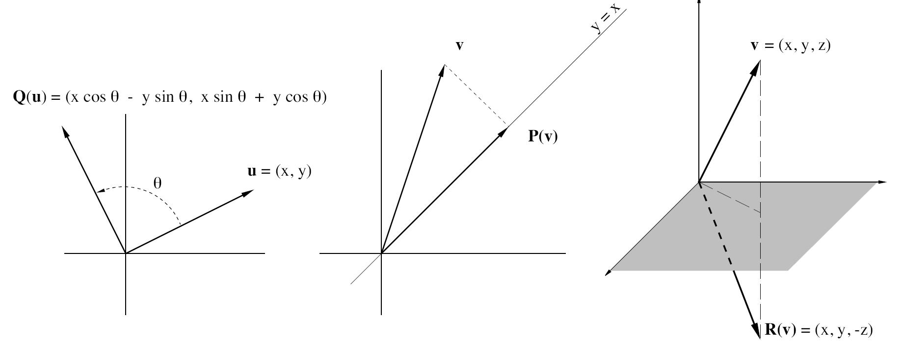

# Linear Transformations

### 线性函数与矩阵之间的联系

线性函数与矩阵之间的联系是我们学科的核心。

现在是时候正式建立矩阵、向量空间以及在向量空间上定义的线性函数之间的联系了。

### 线性变换

设 $\mathcal{U}$ 和 $\mathcal{V}$ 是定义在域 $\mathcal{F}$（对我们来说，$\mathcal{F}$ 是 $\mathbb{R}$ 或 $\mathbb{C}$）上的向量空间。

从 $\mathcal{U}$ 到 $\mathcal{V}$ 的线性变换被定义为一个线性函数 T，将 $\mathcal{U}$ 映射到 $\mathcal{V}$。也就是说，

\[ T(x+y) = T(x) + T(y) \\T(\alpha x) = \alpha T(x)
\\ T(\alpha x + y) = \alpha T(x) + T(y) \]
对于所有的 \( x, y \in \mathcal{U} \) 和 \( \alpha \in \mathcal{F} \)。

**在 $\mathcal{U}$ 上的线性算子被定义为从 $\mathcal{U}$ 到其自身的线性变换，即一个将 $\mathcal{U}$ 映射回 $\mathcal{U}$ 的线性函数。**

### 一些例子

- 将空间 $\mathcal{U}$ 中所有向量映射到另一个空间 $\mathcal{V}$ 中的零向量的函数 $0(x) = 0$ 是从 $\mathcal{U}$ 到 $\mathcal{V}$ 的线性变换，不出意外地被称为**零变换**。

- 将每个向量从空间 $\mathcal{U}$ 映射回其自身的函数 $\mathcal{I}(x) = x$ 是 $\mathcal{U}$ 上的线性算子。$\mathcal{I}$ 被称为 $\mathcal{U}$ 上的**恒等算子**。

- 对于 $\mathbf{A} \in \mathbb{R}^{m \times n}$ 且 $x \in \mathbb{R}^{n \times 1}$，函数 $\mathcal{T}(x) = \mathbf{A}x$ 是从 $\mathbb{R}^n$ 到 $\mathbb{R}^m$ 的线性变换，因为矩阵乘法满足 $\mathbf{A}(\alpha x + y) = \alpha \mathbf{A}x + \mathbf{A}y$。如果 $\mathbf{A}$ 是 $n \times n$ 的矩阵，则 $\mathcal{T}$ 是 $\mathbb{R}^n$ 上的线性算子。

- 如果 $\mathcal{W}$ 是所有从 $\mathbb{R}$ 到 $\mathbb{R}$ 的函数的向量空间，而 $\mathcal{V}$ 是所有从 $\mathbb{R}$ 到 $\mathbb{R}$ 的可微函数的空间，则映射 $\mathcal{D}(f) = df/dx$ 是从 $\mathcal{V}$ 到 $\mathcal{W}$ 的线性变换，因为
  $$
  \frac{d(\alpha f + g)}{dx} = \alpha \frac{df}{dx} + \frac{dg}{dx}.
  $$

- 如果 $\mathcal{V}$ 是从 $\mathbb{R}$ 映射到 $\mathbb{R}$ 的所有连续函数的空间，那么由 $T(f) = \int_0^x f(t) \, dt$ 定义的映射是 $\mathcal{V}$ 上的线性算子，因为
$$
\int_0^x [\alpha f(t) + g(t)] \, dt = \alpha \int_0^x f(t) \, dt + \int_0^x g(t) \, dt.
$$

- 将向量 $\mathbf{u}$ 在 $\mathbb{R}^2$ 中逆时针旋转角度 $\theta$ 的旋转算子 $\mathbf{Q}$ 是 $\mathbb{R}^2$ 上的线性算子，因为 $\mathbf{Q}$ 对 $\mathbf{u}$ 的“作用”可以通过矩阵乘法描述，即旋转后的向量 $\mathbf{Q}(\mathbf{u})$ 的坐标为
$$
\mathbf{Q}(\mathbf{u}) = \begin{pmatrix} x \cos \theta - y \sin \theta \\ x \sin \theta + y \cos \theta \end{pmatrix} = \begin{pmatrix} \cos \theta & -\sin \theta \\ \sin \theta & \cos \theta \end{pmatrix} \begin{pmatrix} x \\ y \end{pmatrix}.
$$

- 将向量 $\mathbf{v} = (x, y, z) \in \mathbb{R}^3$ 映射到其在 $xy$ 平面上的正交投影 $(x, y, 0)$ 的投影算子 $\mathbf{P}$ 是 $\mathbb{R}^3$ 上的一个线性算子，因为如果 $\mathbf{u} = (u_1, u_2, u_3)$ 且 $\mathbf{v} = (v_1, v_2, v_3)$，则
$$
\mathbf{P}(\alpha \mathbf{u} + \mathbf{v}) = (\alpha u_1 + v_1, \alpha u_2 + v_2, 0) = \alpha \mathbf{P}(\mathbf{u}) + \mathbf{P}(\mathbf{v}).
$$

- 将每个向量 $\mathbf{v} = (x, y, z) \in \mathbb{R}^3$ 映射到其关于 $xy$ 平面的反射 $\mathbf{R}(\mathbf{v}) = (x, y, -z)$ 的反射算子 $\mathbf{R}$ 是 $\mathbb{R}^3$ 上的线性算子。

---

### 所有线性变换都可以用矩阵表示吗？

有限维空间上的线性变换总是可以表示为矩阵。

要理解这一点，首先需要理解高维空间中坐标的概念。

回忆一下，如果 $\mathcal{B} = \{\mathbf{u_1}, \mathbf{u_2}, \cdots, \mathbf{u_n}\}$ 是向量空间 $\mathcal{U}$ 的一组基，那么
$$
\mathbf{v} = \alpha_1 \mathbf{u_1} + \alpha_2 \mathbf{u_2} + \cdots + \alpha_n \mathbf{u_n}.
$$

$\alpha_i$ 是由 $\mathbf{v}$ 唯一确定的，称为 $\mathbf{v}$ 相对于基 $\mathcal{B}$ 的**坐标**。记作 $\left[ \mathbf{v} \right]_{\mathcal{B}} = (\alpha_1, \alpha_2, \cdots, \alpha_n)^T$。

**从现在起，$\mathcal{S} = \{\mathbf{e_1}, \mathbf{e_2}, \cdots, \mathbf{e_n}\}$ 将表示 $\mathbb{R}^n$ 的标准单位向量基。**

线性变换和向量一样也有坐标，因为从 $\mathcal{U}$ 到 $\mathcal{V}$ 的线性变换也形成一个向量空间。

---

### Space of Linear Transformations线性变换的空间

- 对于每一对向量空间 $\mathcal{U}$ 和 $\mathcal{V}$，从 $\mathcal{U}$ 到 $\mathcal{V}$ 的所有线性变换的集合 $\mathcal{L(U, V)}$ 在 $\mathcal{F}$ 上是一个向量空间。

- 设 $\mathcal{B} = \{\mathbf{u_1}, \mathbf{u_2}, \cdots, \mathbf{u_n}\}$ 和 $\mathcal{B'} = \{\mathbf{v_1}, \mathbf{v_2}, \cdots, \mathbf{v_m}\}$ 分别是 $\mathcal{U}$ 和 $\mathcal{V}$ 的基，并设 $\mathbf{B_{ji}}$ 为从 $\mathcal{U}$ 到 $\mathcal{V}$ 的线性变换，其中 $\mathbf{B_{ji}(u)} = \xi_j \mathbf{v_i}$，且 $(\xi_1, \xi_2, \dots, \xi_n)^T = [\mathbf{u}]_{\mathcal{B}}$也就是说，从 $\mathbf{u}$ 中取第 $j$ 个坐标，并将其附加到 $\mathbf{v_i}$ 上。
  - $\mathcal{B_L} = \{\mathbf{B_{ji}}\}_{i=1 \cdots m, j=1 \cdots n}$ 是 $\mathcal{L(U, V)}$ 的基。
  - $\dim \mathcal{L(U, V)} = (\dim \mathcal{U})(\dim \mathcal{V})$。
  - 感觉这段话是最绕口的，下面的证明也是。
  

通过证明 \( \mathcal{B_L} \) 是 \( \mathcal{L(U, V)} \) 的一个线性无关的生成集来验证它是一个基。为此，建立线性无关性：

假设 \( \sum_{j,i} \eta_{ji} \mathbf{B_{ji}} = 0 \) 对于任意标量 \( \eta_{ji} \) 成立，并观察到对于每个 \( \mathbf{u_k} \in \mathcal{B} \) 有：

\[
\mathbf{B_{ji}}(\mathbf{u_k}) = 
\begin{cases} 
\mathbf{v_i} & \text{当 } j = k \\ 
0 & \text{当 } j \neq k 
\end{cases} 
\Rightarrow 0 = \left( \sum_{j,i} \eta_{ji} \mathbf{B_{ji}} \right)(\mathbf{u_k}) = \sum_{j,i} \eta_{ji} \mathbf{B_{ji}}(\mathbf{u_k}) = \sum_{i} \eta_{ki} \mathbf{v_i}.
\]

对于每个 \( k \)，基 \( \mathcal{B'} \) 的线性无关性意味着 \( \eta_{ki} = 0 \) 对于每个 \( i \) 成立，因此 \( \mathcal{B_L} \) 是线性无关的。

为了验证 \( \mathcal{B_L} \) 生成 \( \mathcal{L(U, V)} \)，令 \( \mathbf{T} \in \mathcal{L(U, V)} \)，并通过使用 \( \mathbf{u} = \sum_{j=1}^n \xi_j \mathbf{u_j} \) 和 \( \mathbf{T}(\mathbf{u_j}) = \sum_{i=1}^m \alpha_{ij} \mathbf{v_i} \) 来确定 \( \mathbf{T} \) 对 \( \mathcal{U} \) 中任意 \( \mathbf{u} \) 的作用，写作：

\[
\mathbf{T}(\mathbf{u}) = \mathbf{T}\left( \sum_{j=1}^n \xi_j \mathbf{u_j} \right) = \sum_{j=1}^n \xi_j \mathbf{T}(\mathbf{u_j}) = \sum_{j=1}^n \xi_j \sum_{i=1}^m \alpha_{ij} \mathbf{v_i} = \sum_{i,j} \alpha_{ij} \xi_j \mathbf{v_i} = \sum_{i,j} \alpha_{ij} \mathbf{B_{ji}}(\mathbf{u}).
\]

对于所有 \( \mathbf{u} \in \mathcal{U} \)，这都成立，因此 \( \mathbf{T} = \sum_{i,j} \alpha_{ij} \mathbf{B_{ji}} \)，于是 \( \mathcal{B_L} \) 生成 \( \mathcal{L(U, V)} \)。

---

### Coordinate Matrix Representations坐标矩阵表示

设 \( \mathcal{B} = \{\mathbf{u_1}, \mathbf{u_2}, \dots, \mathbf{u_n}\} \) 和 \( \mathcal{B'} = \{\mathbf{v_1}, \mathbf{v_2}, \dots, \mathbf{v_m}\} \) 分别是向量空间 \( \mathcal{U} \) 和 \( \mathcal{V} \) 的基。对于 \( \mathcal{L(U, V)} \) 中的线性变换 \( \mathbf{T} \)，其在基对 \( (\mathcal{B}, \mathcal{B'}) \) 下的**坐标矩阵**定义为 \( m \times n \) 矩阵：

\[
[\mathbf{T}]_{\mathcal{B B'}} = \left( [\mathbf{T}(\mathbf{u_1})]_{\mathcal{B'}} \, \middle| \, [\mathbf{T}(\mathbf{u_2})]_{\mathcal{B'}} \, \middle| \, \dots \, \middle| \, [\mathbf{T}(\mathbf{u_n})]_{\mathcal{B'}} \right).
\]

换句话说，如果 \( \mathbf{T}(\mathbf{u_j}) = \alpha_{1j} \mathbf{v_1} + \alpha_{2j} \mathbf{v_2} + \dots + \alpha_{mj} \mathbf{v_m} \)，那么

\[
[\mathbf{T}(\mathbf{u_j})]_{\mathcal{B'}} = \begin{pmatrix} \alpha_{1j} \\ \alpha_{2j} \\ \vdots \\ \alpha_{mj} \end{pmatrix} \quad \text{且} \quad [\mathbf{T}]_{\mathcal{B B'}} = \begin{pmatrix} \alpha_{11} & \alpha_{12} & \dots & \alpha_{1n} \\ \alpha_{21} & \alpha_{22} & \dots & \alpha_{2n} \\ \vdots & \vdots & \ddots & \vdots \\ \alpha_{m1} & \alpha_{m2} & \dots & \alpha_{mn} \end{pmatrix}.
\]

当 \( \mathbf{T} \) 是 \( \mathcal{U} \) 上的线性算子，并且只有一个基时，用 \( [\mathbf{T}]_{\mathcal{B}} \) 来表示 \( [\mathbf{T}]_{\mathcal{B B}} \)，即 \( \mathbf{T} \) 关于基 \( \mathcal{B} \) 的（必定是方形的）坐标矩阵。

**例子**：如果 \( \mathbf{P} \) 是投影**算子**，确定其在基 \( \mathcal{B} \) 下的坐标矩阵 \( [\mathbf{P}]_{\mathcal{B=B'}} \)，其中

\[
\mathcal{B'=B} = \left\{ \mathbf{u_1} = \begin{pmatrix} 1 \\ 1 \\ 1 \end{pmatrix}, \mathbf{u_2} = \begin{pmatrix} 1 \\ 2 \\ 2 \end{pmatrix}, \mathbf{u_3} = \begin{pmatrix} 1 \\ 2 \\ 3 \end{pmatrix} \right\}.
\]

**解答**：根据上面的结果，\( [\mathbf{P}]_{\mathcal{BB'}} \) 的第 \( j \) 列是 \( [\mathbf{P}(\mathbf{u_j})]_{\mathcal{B}} \)。因此，

\[
\mathbf{P}(\mathbf{u_1}) = \begin{pmatrix} 1 \\ 1 \\ 0 \end{pmatrix} = 1 \mathbf{u_1} + 1 \mathbf{u_2} - 1 \mathbf{u_3} \Rightarrow [\mathbf{P}(\mathbf{u_1})]_{\mathcal{B'}} = \begin{pmatrix} 1 \\ 1 \\ -1 \end{pmatrix},
\]

\[
\mathbf{P}(\mathbf{u_2}) = \begin{pmatrix} 1 \\ 2 \\ 0 \end{pmatrix} = 0 \mathbf{u_1} + 3 \mathbf{u_2} - 2 \mathbf{u_3} \Rightarrow [\mathbf{P}(\mathbf{u_2})]_{\mathcal{B'}} = \begin{pmatrix} 0 \\ 3 \\ -2 \end{pmatrix},
\]

\[
\mathbf{P}(\mathbf{u_3}) = \begin{pmatrix} 1 \\ 2 \\ 0 \end{pmatrix} = 0 \mathbf{u_1} + 3 \mathbf{u_2} - 2 \mathbf{u_3} \Rightarrow [\mathbf{P}(\mathbf{u_3})]_{\mathcal{B'}} = \begin{pmatrix} 0 \\ 3 \\ -2 \end{pmatrix}.
\]

因此，矩阵 \( [\mathbf{P}]_{\mathcal{B}} \) 为：

\[
[\mathbf{P}]_{\mathcal{B}} = \begin{pmatrix} 1 & 0 & 0 \\ 1 & 3 & 3 \\ -1 & -2 & -2 \end{pmatrix}.
\]

线性代数的核心在于认识到有限维线性变换的理论实际上与矩阵理论是相同的。

这是基于这样一个基本事实：对向量 \( \mathbf{u} \) 作用的线性变换 \( \mathbf{T} \) 的本质，就是 \( \mathbf{T} \) 的坐标与 \( \mathbf{u} \) 的坐标之间的矩阵乘法。

---

### Action as Matrix Multiplication

设 \( \mathbf{T} \in \mathcal{L(U, V)} \)，并且 \( \mathcal{B} \) 和 \( \mathcal{B'} \) 分别是 \( \mathcal{U} \) 和 \( \mathcal{V} \) 的基。对于 \( \mathcal{U} \) 中的每个向量 \( \mathbf{u} \)，\( \mathbf{T} \) 作用在 \( \mathbf{u} \) 上的结果通过它们的坐标进行矩阵乘法来表示，即：

\[
[\mathbf{T}(\mathbf{u})]_{\mathcal{B'}} = [\mathbf{T}]_{\mathcal{B B'}} [\mathbf{u}]_{\mathcal{B}}.
\]

**例子**：展示在多项式空间 \( \mathcal{P}_3 \) 上的算子 \( \mathbf{D}(p(t)) = \frac{dp}{dt} \) 的作用如何通过矩阵乘法来表示，其中 \( \mathcal{P}_3 \) 是不超过三次的多项式的空间。

**解答**：算子 \( \mathbf{D} \) 在基 \( \mathcal{B} = \{1, t, t^2, t^3\} \) 下的坐标矩阵为

\[
[\mathbf{D}]_{\mathcal{BB'}} = \begin{pmatrix} 0 & 1 & 0 & 0 \\ 0 & 0 & 2 & 0 \\ 0 & 0 & 0 & 3 \\ 0 & 0 & 0 & 0 \end{pmatrix}.
\]

如果 \( p = p(t) = \alpha_0 + \alpha_1 t + \alpha_2 t^2 + \alpha_3 t^3 \)，则 \( \mathbf{D}(p) = \alpha_1 + 2 \alpha_2 t + 3 \alpha_3 t^2 \)，因此

\[
[\mathbf{p}]_{\mathcal{B}} = \begin{pmatrix} \alpha_0 \\ \alpha_1 \\ \alpha_2 \\ \alpha_3 \end{pmatrix} \quad \text{且} \quad [\mathbf{D}(p)]_{\mathcal{B}} = \begin{pmatrix} \alpha_1 \\ 2 \alpha_2 \\ 3 \alpha_3 \\ 0 \end{pmatrix}.
\]

算子 \( \mathbf{D} \) 的作用可以通过矩阵乘法来实现，因为

\[
[\mathbf{D}(p)]_{\mathcal{B}} = \begin{pmatrix} 0 & 1 & 0 & 0 \\ 0 & 0 & 2 & 0 \\ 0 & 0 & 0 & 3 \\ 0 & 0 & 0 & 0 \end{pmatrix} \begin{pmatrix} \alpha_0 \\ \alpha_1 \\ \alpha_2 \\ \alpha_3 \end{pmatrix} = [\mathbf{D}]_{\mathcal{B}} [\mathbf{p}]_{\mathcal{B}}.
\]
但是上面说的是基中的向量，这里 \( p = p(t) = \alpha_0 + \alpha_1 t + \alpha_2 t^2 + \alpha_3 t^3 \)好像并不是吧？反而像是后面会讲到的内容

对于 \( \mathbf{T} \in \mathcal{L(U, V)} \) 和 \( \mathbf{L} \in \mathcal{L(V, W)} \)，\( \mathbf{L} \) 与 \( \mathbf{T} \) 的复合定义为函数 \( \mathbf{C} : \mathcal{U} \to \mathcal{W} \)，使得 \( \mathbf{C}(x) = \mathbf{L}(\mathbf{T}(x)) \)。

这个复合变换用 \( \mathbf{C}(x) = \mathbf{L T} \) 表示，它也是一个线性变换，因为

\[
\mathbf{C}(\alpha x + y) = \mathbf{L}(\mathbf{T}(\alpha x + y)) = \mathbf{L}(\alpha \mathbf{T}(x) + \mathbf{T}(y)) = \alpha \mathbf{L}(\mathbf{T}(x)) + \mathbf{L}(\mathbf{T}(y)) = \alpha \mathbf{C}(x) + \mathbf{C}(y).
\]

如果 \( \mathcal{B} \)、\( \mathcal{B'} \) 和 \( \mathcal{B''} \) 分别是 \( \mathcal{U} \)、\( \mathcal{V} \) 和 \( \mathcal{W} \) 的基，则 \( \mathbf{C} \) 必须在基对 \( (\mathcal{B}, \mathcal{B''}) \) 下有一个坐标矩阵表示。因此，自然会问 \( [\mathbf{C}]_{\mathcal{B B''}} \) 如何与 \( [\mathbf{L}]_{\mathcal{B' B''}} \) 和 \( [\mathbf{T}]_{\mathcal{B B'}} \) 相关联：

\[
[\mathbf{C}]_{\mathcal{B B''}} = [\mathbf{L}]_{\mathcal{B' B''}} [\mathbf{T}]_{\mathcal{B B'}}.
\]

---

### Connections with Matrix Algebra

- 如果 \( \mathbf{T}, \mathbf{L} \in \mathcal{L(U, V)} \)，并且 \( \mathcal{B} \) 和 \( \mathcal{B'} \) 是 \( \mathcal{U} \) 和 \( \mathcal{V} \) 的基，则：
  - \( [\alpha \mathbf{T}]_{\mathcal{B B'}} = \alpha [\mathbf{T}]_{\mathcal{B B'}} \) 对于标量 \( \alpha \)。
  - \( [\mathbf{T} + \mathbf{L}]_{\mathcal{B B'}} = [\mathbf{T}]_{\mathcal{B B'}} + [\mathbf{L}]_{\mathcal{B B'}} \)。
  - 体现的是T\L都属于**线性**空间

- 如果 \( \mathbf{T} \in \mathcal{L(U, V)} \) 且 \( \mathbf{L} \in \mathcal{L(V, W)} \)，并且 \( \mathcal{B} \)、\( \mathcal{B'} \) 和 \( \mathcal{B''} \) 分别是 \( \mathcal{U} \)、\( \mathcal{V} \) 和 \( \mathcal{W} \) 的基，则 \( \mathbf{LT} \in \mathcal{L(U, W)} \)，且
  - \( [\mathbf{LT}]_{\mathcal{B B''}} = [\mathbf{L}]_{\mathcal{B' B''}} [\mathbf{T}]_{\mathcal{B B'}} \)。

- 如果 \( \mathbf{T} \in \mathcal{L(U, U)} \) 是可逆的，满足 \( \mathbf{T T}^{-1} = \mathbf{T}^{-1} \mathbf{T} = \mathbf{I} \)，则对 \( \mathcal{U} \) 的任意基 \( \mathcal{B} \) 有
  - \( [\mathbf{T}^{-1}]_{\mathcal{B}} = [\mathbf{T}]_{\mathcal{B}}^{-1} \)。

通过两个线性变换 \( \mathbf{T} : \mathbb{R}^3 \to \mathbb{R}^2 \) 和 \( \mathbf{L} : \mathbb{R}^2 \to \mathbb{R}^2 \) 的复合 \( \mathbf{C} = \mathbf{LT} \) 来验证以上结果，其中

\[
\mathbf{T}(x, y, z) = (x + y, y - z) \quad \text{和} \quad \mathbf{L}(u, v) = (2u - v, u),
\]

使用 \( \mathbb{R}^2 \) 和 \( \mathbb{R}^3 \) 的标准基。老师并没有在ppt中写，那我们来尝试一下吧。

---

##### 步骤 1：求 \( T(x, y, z) \) 的输出

根据定义，\( T(x, y, z) \) 的输出是一个二维向量：

\[
T(x, y, z) = (x + y, y - z)
\]

所以，若设 \( u = x + y \) 且 \( v = y - z \)，则有：

\[
T(x, y, z) = (u, v)
\]

##### 步骤 2：将 \( T(x, y, z) \) 的结果代入 \( L \) 中

接下来，将 \( T(x, y, z) = (u, v) \) 代入 \( L(u, v) = (2u - v, u) \)：

\[
L(T(x, y, z)) = L(u, v) = (2u - v, u)
\]

现在将 \( u = x + y \) 和 \( v = y - z \) 代入上述式子：

1. 计算 \( 2u - v \)：
   \[
   2u - v = 2(x + y) - (y - z) = 2x + 2y - y + z = 2x + y + z
   \]

2. 计算 \( u \)：
   \[
   u = x + y
   \]

因此，合成映射 \( C(x, y, z) = L(T(x, y, z)) \) 的结果是：

\[
C(x, y, z) = (2x + y + z, x + y)
\]

矩阵表示的情况下
\[\begin{aligned}
C&=LT\\C&=\left(\begin{matrix}2&-1\\1&0\end{matrix}\right)\left(\begin{matrix}1&1&0\\0&1&-1\end{matrix}\right)\\&\rightarrow\left(\begin{matrix}2&1&1\\1&1&0\end{matrix}\right)\left(\begin{matrix}x\\y\\z\end{matrix}\right)\\&=\left(\begin{matrix}2x+y+z\\x+y\end{matrix}\right)
\end{aligned}\]

---

## Change of Basis and Similarity基与相似度的变化

- 由于其本质，坐标矩阵的表示依赖于基。
- 研究线性变换时，最好不依赖于特定的基，因为某些基可能会使得坐标矩阵的表示表现出其他基下不具备的特殊性质。
- 因此，有必要识别在所有基下保持不变的坐标矩阵的属性。
- 这些是不依赖基的、线性变换本身固有的属性。
- **以下讨论仅限于单一有限维空间 \( \mathcal{V} \) 及其上的线性算子。**
- **首先，研究当 \( \mathcal{V} \) 的基改变时，向量 \( \mathbf{v} \in \mathcal{V} \) 的坐标如何变化。**
- 考虑两个不同的基：

\[
\mathcal{B} = \{\mathbf{x_1}, \mathbf{x_2}, \dots, \mathbf{x_n}\} \quad \text{和} \quad \mathcal{B'} = \{\mathbf{y_1}, \mathbf{y_2}, \dots, \mathbf{y_n}\}.
\]

在本节中，\( \mathbf{T} \) 表示满足 \( \mathbf{T}(\mathbf{y_i}) = \mathbf{x_i} \)（\( i = 1, 2, \dots, n \)）的线性算子。

\( \mathbf{T} \) 被称为**基变换算子**。

### Changing Vector Coordinates

设 \( \mathcal{B} = \{\mathbf{x_1}, \mathbf{x_2}, \dots, \mathbf{x_n}\} \) 和 \( \mathcal{B'} = \{\mathbf{y_1}, \mathbf{y_2}, \dots, \mathbf{y_n}\} \) 是 \( \mathcal{V} \) 的基，并令 \( \mathbf{T} \) 和 \( \mathbf{P} \) 分别为基变换算子和基变换矩阵，即 \( \mathbf{T}(\mathbf{y_i}) = \mathbf{x_i} \) 对每个 \( i \) 成立，并且

\[
\mathbf{P} = [\mathbf{T}]_{\mathcal{B}} = [\mathbf{T}]_{\mathcal{B'}} = [\mathbf{I}]_{\mathcal{B B'}} = \left( [\mathbf{x_1}]_{\mathcal{B'}} \, \middle| \, [\mathbf{x_2}]_{\mathcal{B'}} \, \middle| \, \dots \, \middle| \, [\mathbf{x_n}]_{\mathcal{B'}} \right).
\]

- 对所有 \( \mathbf{v} \in \mathcal{V} \)，\( [\mathbf{v}]_{\mathcal{B'}} = \mathbf{P} [\mathbf{v}]_{\mathcal{B}} \)。
- \( \mathbf{P} \) 是非奇异的。

为此，观察到

\[
\mathbf{x_i} = \sum_{j=1}^n \alpha_j \mathbf{y_j} \Rightarrow \mathbf{T}(\mathbf{x_i}) = \sum_{j=1}^n \alpha_j \mathbf{T}(\mathbf{y_j}) = \sum_{j=1}^n \alpha_j \mathbf{x_j},
\]

这意味着 \( [\mathbf{x_i}]_{\mathcal{B'}} = [\mathbf{T}(\mathbf{x_i})]_{\mathcal{B}} \)，因此，

\[
[\mathbf{T}]_{\mathcal{B}} = \left( [\mathbf{T}(\mathbf{x_1})]_{\mathcal{B}} \, [\mathbf{T}(\mathbf{x_2})]_{\mathcal{B}} \, \dots \, [\mathbf{T}(\mathbf{x_n})]_{\mathcal{B}} \right) = \left( [\mathbf{x_1}]_{\mathcal{B'}} \, [\mathbf{x_2}]_{\mathcal{B'}} \, \dots \, [\mathbf{x_n}]_{\mathcal{B'}} \right) = [\mathbf{T}]_{\mathcal{B'}}.
\]

由于 \( [\mathbf{I}]_{\mathcal{B B'}} = [\mathbf{T}]_{\mathcal{B}} \)，因此 \( \mathbf{P} = [\mathbf{I}]_{\mathcal{B B'}} = [\mathbf{T}]_{\mathcal{B}} = [\mathbf{T}]_{\mathcal{B'}} \)。

- 对于所有 \( \mathbf{v} \in \mathcal{V} \)，\( [\mathbf{v}]_{\mathcal{B'}} = [\mathbf{I}]_{\mathcal{B B'}} [\mathbf{v}]_{\mathcal{B}} = \mathbf{P} [\mathbf{v}]_{\mathcal{B}} \)。
- \( \mathbf{P} \) 是非奇异的，因为 \( \mathbf{T} \) 是可逆的（\( \mathbf{T}^{-1}(\mathbf{x_i}) = \mathbf{y_i} \)）。
- \( [\mathbf{T}^{-1}]_{\mathcal{B}} = [\mathbf{T}]_{\mathcal{B}}^{-1} = \mathbf{P}^{-1} \)。

基变换算子 \( \mathbf{T} \) 的作用是：

\[
\mathbf{T}(\text{new basis}) = \text{old basis}.
\]

而基变换矩阵 \( \mathbf{P} \) 的作用是：

\[
\text{new coordinates} = \mathbf{P} (\text{old coordinates}).
\]

---

### 上面的解释说明

#### 1. 基变换算子 (T)
基变换算子 \( T \) 是一个函数，它将一个向量在新基下的坐标映射到它在旧基下的坐标。换句话说，如果 \( \mathbf{v} \) 是向量空间 \( V \) 中的一个向量，并且 \( B = \{x_1, x_2, \ldots, x_n\} \) 和 \( B' = \{y_1, y_2, \ldots, y_n\} \) 是 \( V \) 的两个基，那么 \( T \) 满足：
\[ T(y_i) = x_i \]
对每个 \( i \) 成立。

#### 2. 基变换矩阵 (P)
基变换矩阵 \( P \) 是一个矩阵，它将向量在新基下的坐标转换为旧基下的坐标。矩阵 \( P \) 定义为：
\[ P = [T]_B \]
其中 \( [T]_B \) 表示 \( T \) 在基 \( B \) 下的矩阵表示。

#### 3. 基变换矩阵的计算
基变换矩阵 \( P \) 可以通过将新基 \( B' \) 中的每个向量 \( y_i \) 用旧基 \( B \) 表示来计算。具体来说，如果 \( y_i = \sum_{j=1}^n a_{ij} x_j \)，那么 \( P \) 的第 \( i \) 列是 \( [a_{i1}, a_{i2}, \ldots, a_{in}]^T \)。

#### 4. 例子
假设我们有一个向量空间 \( V \) 和两个基：
- 旧基 \( B = \{x_1, x_2\} \)
- 新基 \( B' = \{y_1, y_2\} \)

假设 \( y_1 = 2x_1 + 3x_2 \) 和 \( y_2 = x_1 + 4x_2 \)。

##### 步骤 1: 定义基变换算子 \( T \)
\[ T(y_1) = x_1 \]
\[ T(y_2) = x_2 \]

##### 步骤 2: 计算基变换矩阵 \( P \)
我们需要用旧基 \( B \) 来表示 \( y_1 \) 和 \( y_2 \)：
\[ y_1 = 2x_1 + 3x_2 \]
\[ y_2 = x_1 + 4x_2 \]

因此，基变换矩阵 \( P \) 是：
\[ P = \begin{bmatrix} 2 & 1 \\ 3 & 4 \end{bmatrix} \]

##### 步骤 3: 使用基变换矩阵
如果 \( \mathbf{v} \) 在新基 \( B' \) 下的坐标是 \( [v]_{B'} = \begin{bmatrix} v_1 \\ v_2 \end{bmatrix} \)，那么它在旧基 \( B \) 下的坐标是：
\[ [v]_B = P [v]_{B'} = \begin{bmatrix} 2 & 1 \\ 3 & 4 \end{bmatrix} \begin{bmatrix} v_1 \\ v_2 \end{bmatrix} \]

#### 5. 总结
基变换算子 \( T \) 将新基中的向量映射到旧基中的向量，而基变换矩阵 \( P \) 将新基下的坐标转换为旧基下的坐标。通过将新基中的向量用旧基表示，我们可以计算出基变换矩阵。

希望这个例子能帮助你理解基变换算子和基变换矩阵的概念！如果你有任何疑问或需要进一步的解释，请随时告诉我。

**例2**：对于不超过二次的多项式空间 \( \mathcal{P}_2 \)，确定从基 \( \mathcal{B} \) 到 \( \mathcal{B'} \) 的基变换矩阵 \( \mathbf{P} \)，其中

\[
\mathcal{B} = \{1, t, t^2\} \quad \text{和} \quad \mathcal{B'} = \{1, 1 + t, 1 + t + t^2\}，
\]

并找到多项式 \( q(t) = 3 + 2t + 4t^2 \) 相对于 \( \mathcal{B'} \) 的坐标。

**解答**：从 \( \mathcal{B} \) 到 \( \mathcal{B'} \) 的基变换矩阵 \( \mathbf{P} \) 为：

\[
\mathbf{P} = ([\mathbf{x_1}]_{\mathcal{B'}} \, | \, [\mathbf{x_2}]_{\mathcal{B'}} \, | \, [\mathbf{x_3}]_{\mathcal{B'}}).
\]

在此例中，\( x_1 = 1 \)，\( x_2 = t \)，且 \( x_3 = t^2 \)，同时 \( y_1 = 1 \)，\( y_2 = 1 + t \)，\( y_3 = 1 + t + t^2 \)。因此，坐标 \( [x_i]_{\mathcal{B'}} \) 计算如下：

\[
1 = 1(1) + 0(1 + t) + 0(1 + t + t^2) = 1y_1 + 0y_2 + 0y_3,
\]
\[
t = -1(1) + 1(1 + t) + 0(1 + t + t^2) = -1y_1 + 1y_2 + 0y_3,
\]
\[
t^2 = 0(1) - 1(1 + t) + 1(1 + t + t^2) = 0y_1 - 1y_2 + 1y_3.
\]

因此，

\[
\mathbf{P} = \left( [x_1]_{\mathcal{B'}} \, \middle| \, [x_2]_{\mathcal{B'}} \, \middle| \, [x_3]_{\mathcal{B'}} \right) = \begin{pmatrix} 1 & -1 & 0 \\ 0 & 1 & -1 \\ 0 & 0 & 1 \end{pmatrix},
\]

多项式 \( q = q(t) = 3 + 2t + 4t^2 \) 在基 \( \mathcal{B'} \) 下的坐标为

\[
[q]_{\mathcal{B'}} = \mathbf{P} [q]_{\mathcal{B}} = \begin{pmatrix} 1 & -1 & 0 \\ 0 & 1 & -1 \\ 0 & 0 & 1 \end{pmatrix} \begin{pmatrix} 3 \\ 2 \\ 4 \end{pmatrix} = \begin{pmatrix} 1 \\ -2 \\ 4 \end{pmatrix}.
\]

为了独立验证这些坐标的正确性，可以检查如下等式：

\[
q(t) = 1(1) - 2(1 + t) + 4(1 + t + t^2).
\]
现在可以很容易地描述，当底层基改变时，线性算子的坐标矩阵如何变化。

### Changing Matrix Coordinates

设 \( \mathbf{A} \) 是 \( \mathcal{V} \) 上的线性算子，\( \mathcal{B} \) 和 \( \mathcal{B'} \) 是 \( \mathcal{V} \) 的两个基。则坐标矩阵 \( [\mathbf{A}]_{\mathcal{B}} \) 和 \( [\mathbf{A}]_{\mathcal{B'}} \) 的关系如下：

\[
[\mathbf{A}]_{\mathcal{B}} = \mathbf{P}^{-1} [\mathbf{A}]_{\mathcal{B'}} \mathbf{P},
\]

其中 \( \mathbf{P} = [\mathbf{I}]_{\mathcal{B B'}} \)，它是从基 \( \mathcal{B} \) 到 \( \mathcal{B'} \) 的基变换矩阵。等价地，

\[
[\mathbf{A}]_{\mathcal{B'}} = \mathbf{Q}^{-1} [\mathbf{A}]_{\mathcal{B}} \mathbf{Q},
\]

其中 \( \mathbf{Q} = [\mathbf{I}]_{\mathcal{B' B}} = \mathbf{P}^{-1} \)，它是从基 \( \mathcal{B'} \) 到 \( \mathcal{B} \) 的基变换矩阵。

**问题**：考虑定义在 \( \mathbb{R}^2 \) 上的线性算子 \( \mathbf{A}(x, y) = (y, -2x + 3y) \)，并给定两个基：

\[
S = \left\{ \begin{pmatrix} 1 \\ 0 \end{pmatrix}, \begin{pmatrix} 0 \\ 1 \end{pmatrix} \right\} \quad \text{和} \quad S' = \left\{ \begin{pmatrix} 1 \\ 1 \end{pmatrix}, \begin{pmatrix} 1 \\ 2 \end{pmatrix} \right\}.
\]

首先计算 \( \mathbf{A} \) 在基 \( S \) 下的坐标矩阵 \( [\mathbf{A}]_S \)，以及从 \( S' \) 到 \( S \) 的基变换矩阵 \( \mathbf{Q} \)，然后利用这两个矩阵来确定 \( [\mathbf{A}]_{S'} \)。

**解答**：通过计算得到 \( \mathbf{A} \) 在基 \( S \) 下的矩阵：

\[
\mathbf{A}(\mathbf{e_1}) = \mathbf{A}(1, 0) = (0, -2) = 0 \mathbf{e_1} + (-2) \mathbf{e_2},
\]
\[
\mathbf{A}(\mathbf{e_2}) = \mathbf{A}(0, 1) = (1, 3) = 1 \mathbf{e_1} + (3) \mathbf{e_2},
\]

因此，

\[
[\mathbf{A}]_S = \left( [\mathbf{A}(\mathbf{e_1})]_S \, | \, [\mathbf{A}(\mathbf{e_2})]_S \right) = \begin{pmatrix} 0 & 1 \\ -2 & 3 \end{pmatrix}.
\]

从 \( S' \) 到 \( S \) 的基变换矩阵为

\[
\mathbf{Q} = \left( [\mathbf{y_1}]_S \, | \, [\mathbf{y_2}]_S \right) = \begin{pmatrix} 1 & 1 \\ 1 & 2 \end{pmatrix},
\]

并且 \( \mathbf{A} \) 在基 \( S' \) 下的矩阵为

\[
[\mathbf{A}]_{S'} = \mathbf{Q}^{-1} [\mathbf{A}]_S \mathbf{Q} = \begin{pmatrix} 2 & -1 \\ -1 & 1 \end{pmatrix} \begin{pmatrix} 0 & 1 \\ -2 & 3 \end{pmatrix} \begin{pmatrix} 1 & 1 \\ 1 & 2 \end{pmatrix} = \begin{pmatrix} 1 & 0 \\ 0 & 2 \end{pmatrix}.
\]

## Similarity

- 矩阵 \( B_{n \times n} \) 和 \( C_{n \times n} \) 称为**相似矩阵**，当存在一个非奇异矩阵 \( Q \) 使得 \( B = Q^{-1} C Q \) 时。
  - 我们用 \( B \simeq C \) 表示 \( B \) 和 \( C \) 是相似的。
- 线性算子 \( f : \mathbb{R}^{n \times n} \to \mathbb{R}^{n \times n} \) 定义为 \( f(C) = Q^{-1} C Q \)，称为**相似变换**（similarity transformation）。
- 任何给定线性算子的两个坐标矩阵必定是相似的。
- 是否任何两个相似矩阵一定是同一线性算子的坐标矩阵？
- **相似矩阵表示相同的线性算子**。
- 因此，坐标无关的属性正是那些在相似变换下保持不变的属性，称为**相似不变量**（similarity invariants）。
- 确定和研究相似不变量是线性代数和矩阵理论中的重要部分。

## Invariant Subspaces

- 对于一个向量空间 \( V \) 上的线性算子 \( T \)，以及 \( V \) 的子集 \( X \subseteq V \)，定义
  \[
  T(X) = \{T(x) \mid x \in X\}
  \]
  是集合 \( X \) 在变换 \( T \) 下所有可能的映像。
- 注意到 \( T(V) = R(T) \)。当 \( X \) 是 \( V \) 的一个子空间时，通常 \( T(X) \) 不会与 \( X \) 有关。然而在某些特殊情况下，\( T(X) \subseteq X \)，这样的子空间就是本节讨论的重点。

### 不变子空间

- 对于 \( V \) 上的线性算子 \( T \)，当 \( T(X) \subseteq X \) 时，子空间 \( X \subseteq V \) 称为 \( T \) 的**不变子空间**。
- 在这种情况下，可以将 \( T \) 看作一个作用在 \( X \) 上的线性算子，仅仅限制 \( T \) 只作用于来自 \( X \) 的向量。此后，这个约束算子记为 \( T_{/X} \)。

## Problem

给定
\[
A = \begin{pmatrix} 4 & 4 & 4 \\ -2 & -2 & -5 \\ 1 & 2 & 5 \end{pmatrix}, \quad x_1 = \begin{pmatrix} 2 \\ -1 \\ 0 \end{pmatrix}, \quad x_2 = \begin{pmatrix} -1 \\ 2 \\ -1 \end{pmatrix},
\]
证明由 \( B = \{x_1, x_2\} \) 张成的子空间 \( X \) 是 \( A \) 的不变子空间。然后描述 \( A \) 在 \( X \) 上的限制 \( A_{/X} \)，并确定 \( A_{/X} \) 在基 \( B \) 下的坐标矩阵。

## Solution

观察到
\[
A x_1 = 2 x_1 \in X \quad \text{和} \quad A x_2 = x_1 + 2 x_2 \in X，
\]
因此，\( X \) 中任意向量 \( x = \alpha x_1 + \beta x_2 \) 的像 \( A x \) 仍在 \( X \) 中，因为
\[
A x = A(\alpha x_1 + \beta x_2) = \alpha A x_1 + \beta A x_2 = (2 \alpha + \beta) x_1 + 2 \beta x_2。
\]
这个等式完全描述了 \( A \) 在 \( X \) 上的限制，因此
\[
A_{/X}(x) = (2 \alpha + \beta) x_1 + 2 \beta x_2 \quad \text{对于每个} \quad x = \alpha x_1 + \beta x_2 \in X。
\]
由于
\[
A_{/X}(x_1) = 2 x_1 \quad \text{和} \quad A_{/X}(x_2) = x_1 + 2 x_2，
\]
我们有
\[
[A_{/X}]_B = \begin{pmatrix} [A_{/X}(x_1)]_B & [A_{/X}(x_2)]_B \end{pmatrix} = \begin{pmatrix} 2 & 1 \\ 0 & 2 \end{pmatrix}。
\]

## Invariant Subspaces for Linear Operator T

- 不变子空间对于线性算子 \( T \) 非常重要，因为它们能生成 \( T \) 的简化坐标矩阵表示。
- 为了理解其机制，假设 \( X \) 是 \( T \) 的一个不变子空间，且设
  \[
  B_X = \{x_1, x_2, \dots, x_r\}
  \]
  是 \( X \) 的一个基，而 \( B = \{x_1, x_2, \dots, x_r, y_1, y_2, \dots, y_q\} \) 是 \( V \) 的一个基。
- 为了计算 \( [T]_B \)，回忆坐标矩阵的定义：
  \[
  [T]_B = \left( [T(x_1)]_B \, \middle| \, \dots \, \middle| \, [T(x_r)]_B \, \middle| \, [T(y_1)]_B \, \middle| \, \dots \, \middle| \, [T(y_q)]_B \right)。
  \]
- 因为每个 \( T(x_j) \) 属于 \( X \)，所以只需要 \( B \) 的前 \( r \) 个向量来表示每个 \( T(x_j) \)，因此对于 \( j = 1, 2, \dots, r \)，有：
  \[
  T(x_j) = \sum_{i=1}^r \alpha_{ij} x_i，\quad [T(x_j)]_B = \begin{pmatrix} \alpha_{1j} \\ \vdots \\ \alpha_{rj} \\ 0 \\ \vdots \\ 0 \end{pmatrix}。
  \]

- 空间 \( Y = \text{span}\{y_1, y_2, \dots, y_q\} \) 可能不是 \( T \) 的一个不变子空间，因此需要 \( B \) 中的所有基向量来表示每个 \( T(y_j) \)。
- 因此，对于 \( j = 1, 2, \dots, q \)，有：
  \[
  T(y_j) = \sum_{i=1}^r \beta_{ij} x_i + \sum_{i=1}^q \gamma_{ij} y_i，
  \]
  \[
  [T(y_j)]_B = \begin{pmatrix} \beta_{1j} \\ \vdots \\ \beta_{rj} \\ \gamma_{1j} \\ \vdots \\ \gamma_{qj} \end{pmatrix}。
  \]
- 因此矩阵 \( [T]_B \) 的形式为：
\[[\mathbf{T}]_{\mathcal{B}}=\begin{pmatrix}\alpha_{11}&\cdots&\alpha_{1r}&\beta_{11}&\cdots&\beta_{1q}\\\vdots&\ddots&\vdots&\vdots&\ddots&\vdots\\\alpha_{r1}&\cdots&\alpha_{rr}&\beta_{r1}&\cdots&\beta_{rq}\\0&\cdots&0&\gamma_{11}&\cdots&\gamma_{1q}\\\vdots&\ddots&\vdots&\vdots&\ddots&\vdots\\0&\cdots&0&\gamma_{q1}&\cdots&\gamma_{qq}\end{pmatrix}\]

---

## Similarity相似

- 矩阵 \( B_{n \times n} \) 和 \( C_{n \times n} \) 称为**相似矩阵**，当存在一个非奇异矩阵 \( Q \) 使得 \( B = Q^{-1} C Q \)。
  - 记作 \( B \simeq C \) 表示 \( B \) 和 \( C \) 是相似的。
- 线性算子 \( f : \mathbb{R}^{n \times n} \to \mathbb{R}^{n \times n} \) 定义为 \( f(C) = Q^{-1} C Q \)，称为**相似变换**（similarity transformation）。

- 任何线性算子的两个坐标矩阵必定是相似的。
- 探讨是否任何两个相似矩阵表示同一线性算子的坐标矩阵？
- **相似矩阵代表同一线性算子**。
- 这种坐标无关的属性称为**相似不变量**。
- 研究相似不变量是线性代数和矩阵理论中的重要内容。

---

### Invariant Subspaces and Matrix Representations不变子空间的矩阵表示

- 子空间 \( X \) 是 \( T \) 的不变子空间，当且仅当 \( [T]_B \) 为分块三角矩阵：
  \[
  [T]_B = \begin{pmatrix} A & B \\ 0 & C \end{pmatrix},
  \]
  其中 \( A = [T_{/X}]_{B_X} \)。
- 如果子空间 \( X, Y, \dots, Z \) 在 \( T \) 下不变，且对应的坐标矩阵为分块对角矩阵：
  \[
  [T]_B = \begin{pmatrix} A_{r_1 \times r_1} & 0 & \dots & 0 \\ 0 & B_{r_2 \times r_2} & \dots & 0 \\ \vdots & \vdots & \ddots & \vdots \\ 0 & 0 & \dots & C_{r_k \times r_k} \end{pmatrix},
  \]
  则 \( A = [T_{/X}]_{B_X}, B = [T_{/Y}]_{B_Y}, \dots, C = [T_{/Z}]_{B_Z} \)。

### Triangular and Diagonal Block Forms三角和对角分块形式

- 当 \( T \) 是 \( n \times n \) 矩阵时，下列两条成立：
  - 存在非奇异矩阵 \( Q \)，使得
    \[
    Q^{-1} T Q = \begin{pmatrix} A_{r \times r} & B_{r \times q} \\ 0 & C_{q \times q} \end{pmatrix}
    \]
    当且仅当 \( Q \) 的前 \( r \) 列张成的子空间在 \( T \) 下不变。
  - 存在非奇异矩阵 \( Q \)，使得
    \[
    Q^{-1} T Q = \begin{pmatrix} A_{r_1 \times r_1} & 0 & \dots & 0 \\ 0 & B_{r_2 \times r_2} & \dots & 0 \\ \vdots & \vdots & \ddots & \vdots \\ 0 & 0 & \dots & C_{r_k \times r_k} \end{pmatrix}
    \]
    当且仅当每个 \( Q_i \) 的列张成 \( T \) 的不变子空间。

---

#### 求不变子空间 (Finding Invariant Subspaces)

找出在算子
\[
A = \begin{pmatrix} 0 & 1 \\ -2 & 3 \end{pmatrix}
\]
下 \( \mathbb{R}^2 \) 的所有不变子空间。

#### Solution

- 平凡子空间 \( \{0\} \) 和 \( \mathbb{R}^2 \) 自然不变。
- 查找一维不变子空间，假设 \( \mathcal{M} = \text{span}\{x\} \)，满足 \( A x \in \mathcal{M} \)，即存在 \( \lambda \) 使得 \( A x = \lambda x \)。
- 解 \( A - \lambda I \) 的行列式等于零，得特征值：
  \[
  \lambda^2 - 3 \lambda + 2 = 0。
  \]
  得到特征值 \( \lambda = 1 \) 和 \( \lambda = 2 \)。

- 对应特征值 \( \lambda = 1 \) 的特征向量为 \( \begin{pmatrix} 1 \\ 1 \end{pmatrix} \)，对应特征值 \( \lambda = 2 \) 的特征向量为 \( \begin{pmatrix} 1 \\ 2 \end{pmatrix} \)。
- 因此，不变子空间为
  \[
  \mathcal{M}_1 = \text{span}\left\{ \begin{pmatrix} 1 \\ 1 \end{pmatrix} \right\} \quad \text{和} \quad \mathcal{M}_2 = \text{span}\left\{ \begin{pmatrix} 1 \\ 2 \end{pmatrix} \right\}。
  \]
- 基 \( B = \left\{ \begin{pmatrix} 1 \\ 1 \end{pmatrix}, \begin{pmatrix} 1 \\ 2 \end{pmatrix} \right\} \) 上 \( A \) 的坐标矩阵为
  \[
  [A]_B = Q^{-1} A Q = \begin{pmatrix} 1 & 0 \\ 0 & 2 \end{pmatrix}。
  \]

