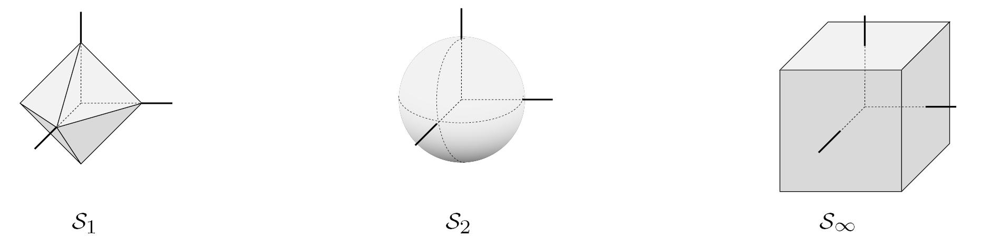
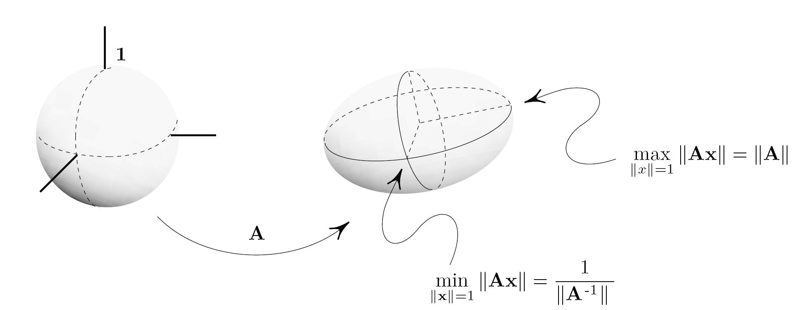
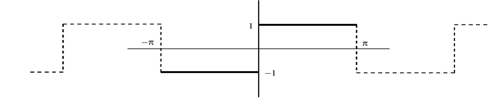
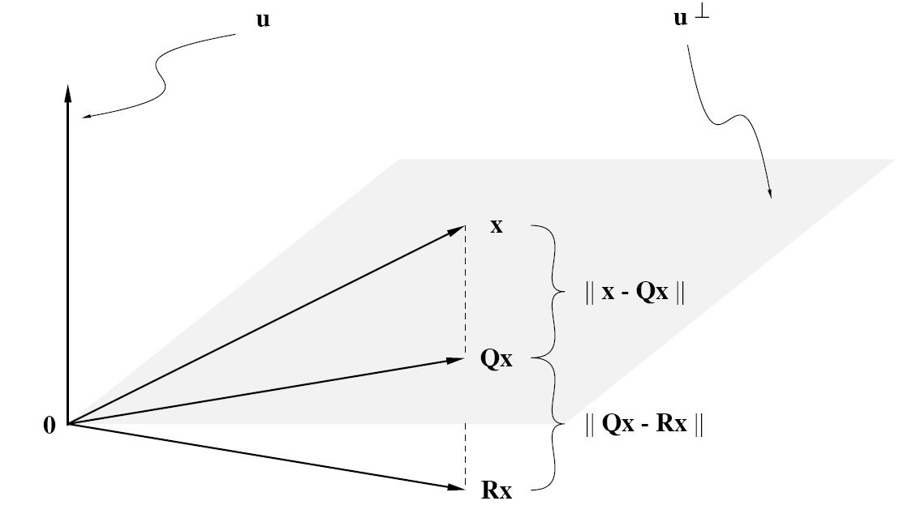
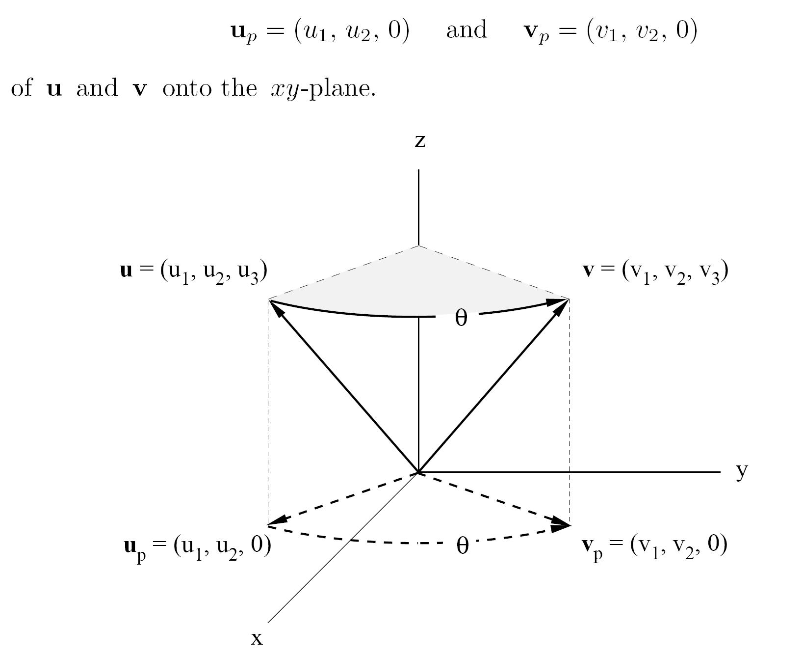

#  范数和内积
## 向量的范数

### 向量范数

- 线性代数的一个重要部分实际上是几何性质。
- 该学科的很大一部分是由于需要将 \(\mathbb{R}^2\) 和 \(\mathbb{R}^3\) 的基本几何扩展到非直观的高维空间。
- 通常的方法是将几何概念在 \(\mathbb{R}^2\) 和 \(\mathbb{R}^3\) 中进行坐标化，然后扩展到 \(\mathbb{R}^n\) 和 \(\mathbb{C}^n\) 的有序 n 元组。

### 欧几里得向量范数

对于一个向量 \( x_{n \times 1} \)，欧几里得范数定义为
- \( \|x\| = \left( \sum_{i=1}^n x_i^2 \right)^{1/2} = \sqrt{x^T x} \quad \text{当 } x \in \mathbb{R}^{n \times 1} \text{时} \)
- \( \|x\| = \left( \sum_{i=1}^n |x_i|^2 \right)^{1/2} = \sqrt{\overline{x}^T x} \quad \text{当 } x \in \mathbb{C}^{n \times 1} \text{时} \)

例如，如果 \( \mathbf{u} = \begin{pmatrix} 0 \\ -1 \\ 2 \\ 4 \end{pmatrix} \) 且 \( \mathbf{v} = \begin{pmatrix} i \\ 2 \\ 1 - i \\ 0 \end{pmatrix} \)，则
- \( \|\mathbf{u}\| = \sqrt{\sum u_i^2} = \sqrt{\mathbf{u}^T \mathbf{u}} = \sqrt{0 + 1 + 4 + 16} = \sqrt{21} \)
- \( \|\mathbf{v}\| = \sqrt{\sum |v_i|^2} = \sqrt{\overline{\mathbf{v}}^T \mathbf{v}} = \sqrt{1 + 4 + 2 + 0} = \sqrt{7} \)

**有几点需要注意**

- 向量范数的复数版本包含实数版本作为特例，因为当 \( z \) 为实数时，\( \|z\|^2 = z^2 \)。
- 欧几里得范数的定义保证了对于所有标量 \( \alpha \)，
  \[
  \|x\| \geq 0, \quad \|x\| = 0 \Leftrightarrow x = 0, \quad \text{且} \quad \|\alpha x\| = |\alpha| \|x\|。
  \]
- 给定一个向量 \( x \neq 0 \)，我们通过设置 \( \mathbf{u} = \frac{x}{\|x\|} \) 来对 \( x \) 进行 **标准化**。
- 在 \(\mathbb{R}^3\) 中，向量之间的距离可以借助平行四边形法则进行可视化。向量 \( \mathbf{u} \) 和 \( \mathbf{v} \) 之间的距离自然定义为 \( \|\mathbf{u} - \mathbf{v}\| \)。

### 标准内积

标量项定义为
- \( x^T y = \sum_{i=1}^n x_i y_i \in \mathbb{R} \)
- \( x^* y = \sum_{i=1}^n \overline{x_i} y_i \in \mathbb{C} \)

分别称为 \(\mathbb{R}^n\) 和 \(\mathbb{C}^n\) 的 **标准内积**。

---

### 柯西不等式

柯西–布尼亚科夫斯基–施瓦兹 (CBS) 不等式是最重要的不等式之一，**它将内积与范数联系起来。**
\[
|x^* y| \leq \|x\| \|y\| \quad \text{对所有 } x, y \in \mathbb{C}^{n \times 1}.
\]
当且仅当 \( y = \alpha x \) 且 \( \alpha = \frac{x^* y}{x^* x} \) 时，等号成立。

**证明|写得很奇怪，只证明了\( \alpha = \frac{x^* y}{x^* x} = \frac{x^* y}{\|x\|^2} \)时的柯西不等式。**

设 \( \alpha = \frac{x^* y}{x^* x} = \frac{x^* y}{\|x\|^2} \)（假设 \( x \neq 0 \)，因为如果 \( x = 0 \) 则没有必要证明），并观察到 \( x^* (\alpha x - y) = 0 \)，因此
\[
0 \leq \|\alpha x - y\|^2 = (\alpha x - y)^* (\alpha x - y) = \overline{\alpha} x^* (\alpha x - y) - y^* (\alpha x - y).
\]
\[
= -y^* (\alpha x - y) = y^* y - \alpha y^* x = \frac{\|y\|^2 \|x\|^2 - |x^* y|^2}{\|x\|^2}.
\]
因为 \( y^* x = \overline{x^* y} \)，因此得到 \( (x^* y)(y^* x) = |x^* y|^2 \)，所以
\[
0 \leq \frac{\|y\|^2 \|x\|^2 - |x^* y|^2}{\|x\|^2}.
\]
现在，\( 0 \leq \|x\|^2 \) 表明 \( 0 \leq \|y\|^2 \|x\|^2 - |x^* y|^2 \)，从而得出 CBS 不等式。

### 三角不等式

对于任意 \( x, y \in \mathbb{C}^n \)，有
\[
\|x + y\| \leq \|x\| + \|y\|。
\]

**证明**：设 \( x \) 和 \( y \) 为列向量，并写成
\[
\|x + y\|^2 = (x + y)^* (x + y) = x^* x + x^* y + y^* x + y^* y = \|x\|^2 + x^* y + y^* x + \|y\|^2。
\]
回忆一下，如果 \( z = a + ib \)，则 \( z + \overline{z} = 2a = 2 \operatorname{Re}(z) \) 且 \( |z|^2 = a^2 + b^2 \geq a^2 \)，因此 \( |z| \geq \operatorname{Re}(z) \)。使用 \( y^* x = \overline{x^* y} \) 以及 CBS 不等式，得出
\[
x^* y + y^* x = 2 \operatorname{Re}(x^* y) \leq 2 |x^* y| \leq 2 \|x\| \|y\|。
\]
因此，我们可以推断出
\[
\|x + y\|^2 \leq \|x\|^2 + 2 \|x\| \|y\| + \|y\|^2 = (\|x\| + \|y\|)^2。
\]

- 不难看出，三角不等式可以扩展到任意数量的向量，即 \( \|\sum_i x_i\| \leq \sum_i \|x_i\| \)。
- 此外，对于实数或复数，\( \|\sum_i \alpha_i\| \leq \sum_i |\alpha_i| \)。

### 反向三角不等式

三角不等式对和的上界进行了限制，但它也提供了差值的下界：
\[
|\|x\| - \|y\|| \leq \|x - y\|。
\]
这是三角不等式的推论，因为
\[
\|x\| = \|x - y + y\| \leq \|x - y\| + \|y\| \implies \|x\| - \|y\| \leq \|x - y\|
\]
以及
\[
\|y\| = \|x - y - x\| \leq \|x - y\| + \|x\| \implies -(|\|x\| - \|y\||) \leq \|x - y\|。
\]

---

### \( p \)-范数

对于 \( p \geq 1 \)，\( x \in \mathbb{C}^n \) 的 \( p \)-范数定义为
\[
\|x\|_p = \left( \sum_{i=1}^n |x_i|^p \right)^{1/p}。
\]

可以证明，欧几里得范数的以下性质实际上对所有 \( p \)-范数都成立：
- \( \|x\|_p \geq 0 \) 且 \( \|x\|_p = 0 \Leftrightarrow x = 0 \)。
- \( \|\alpha x\|_p = |\alpha| \|x\|_p \) 对于所有标量 \( \alpha \) 成立。
- **\( \|x + y\|_p \leq \|x\|_p + \|y\|_p \)。**

广义的 CBS 不等式的 \( p \)-范数版本是 Hölder 不等式。

如果 \( p > 1 \) 且 \( q > 1 \) 为实数，且满足 \( \frac{1}{p} + \frac{1}{q} = 1 \)，那么
\[
|x^* y| \leq \|x\|_p \|y\|_q。
\]

在实际中，仅使用了三种 \( p \)-范数，它们分别是：
- \( \|x\|_1 = \sum_{i=1}^n |x_i| \) （网格范数），
- \( \|x\|_2 = \left( \sum_{i=1}^n |x_i|^2 \right)^{1/2} \) （欧几里得范数），
- \( \|x\|_{\infty} = \lim_{p \to \infty} \|x\|_p = \lim_{p \to \infty} \left( \sum_{i=1}^n |x_i|^p \right)^{1/p} = \max_i |x_i| \) （最大范数）。

要理解 1-范数、2-范数和无穷范数的意义，可以了解单位 \( p \)-球体 \( S_p = \{x \mid \|x\|_p = 1\} \) 的形状和相对大小。对于 \(\mathbb{R}^3\) 中的单位 1-球体、2-球体和无穷球体，它们分别是一个八面体、一个球和一个立方体。

从图形上可以明显看出，\( S_1 \) 包含在 \( S_2 \) 内，而 \( S_2 \) 又包含在 \( S_\infty \) 内。

这意味着对于所有 \( x \in \mathbb{R}^3 \)，
\[
\|x\|_1 \geq \|x\|_2 \geq \|x\|_\infty。
\]
一般来说，这在 \(\mathbb{R}^n\) 中也是成立的。

由于 \( p \)-范数是基于坐标定义的，其应用局限于坐标空间。

我们希望拥有一个适用于所有向量空间的范数的通用概念。

换句话说，我们需要**一个不依赖坐标的范数定义，它包含标准的 \( p \)-范数作为特例。**

#### 一般向量范数

对于实或复向量空间 \( \mathcal{V} \)，范数是一种将 \( \mathcal{V} \) 映射到 \( \mathbb{R} \) 的函数 \( \|\ast\| \)，满足以下条件：
- \( \|x\| \geq 0 \) 且 \( \|x\| = 0 \Leftrightarrow x = 0 \)。
- \( \|\alpha x\| = |\alpha| \|x\| \) 对于所有标量 \( \alpha \) 成立。
- \( \|x + y\| \leq \|x\| + \|y\| \)。

- 向量范数是定义和分析向量空间 \( \mathcal{V} \) 中极限行为的基本工具。
- 如果 \( \|x_k - x\| \rightarrow 0 \)，则序列 \( \{x_k\} \subset \mathcal{V} \) 被称为收敛到 \( x \)。
- 这取决于所选择的范数，因此，可能会出现 \( x_k \rightarrow x \) 在一种范数下成立，但在另一种范数下不成立的情况。
- 幸运的是，这种情况在有限维空间中是不可能的，因为所有范数在以下意义上是等价的。
- 对于 \( n \)-维空间 \( \mathcal{V} \) 上的每对范数 \( \|\ast\|_a \) 和 \( \|\ast\|_b \)，如果存在常数 \( \alpha \) 和 \( \beta \)，使得对于所有非零向量 \( x \)，有
  \[
  \alpha \|x\|_b \leq \|x\|_a \leq \beta \|x\|_b。
  \]

**这表示任意一个向量在这两个范数下的“大小”不会相差太多（等价），因为一种范数总能被另一种范数按比例上下界定。**

## 矩阵范数

- 因为 \( \mathbb{C}^{m \times n} \) 是一个维度为 \( mn \) 的向量空间，所以 \( A \in \mathbb{C}^{m \times n} \) 的大小可以通过在 \( \mathbb{C}^{mn} \) 上使用任何向量范数来衡量。
- 其中最简单的矩阵范数之一称为 **Frobenius 范数**（或 Schur 范数）。

### Frobenius 矩阵范数

对于 \( A \in \mathbb{C}^{m \times n} \)，Frobenius 范数定义为
\[
\|A\|_F^2 = \sum_{i,j} |a_{ij}|^2 = \sum_i \|A_{i*}\|_2^2 = \sum_j \|A_{*j}\|_2^2 = \operatorname{trace}(A^* A)。
\]

- Frobenius 矩阵范数并不适合所有应用。
- 类似于向量范数的情况，需要探索其他选择。
- 首先给出矩阵范数的一般定义是合理的。

矩阵乘法将矩阵空间与更一般的向量空间区分开来，但三个向量范数的性质并未涉及乘积。因此，需要一个额外的性质将 \( \|AB\| \) 与 \( \|A\| \) 和 \( \|B\| \) 关联起来。Frobenius 范数暗示了这种额外性质的特性。

CBS 不等式保证了
\[
\|Ax\|_2^2 = \sum_i |A_{i*} x|^2 \leq \sum_i \|A_{i*}\|_2^2 \|x\|_2^2 = \|A\|_F^2 \|x\|_2^2。
\]
即，
\[
\|Ax\|_2 \leq \|A\|_F \|x\|_2，
\]
我们用这种方式表示 **Frobenius 矩阵范数** \( \|\ast\|_F \) 和欧几里得向量范数 \( \|\ast\|_2 \) 是兼容的。该兼容性条件表示，对于所有符合条件的矩阵 \( A \) 和 \( B \)，有
\[
\|AB\|_F^2 = \sum_j \|[AB]_{*j}\|_2^2 = \sum_j \|AB_{*j}\|_2^2 \leq \sum_j \|A\|_F^2 \|B_{*j}\|_2^2 = \|A\|_F^2 \sum_j \|B_{*j}\|_2^2 = \|A\|_F^2 \|B\|_F^2，
\]
即
\[
\|AB\|_F \leq \|A\|_F \|B\|_F。
\]

### 一般矩阵范数

矩阵范数是一个将所有复矩阵（所有有限阶次）集合映射到实数 \( \mathbb{R} \) 的函数 \( \|\ast\| \)，满足以下性质：
- \( \|A\| \geq 0 \) 且 \( \|A\| = 0 \Leftrightarrow A = 0 \)。
- \( \|\alpha A\| = |\alpha| \|A\| \) 对于所有标量 \( \alpha \)。
- \( \|A + B\| \leq \|A\| + \|B\| \) 对于相同大小的矩阵。
- \( \|AB\| \leq \|A\| \|B\| \) 对于所有符合矩阵乘法条件的矩阵。

Frobenius 范数满足上述定义，但其他矩阵范数是如何得出的呢？事实上，每一个合法的向量范数都会生成一个矩阵范数。

### 诱导矩阵范数

在 \( C^p \) 上定义的向量范数（对于 \( p = m, n \)）通过以下方式诱导了 \( C^{m \times n} \) 上的矩阵范数：
\[
\|A\| = \max_{\|x\| = 1} \|Ax\| \quad \text{对于 } A \in C^{m \times n}, \ x \in C^{n \times 1}。
\]

显然，诱导矩阵范数与其所依赖的向量范数是兼容的，这意味着
\[
\|Ax\| \leq \|A\| \|x\|。
\]

当矩阵 \( A \) 是非奇异矩阵时，
\[
\min_{\|x\| = 1} \|Ax\| = \frac{1}{\|A^{-1}\|}。
\]

换句话说，诱导范数 \( \|A\| \) 表示矩阵 \( A \) 可以将单位球面上的向量拉伸的最大程度。而 \( \frac{1}{\|A^{-1}\|} \) 则表示一个非奇异矩阵 \( A \) 可以将单位球面上的向量缩小的程度。

### 矩阵 2-范数

- 由欧几里得向量范数诱导的矩阵范数为
  \[
  \|A\|_2 = \max_{\|x\|_2=1} \|Ax\|_2 = \sqrt{\lambda_{\max}}，
  \]
  其中 \( \lambda_{\max} \) 是使 \( A^* A - \lambda I \) 奇异的最大数值 \( \lambda \)。

- 当 \( A \) 是非奇异矩阵时，
  \[
  \|A^{-1}\|_2 = \frac{1}{\min_{\|x\|_2=1} \|Ax\|_2} = \frac{1}{\sqrt{\lambda_{\min}}}，
  \]
  其中 \( \lambda_{\min} \) 是使 \( A^* A - \lambda I \) 奇异的最小数值 \( \lambda \)。

矩阵的 2-范数（或称为谱范数）是通过欧几里得向量范数诱导出来的。具体来说，矩阵 \( A \) 的 2-范数 \(\|A\|_2\) 定义为：

\[
\|A\|_2 = \max_{\|x\|_2 = 1} \|Ax\|_2。
\]

这意味着，矩阵 2-范数是 \(A\) 作用在所有单位向量 \(x\) 上所得向量 \(Ax\) 的最大长度。这种定义确保了矩阵 2-范数能够测量矩阵 \(A\) 拉伸向量的能力，特别是在欧几里得空间中。

#### 推导过程

1. **定义矩阵 2-范数**：  
   由定义，矩阵 \(A\) 的 2-范数为
   \[
   \|A\|_2 = \max_{\|x\|_2 = 1} \|Ax\|_2。
   \]

2. **将 \(\|Ax\|_2\) 表达为二次型**：  
   如果我们将 \(\|Ax\|_2^2\) 展开，有
   \[
   \|Ax\|_2^2 = (Ax)^T (Ax) = x^T (A^T A) x。
   \]
   因此，最大化 \(\|Ax\|_2\) 的问题等价于最大化 \(\sqrt{x^T (A^T A) x}\) 这一表达式。

3. **利用特征值的性质**：  
   矩阵 \(A^T A\) 是对称的，因此它的特征值都是非负实数。我们可以将 \(A^T A\) 分解为它的特征值和特征向量：
   \[
   A^T A v_i = \lambda_i v_i，
   \]
   其中 \(\lambda_i\) 是 \(A^T A\) 的第 \(i\) 个特征值，\(v_i\) 是对应的特征向量。

4. **最大特征值与 2-范数的关系**：  
   因为 \(A^T A\) 是半正定的对称矩阵，所以其特征值可以排序为 \(\lambda_{\max} \geq \lambda_2 \geq \dots \geq \lambda_{\min} \geq 0\)。在这种情况下，可以证明，当 \(x\) 选择为与最大特征值 \(\lambda_{\max}\) 对应的特征向量时，\(\|Ax\|_2\) 达到最大值 \(\sqrt{\lambda_{\max}}\)。
    因此，我们得到
\[
\|A\|_2 = \sqrt{\lambda_{\max}}，
\]
其中 \(\lambda_{\max}\) 是 \(A^T A\) 的最大特征值。

### 总结

矩阵的 2-范数实际上是矩阵 \(A^T A\) 的最大特征值的平方根，这个定义是通过欧几里得范数诱导而来，用来测量矩阵 \(A\) 作用在欧几里得空间中的“拉伸能力”。

---

**问题**：确定非奇异矩阵
\[
A = \frac{1}{\sqrt{3}} \begin{pmatrix} 3 & -1 \\ 0 & \sqrt{8} \end{pmatrix}
\]
的诱导范数 \( \|A\|_2 \) 以及 \( \|A^{-1}\|_2 \)。

**解答**：找到使 \( A^T A - \lambda I \) 奇异的 \( \lambda \) 值，通过应用高斯消去法得出
\[
A^T A - \lambda I = \begin{pmatrix} 3 - \lambda & -1 \\ -1 & 3 - \lambda \end{pmatrix} \rightarrow \begin{pmatrix} -1 & 3 - \lambda \\ 0 & -1 + (3 - \lambda)^2 \end{pmatrix}。
\]
这表明 \( A^T A - \lambda I \) 在 \( -1 + (3 - \lambda)^2 = 0 \) 时奇异，等价地，当 \( \lambda = 2 \) 或 \( \lambda = 4 \) 时，故 \( \lambda_{\min} = 2 \) 且 \( \lambda_{\max} = 4 \)。因此，
\[
\|A\|_2 = \sqrt{\lambda_{\max}} = 2 \quad \text{且} \quad \|A^{-1}\|_2 = \frac{1}{\sqrt{\lambda_{\min}}} = \frac{1}{\sqrt{2}}。
\]

- 注意：\( \lambda_{\max} \) 和 \( \lambda_{\min} \) 分别是 \( A^* A \) 的最大和最小特征值。

#### 2-范数的性质

除了所有诱导范数的通性外，2-范数还具有以下特殊性质：
- \(\|A\|_2 = \max_{\|x\|_2=1} \max_{\|y\|_2=1} |y^*Ax|\)。
- \(\|A\|_2 = \|A^*\|_2\)。
- \(\|A^*A\|_2 = \|A\|_2^2\)。
- \[
  \left\|\begin{pmatrix} A & 0 \\ 0 & B \end{pmatrix}\right\|_2 = \max \{ \|A\|_2, \|B\|_2 \}。
  \]
- \(\|U^* A V\|_2 = \|A\|_2\)，当 \( U^* U = I \) 且 \( V^* V = I \) 时。

---

### 矩阵 1-范数和矩阵 \(\infty\)-范数

让我们来探讨由向量 1-范数和 \(\infty\)-范数诱导的矩阵范数的性质。

#### 矩阵 1-范数
- \(\|A\|_1 = \max_{\|x\|_1=1} \|Ax\|_1 = \max_j \sum_i |a_{ij}|\)，即最大的绝对列和。

#### 矩阵 \(\infty\)-范数
- \(\|A\|_\infty = \max_{\|x\|_\infty=1} \|Ax\|_\infty = \max_i \sum_j |a_{ij}|\)，即最大的绝对行和。

### 矩阵 1-范数和矩阵 ∞-范数的推导

矩阵的 1-范数和 ∞-范数是通过向量的 1-范数和 ∞-范数诱导出来的。我们可以通过定义和一些基本的不等式来推导它们。

#### 1-范数的推导

矩阵 \(A\) 的 1-范数定义为：
\[
\|A\|_1 = \max_{\|x\|_1 = 1} \|Ax\|_1。
\]
这意味着矩阵 1-范数是 \(A\) 作用在所有单位 1-范数的向量 \(x\) 上，得到的 \(Ax\) 向量的 1-范数的最大值。

对 \(Ax\) 的 1-范数进行展开，有：
\[
\|Ax\|_1 = \sum_i |(Ax)_i| = \sum_i \left| \sum_j a_{ij} x_j \right|。
\]
利用三角不等式，可以得出：
\[
\|Ax\|_1 = \sum_i \left| \sum_j a_{ij} x_j \right| \leq \sum_i \sum_j |a_{ij}| |x_j|。
\]
将求和顺序改变，我们得到：
\[
\|Ax\|_1 \leq \sum_j \left( \sum_i |a_{ij}| \right) |x_j|。
\]
由于我们假设 \(\|x\|_1 = 1\)，因此 \(\sum_j |x_j| = 1\)。因此，\(\|Ax\|_1\) 的上界为：
\[
\|Ax\|_1 \leq \max_j \sum_i |a_{ij}|。
\]
当 \(x\) 选择为与最大绝对列和对应的标准基向量时，上述不等式可以达到等号。因此：
\[
\|A\|_1 = \max_j \sum_i |a_{ij}|。
\]
这就是矩阵 1-范数，即最大绝对列和。

---

#### ∞-范数的推导

矩阵 \(A\) 的 ∞-范数定义为：
\[
\|A\|_\infty = \max_{\|x\|_\infty = 1} \|Ax\|_\infty。
\]
这意味着矩阵 ∞-范数是 \(A\) 作用在所有单位 ∞-范数的向量 \(x\) 上，得到的 \(Ax\) 向量的 ∞-范数的最大值。

对 \(Ax\) 的 ∞-范数进行展开，有：
\[
\|Ax\|_\infty = \max_i |(Ax)_i| = \max_i \left| \sum_j a_{ij} x_j \right|。
\]
利用三角不等式，可以得出：
\[
\|Ax\|_\infty = \max_i \left| \sum_j a_{ij} x_j \right| \leq \max_i \sum_j |a_{ij}| |x_j|。
\]
由于我们假设 \(\|x\|_\infty = 1\)，因此 \(|x_j| \leq 1\) 对所有 \(j\) 成立。这样我们可以得到：
\[
\|Ax\|_\infty \leq \max_i \sum_j |a_{ij}|。
\]
当 \(x\) 选择为与最大绝对行和对应的向量时，上述不等式可以达到等号。因此：
\[
\|A\|_\infty = \max_i \sum_j |a_{ij}|。
\]
这就是矩阵 ∞-范数，即最大绝对行和。

---

#### 总结

- **矩阵 1-范数**：最大绝对列和。
  \[
  \|A\|_1 = \max_j \sum_i |a_{ij}|。
  \]

- **矩阵 ∞-范数**：最大绝对行和。
  \[
  \|A\|_\infty = \max_i \sum_j |a_{ij}|。
  \]

---

对于所有满足 \(\|x\|_1 = 1\) 的向量 \(x\)，标量的三角不等式得出：
\[
\|Ax\|_1 = \sum_i |A_{i*} x| = \sum_i \left| \sum_j a_{ij} x_j \right| \leq \sum_i \sum_j |a_{ij}| |x_j| = \sum_j \left(|x_j| \sum_i |a_{ij}|\right)。
\]
\[
= \left( \sum_j |x_j| \right) \left( \max_j \sum_i |a_{ij}| \right) = \max_j \sum_i |a_{ij}|。
\]
可以达到等号，因为如果 \(A_{*k}\) 是绝对和最大的列，那么令 \(x = e_k\)，注意到 \(\|e_k\|_1 = 1\) 且 \(\|Ae_k\|_1 = \|A_{*k}\|_1 = \max_j \sum_i |a_{ij}|\)。
？？？？？？？？？？？？？在写啥啊，莫名其妙

---

对于所有 \(n \times n\) 矩阵，可以证明 \(\|A\|_i \leq \alpha \|A\|_j\)，其中 \(\alpha\) 是如下矩阵中第 \((i, j)\) 项的值：

\[
\begin{pmatrix}
1 & \sqrt{n} & \sqrt{n} & 1 \\
\sqrt{n} & 1 & n & \sqrt{n} \\
\sqrt{n} & n & 1 & \sqrt{n} \\
1 & \sqrt{n} & \sqrt{n} & 1
\end{pmatrix}
\]

- 与 \(\|A\|_1\)、\(\|A\|_\infty\) 和 \(\|A\|_F\) 相比，\(\|A\|_2\) 的计算更为复杂。

### 一般内积

实（或复）向量空间 \( \mathcal{V} \) 上的 **内积** 是一个将每对向量 \( x, y \) 映射到实（或复）标量 \( \langle x | y \rangle \) 的函数，满足以下四个性质：

1. \(\langle x | x \rangle\) 是实数且 \(\langle x | x \rangle \geq 0\)，并且 \(\langle x | x \rangle = 0\) 当且仅当 \( x = 0 \)。
2. \(\langle x | \alpha y \rangle = \alpha \langle x | y \rangle\)，对所有标量 \( \alpha \) 成立。
3. \(\langle x | y + z \rangle = \langle x | y \rangle + \langle x | z \rangle\)。
4. \(\langle x | y \rangle = \overline{\langle y | x \rangle}\)（对于实空间，此性质变为 \(\langle x | y \rangle = \langle y | x \rangle\)）。

请注意，对于每一个固定值的 \( x \)，第二和第三个性质表明 \(\langle x | y \rangle\) 是 \(y\) 的线性函数。

任何带有内积的实或复向量空间被称为**内积空间**。

---

#### 一些例子：

- 标准内积：对于 \(\mathbb{R}^{n \times 1}\) 中的标准内积 \(\langle x | y \rangle = x^T y\) 和 \(\mathbb{C}^{n \times 1}\) 中的 \(\langle x | y \rangle = x^* y\)，满足上述四个定义条件。
  
- 如果 \( A_{n \times n} \) 是非奇异矩阵，那么 \(\langle x | y \rangle = x^* A^* A y\) 是 \(\mathbb{C}^{n \times 1}\) 上的一个内积。这种内积有时称为 **A-内积** 或 **椭圆内积**。
- 考虑 \( m \times n \) 矩阵的向量空间。由
  \[
  \langle A | B \rangle = \operatorname{trace}(A^T B) \quad \text{和} \quad \langle A | B \rangle = \operatorname{trace}(A^* B)
  \]
  定义的函数分别是 \( \mathbb{R}^{m \times n} \) 和 \( \mathbb{C}^{m \times n} \) 的内积。它们被称为矩阵的**标准内积**。

- 如果 \( \mathcal{V} \) 是定义在区间 \( (a, b) \) 上的实值连续函数的向量空间，那么
  \[
  \langle f | g \rangle = \int_a^b f(t)g(t) \, dt
  \]
  是 \( \mathcal{V} \) 上的一个内积。

- 在内积空间 \( \mathcal{V} \) 中，**每个一般的内积都可以通过以下方式定义一个范数**：
  \[
  \|\ast\| = \sqrt{\langle \ast | \ast \rangle}。
  \]

---

### 一般 CBS 不等式

如果 \( \mathcal{V} \) 是一个内积空间，并且我们定义 \( \|\ast\| = \sqrt{\langle \ast | \ast \rangle} \)，那么对于所有 \( x, y \in \mathcal{V} \)，有
\[
|\langle x | y \rangle| \leq \|x\| \|y\|。
\]
当且仅当 \( y = \alpha x \) 且 \( \alpha = \frac{\langle x | y \rangle}{\|x\|^2} \) 时取等号。

**证明**：令 \( \alpha = \langle x | y \rangle / \|x\|^2 \)（假设 \( x \neq 0 \)，否则无需要证明），并观察到 \( \langle x | \alpha x - y \rangle = 0 \)，因此

\[
0 \leq \|\alpha x - y\|^2 = \langle \alpha x - y | \alpha x - y \rangle
\]
\[
= \overline{\alpha} \langle \alpha x - y | x \rangle - \langle y | \alpha x - y \rangle
\]
\[
= - \langle y | \alpha x - y \rangle = \langle y | y \rangle - \alpha \langle y | x \rangle
\]
\[
= \frac{\|y\|^2 \|x\|^2 - \langle x | y \rangle \langle y | x \rangle}{\|x\|^2}。
\]

由于 \( \langle y | x \rangle = \overline{\langle x | y \rangle} \)，因此可以得出 \( \langle x | y \rangle \langle y | x \rangle = |\langle x | y \rangle|^2 \)，所以

\[
0 \leq \frac{\|y\|^2 \|x\|^2 - |\langle x | y \rangle|^2}{\|x\|^2} \Rightarrow |\langle x | y \rangle| \leq \|x\| \|y\|。
\]

---

### 内积空间中的范数

如果 \( \mathcal{V} \) 是一个带有内积 \( \langle x | y \rangle \) 的内积空间，那么
\[
\|\ast\| = \sqrt{\langle \ast | \ast \rangle}
\]
在 \( \mathcal{V} \) 上定义了一个范数。

由上述内积生成的范数如下：

- 给定非奇异矩阵 \( A \in \mathbb{C}^{n \times n} \)，由 \( \mathbb{C}^{n \times 1} \) 上的 \( A \)-内积生成的 \( A \)-范数（或椭圆范数）为
  \[
  \|x\|_A = \sqrt{\langle x | x \rangle} = \sqrt{x^* A^* A x} = \|Ax\|_2。
  \]

- 矩阵的标准内积生成了 Frobenius 矩阵范数，因为
  \[
  \|A\| = \sqrt{\langle A | A \rangle} = \sqrt{\operatorname{trace}(A^* A)} = \|A\|_F。
  \]

- 对于定义在区间 \( (a, b) \) 上的实值连续函数空间，由内积 \( \langle f | g \rangle = \int_a^b f(t)g(t) \, dt \) 生成的函数 \( f \) 的范数为
  \[
  \|f\| = \sqrt{\langle f | f \rangle} = \left( \int_a^b f(t)^2 \, dt \right)^{1/2}。
  \]

---

为了说明**上述概念的实用性**，考虑如何证明
\[
\operatorname{trace}(A^T B)^2 \leq \operatorname{trace}(A^T A) \operatorname{trace}(B^T B)。
\]

- 由于每个内积都可以生成一个范数，提出反向的问题也是合乎情理的。
- 也就是说，对于每个向量范数，是否存在一个对应的内积？
- 如果不存在，在什么条件下给定的范数可以由内积生成？
- Maurice R. Fréchet 和 John Von Neumann 提供了答案。

### 平行四边形恒等式

对于向量空间 \( \mathcal{V} \) 上的给定范数 \( \|\ast\| \)，如果平行四边形恒等式

\[
\|x + y\|^2 + \|x - y\|^2 = 2(\|x\|^2 + \|y\|^2)
\]

对所有 \( x, y \in \mathcal{V} \) 成立，那么存在一个内积使得 \( \langle \ast | \ast \rangle = \|\ast\|^2 \) 。

---

平行四边形恒等式表达了这样一个事实：平行四边形对角线的平方和等于边平方和的两倍。

**问题**：除了欧几里得范数之外，是否有其他向量 \( p \)-范数可以由内积生成？

- 答案是否定的，因为当 \( p \neq 2 \) 时，平行四边形恒等式不成立。
  
  当 \( p \neq 2 \) 时，考虑 \( x = e_1 \) 和 \( y = e_2 \)。显然有：
  \[
  \|e_1 + e_2\|_p^2 = 2^{2/p} = \|e_1 - e_2\|_p^2，
  \]
  
  因此
  \[
  \|e_1 + e_2\|_p^2 + \|e_1 - e_2\|_p^2 = 2^{(p+2)/p} \quad \text{且} \quad 2(\|e_1\|_p^2 + \|e_2\|_p^2) = 4。
  \]
  
  很明显，\( 2^{(p+2)/p} = 4 \) 仅当 \( p = 2 \) 时成立。

- 对于那些最好在内积空间中进行分析的应用（例如最小二乘问题），我们只能选择欧几里得范数或其变体（如椭圆范数）。

- 在 \( \mathbb{R}^3 \) 中，如果两个向量之间的夹角为直角（\(90^\circ\)），则它们是正交的（垂直的）。
- 向量 \( \mathbf{u} \) 和 \( \mathbf{v} \) 正交，当且仅当 \( \|\mathbf{u}\|^2 + \|\mathbf{v}\|^2 = \|\mathbf{u} - \mathbf{v}\|^2 \)。
- 我们可以将等式重写为：
  \[
  0 = \|\mathbf{u}\|^2 + \|\mathbf{v}\|^2 - \|\mathbf{u} - \mathbf{v}\|^2 = \mathbf{u}^T \mathbf{u} + \mathbf{v}^T \mathbf{v} - (\mathbf{u} - \mathbf{v})^T (\mathbf{u} - \mathbf{v})
  \]
  \[
  = \mathbf{u}^T \mathbf{u} + \mathbf{v}^T \mathbf{v} - (\mathbf{u}^T \mathbf{u} - \mathbf{u}^T \mathbf{v} - \mathbf{v}^T \mathbf{u} + \mathbf{v}^T \mathbf{v}) = 2 \mathbf{u}^T \mathbf{v}
  \]
- 因此，在 \( \mathbb{R}^3 \) 中，\( \mathbf{u} \) 和 \( \mathbf{v} \) 是正交的，当且仅当 \( \mathbf{u}^T \mathbf{v} = 0 \)。
- 这种定义的自然扩展使我们能够在更一般的空间中定义正交。

---

### 正交性

在内积空间 \( \mathcal{V} \) 中，当两个向量 \( \mathbf{x}, \mathbf{y} \in \mathcal{V} \) 满足 \( \langle \mathbf{x} | \mathbf{y} \rangle = 0 \) 时，称它们是正交的（彼此正交），记作 \( \mathbf{x} \perp \mathbf{y} \)。

- 对于具有标准内积的 \( \mathbb{R}^n \)，\( \mathbf{x} \perp \mathbf{y} \iff \mathbf{x}^T \mathbf{y} = 0 \)。
- 对于具有标准内积的 \( \mathbb{C}^n \)，\( \mathbf{x} \perp \mathbf{y} \iff \mathbf{x}^* \mathbf{y} = 0 \)。

### 傅里叶级数

- 设 \( \mathcal{V} \) 为定义在区间 \( (-\pi, \pi) \) 上的实值可积函数的内积空间，其内积和范数定义为：
  \[
  \langle f | g \rangle = \int_{-\pi}^{\pi} f(t)g(t) \, dt \quad \text{和} \quad \|f\| = \left( \int_{-\pi}^{\pi} f(t)^2 \, dt \right)^{1/2}。
  \]

- 集合
  \[
  \mathcal{B} = \left\{ \frac{1}{\sqrt{2\pi}}, \frac{\cos t}{\sqrt{\pi}}, \frac{\cos 2t}{\sqrt{\pi}}, \dots, \frac{\sin t}{\sqrt{\pi}}, \frac{\sin 2t}{\sqrt{\pi}}, \dots \right\}
  \]
  形成一个正交归一集。

- 给定任意的 \( f \in \mathcal{V} \)，我们可以构造其傅里叶展开式：
  \[
  F(t) = \alpha_0 \frac{1}{\sqrt{2\pi}} + \sum_{k=1}^{\infty} \alpha_k \frac{\cos kt}{\sqrt{\pi}} + \sum_{k=1}^{\infty} \beta_k \frac{\sin kt}{\sqrt{\pi}}。
  \]

- 傅里叶系数由下式给出：
  \[
  \alpha_0 = \left\langle \frac{1}{\sqrt{2\pi}} \Bigg| f \right\rangle, \quad \alpha_k = \left\langle \frac{\cos kt}{\sqrt{\pi}} \Bigg| f \right\rangle, \quad \beta_k = \left\langle \frac{\sin kt}{\sqrt{\pi}} \Bigg| f \right\rangle。
  \]

- 代入这些系数得到无穷级数
  \[
  F(t) = \frac{\alpha_0}{2} + \sum_{n=1}^{\infty} (a_n \cos nt + b_n \sin nt),
  \]
  其中
  \[
  a_n = \frac{1}{\pi} \int_{-\pi}^{\pi} f(t) \cos nt \, dt \quad \text{且} \quad b_n = \frac{1}{\pi} \int_{-\pi}^{\pi} f(t) \sin nt \, dt。
  \]

- 这个表达式被称为函数 \( f(t) \) 的傅里叶级数展开。

- \( F(t) \) 不一定与原始函数 \( f(t) \) 一致。（无限逼近

- 如果 \( f(t) \) 是一个周期为 \( 2\pi \) 的非周期函数，且在区间 \( (-\pi, \pi) \) 上逐段连续，那么傅里叶级数 \( F(t) \) 会在 \( f \) 连续的每一点 \( t \in (-\pi, \pi) \) 上收敛于 \( f(t) \)。

- 例如，对于
  \[
  f(t) = \begin{cases} 
      -1 & \text{当 } -\pi < t < 0, \\ 
       1 & \text{当 } 0 < t < \pi 
    \end{cases}
  \]
  
  有
  \[
  a_n = 0, \quad b_n = \frac{2}{n\pi}(1 - \cos n \pi)。
  \]

为了找到函数 \( f \) 的傅里叶级数展开式，计算系数如下：

\[
a_n = \frac{1}{\pi} \int_{-\pi}^{\pi} f(t) \cos nt \, dt = \frac{1}{\pi} \int_{-\pi}^{0} -\cos nt \, dt + \frac{1}{\pi} \int_{0}^{\pi} \cos nt \, dt = 0，
\]

\[
b_n = \frac{1}{\pi} \int_{-\pi}^{\pi} f(t) \sin nt \, dt = \frac{1}{\pi} \int_{-\pi}^{0} -\sin nt \, dt + \frac{1}{\pi} \int_{0}^{\pi} \sin nt \, dt = \frac{2}{n \pi} (1 - \cos n \pi) = 
\begin{cases} 
0 & \text{当 \( n \) 为偶数时}, \\ 
\frac{4}{n \pi} & \text{当 \( n \) 为奇数时}.
\end{cases}
\]

因此，

\[
F(t) = \frac{4}{\pi} \sin t + \frac{4}{3\pi} \sin 3t + \frac{4}{5\pi} \sin 5t + \dots = \sum_{n=1}^{\infty} \frac{4}{(2n - 1)\pi} \sin(2n - 1)t。
\]

--

## 正交化方法

### Gram-Schmidt 过程

- 正交归一基（Orthonormal bases）相较于非正交归一基具有显著的优势。
- 每个有限维空间是否都存在一个正交归一基？如果存在，该如何构造？
- 下面发展的 Gram-Schmidt 正交化过程解答了这些问题。

> **设定：**  
> 设 \( \mathcal{B} = \{x_1, x_2, \dots, x_n\} \) 为 \( S \) 的一个任意基（不一定是正交归一的），其中 \( S \) 是一个 \( n \)-维内积空间，并记住 \( \|\star\| = \langle \star | \star \rangle^{1/2} \)。

**目标：**  
使用 \( \mathcal{B} \) 构造一个 \( S \) 的正交归一基 \( \mathcal{O} = \{u_1, u_2, \dots, u_n\} \)。

**策略：**  
逐步构造 \( \mathcal{O} \)，使得 \( \mathcal{O}_k = \{u_1, u_2, \dots, u_k\} \) 是 \( S_k = \operatorname{span}\{x_1, x_2, \dots, x_k\} \) 的正交归一基，适用于 \( k = 1, 2, \dots, n \)。

对于 \( k = 1 \)，我们简单地取 \( u_1 = x_1 / \|x_1\| \)。显然，\( \mathcal{O}_1 = \{u_1\} \) 是一个正交归一集合，其张成空间与 \( S_1 = \{x_1\} \) 的张成空间一致。现在进行归纳推理。

假设 \( \mathcal{O}_k = \{u_1, u_2, \dots, u_k\} \) 是 \( S_k = \operatorname{span}\{x_1, x_2, \dots, x_k\} \) 的正交归一基，并考虑找到一个额外的向量 \( u_{k+1} \)，使得 \( \mathcal{O}_{k+1} = \{u_1, u_2, \dots, u_k, u_{k+1}\} \) 是 \( S_{k+1} = \operatorname{span}\{x_1, x_2, \dots, x_k, x_{k+1}\} \) 的正交归一基。

为使这一点成立，\( x_{k+1} \) 关于 \( \mathcal{O}_{k+1} \) 的傅里叶展开应为
\[
x_{k+1} = \sum_{i=1}^{k+1} \langle u_i | x_{k+1} \rangle u_i,
\]
这意味着
\[
u_{k+1} = \frac{x_{k+1} - \sum_{i=1}^k \langle u_i | x_{k+1} \rangle u_i}{\langle u_{k+1} | x_{k+1} \rangle}.
\]

由于 \( \|u_{k+1}\| = 1 \)，因此有
\[
|\langle u_{k+1} | x_{k+1} \rangle| = \left\| x_{k+1} - \sum_{i=1}^k \langle u_i | x_{k+1} \rangle u_i \right\|,
\]

因此，
\[
\langle u_{k+1} | x_{k+1} \rangle = e^{i\theta} \left\| x_{k+1} - \sum_{i=1}^k \langle u_i | x_{k+1} \rangle u_i \right\|
\]
其中 \( 0 \leq \theta < 2\pi \)，并且
\[
u_{k+1} = \frac{x_{k+1} - \sum_{i=1}^k \langle u_i | x_{k+1} \rangle u_i}{e^{i\theta} \left\| x_{k+1} - \sum_{i=1}^k \langle u_i | x_{k+1} \rangle u_i \right\|}.
\]

由于 \( e^{i\theta} \) 的取值不影响 \( \operatorname{span}\{u_1, u_2, \dots, u_{k+1}\} \)，且 \( \|u_{k+1}\| = 1 \) 以及 \( \langle u_{k+1} | u_i \rangle = 0 \) 对于所有 \( i \leq k \) 成立，我们可以任意选择使 \( e^{i\theta} = 1 \)，即取 \( \theta = 0 \)。为方便起见，设
\[
\nu_{k+1} = \left\| x_{k+1} - \sum_{i=1}^k \langle u_i | x_{k+1} \rangle u_i \right\|,
\]
从而我们可以写为
\[
u_1 = \frac{x_1}{\|x_1\|} \quad \text{并且} \quad u_{k+1} = \frac{x_{k+1} - \sum_{i=1}^k \langle u_i | x_{k+1} \rangle u_i}{\nu_{k+1}} \quad \text{对于} \quad k > 0.
\]

这一向量序列称为 **Gram-Schmidt 序列**。通过直接的归纳法可以证明，\( \mathcal{O}_k = \{u_1, u_2, \dots, u_k\} \) 的确是 \( \operatorname{span}\{x_1, x_2, \dots, x_k\} \) 的一个正交归一基，对于每一个 \( k = 1, 2, \dots \)。

### Gram-Schmidt 正交化过程

如果 \( \mathcal{B} = \{x_1, x_2, \dots, x_n\} \) 是一般内积空间 \( S \) 的基，那么定义的 **Gram-Schmidt 序列**为

\[
u_1 = \frac{x_1}{\|x_1\|} \quad \text{并且} \quad u_k = \frac{x_k - \sum_{i=1}^{k-1} \langle u_i | x_k \rangle u_i}{\left\| x_k - \sum_{i=1}^{k-1} \langle u_i | x_k \rangle u_i \right\|}, \quad k = 2, \dots, n
\]

是 \( S \) 的一个正交归一基。当 \( S \) 是 \( \mathbb{C}^{m \times 1} \) 的 \( n \)-维子空间时，Gram-Schmidt 序列可以表示为

\[
u_k = \frac{(I - U_k U_k^*) x_k}{\|(I - U_k U_k^*) x_k\|}, \quad k = 1, 2, \dots, n
\]

其中 \( U_1 = 0_{m \times 1} \) 并且 \( U_k = (u_1 | u_2 | \dots | u_{k-1})_{m \times k-1} \) 对于 \( k > 1 \)。

假设 \( \mathcal{B} = \{x_1, x_2, \dots, x_n\} \) 是 \( \mathbb{C}^{m \times 1} \) 的 \( n \)-维子空间 \( S \) 的基，从而 Gram-Schmidt 序列变为

\[
u_1 = \frac{x_1}{\|x_1\|} \quad \text{并且} \quad u_k = \frac{x_k - \sum_{i=1}^{k-1} (u_i^* x_k) u_i}{\left\| x_k - \sum_{i=1}^{k-1} (u_i^* x_k) u_i \right\|}, \quad k = 2, 3, \dots, n.
\]

为了以矩阵形式表达此过程，设

\[
U_1 = 0_{m \times 1} \quad \text{并且} \quad U_k = (u_1 | u_2 | \dots | u_{k-1})_{m \times k-1}, \quad k > 1。
\]

### 经典 Gram-Schmidt 算法

我们有以下定义：

\[
U_k^* x_k = \begin{pmatrix} u_1^* x_k \\ u_2^* x_k \\ \vdots \\ u_{k-1}^* x_k \end{pmatrix} \quad \text{和} \quad U_k U_k^* x_k = \sum_{i=1}^{k-1} u_i (u_i^* x_k) = \sum_{i=1}^{k-1} (u_i^* x_k) u_i.
\]

因此，

\[
x_k - \sum_{i=1}^{k-1} (u_i^* x_k) u_i = x_k - U_k U_k^* x_k = (I - U_k U_k^*) x_k,
\]

并且

\[
u_k = \frac{(I - U_k U_k^*) x_k}{\|(I - U_k U_k^*) x_k\|}, \quad k = 1, 2, \dots, n.
\]

### 经典 Gram-Schmidt 算法

以下是 Gram-Schmidt 正交化过程的经典实现。定义操作符 \( a \leftarrow b \) 表示 "a 被定义为 (或覆盖) b"。

1. 对于 \( k = 1 \):
   \[
   u_1 \leftarrow \frac{x_1}{\|x_1\|}
   \]

2. 对于 \( k > 1 \):
   \[
   u_k \leftarrow x_k - \sum_{i=1}^{k-1} (u_i^* x_k) u_i
   \]
   \[
   u_k \leftarrow \frac{u_k}{\|u_k\|}
   \]
### 问题
使用上面给出的经典 Gram-Schmidt 正交化过程来找到由以下三个线性无关的向量所张成的空间的一个标准正交基。

\[
\mathbf{x}_1 = \begin{pmatrix} 1 \\ 0 \\ 0 \\ -1 \end{pmatrix}, \quad \mathbf{x}_2 = \begin{pmatrix} 1 \\ 2 \\ 0 \\ 0 \end{pmatrix}, \quad \mathbf{x}_3 = \begin{pmatrix} 3 \\ 1 \\ 1 \\ -1 \end{pmatrix}.
\]

### 解
1. \( k = 1 \):
   \[
   \mathbf{u}_1 \leftarrow \frac{\mathbf{x}_1}{\|\mathbf{x}_1\|} = \frac{1}{\sqrt{2}} \begin{pmatrix} 1 \\ 0 \\ 0 \\ -1 \end{pmatrix}
   \]

2. \( k = 2 \):
   \[
   \mathbf{u}_2 \leftarrow \mathbf{x}_2 - (\mathbf{u}_1^T \mathbf{x}_2) \mathbf{u}_1 = \begin{pmatrix} 0 \\ 2 \\ 0 \\ 0 \end{pmatrix}, \quad \mathbf{u}_2 \leftarrow \frac{\mathbf{u}_2}{\|\mathbf{u}_2\|} = \begin{pmatrix} 0 \\ 1 \\ 0 \\ 0 \end{pmatrix}
   \]

3. \( k = 3 \):
   \[
   \mathbf{u}_3 \leftarrow \mathbf{x}_3 - (\mathbf{u}_1^T \mathbf{x}_3) \mathbf{u}_1 - (\mathbf{u}_2^T \mathbf{x}_3) \mathbf{u}_2 = \begin{pmatrix} 1 \\ 0 \\ 1 \\ 1 \end{pmatrix}, \quad \mathbf{u}_3 \leftarrow \frac{\mathbf{u}_3}{\|\mathbf{u}_3\|} = \frac{1}{\sqrt{3}} \begin{pmatrix} 1 \\ 0 \\ 1 \\ 1 \end{pmatrix}
   \]

因此，标准正交基为：

\[
\mathbf{u}_1 = \frac{1}{\sqrt{2}} \begin{pmatrix} 1 \\ 0 \\ 0 \\ -1 \end{pmatrix}, \quad \mathbf{u}_2 = \begin{pmatrix} 0 \\ 1 \\ 0 \\ 0 \end{pmatrix}, \quad \mathbf{u}_3 = \frac{1}{\sqrt{3}} \begin{pmatrix} 1 \\ 0 \\ 1 \\ 1 \end{pmatrix}.
\]

### Gram-Schmidt 过程

- Gram-Schmidt 过程经常以矩阵分解的形式出现。
- 设 \( A_{m \times n} = (a_1 | a_2 | \dots | a_n) \) 是一个列线性无关的矩阵。
- 当对矩阵 \( A \) 的列应用 Gram-Schmidt 过程时，结果是 \( R(A) \) 的一个标准正交基 \( \{q_1, q_2, \dots, q_n\} \)，其中

  \[
  q_1 = \frac{a_1}{\nu_1} \quad \text{和} \quad q_k = \frac{a_k - \sum_{i=1}^{k-1} \langle q_i | a_k \rangle q_i}{\nu_k} \quad \text{对于} \quad k = 2, 3, \dots, n,
  \]

  其中 \( \nu_1 = \|a_1\| \) 且 \( \nu_k = \left\| a_k - \sum_{i=1}^{k-1} \langle q_i | a_k \rangle q_i \right\| \) 对于 \( k > 1 \)。

- 上述关系可以重写为

  \[
  a_1 = \nu_1 q_1 \quad \text{和} \quad a_k = \langle q_1 | a_k \rangle q_1 + \dots + \langle q_{k-1} | a_k \rangle q_{k-1} + \nu_k q_k \quad \text{对于} \quad k > 1,
  \]

  进一步可以用矩阵形式表示为

  \[
  (a_1 | a_2 | \dots | a_n) = (q_1 | q_2 | \dots | q_n) \begin{pmatrix} \nu_1 & \langle q_1 | a_2 \rangle & \langle q_1 | a_3 \rangle & \dots & \langle q_1 | a_n \rangle \\ 0 & \nu_2 & \langle q_2 | a_3 \rangle & \dots & \langle q_2 | a_n \rangle \\ 0 & 0 & \nu_3 & \dots & \langle q_3 | a_n \rangle \\ \vdots & \vdots & \vdots & \ddots & \vdots \\ 0 & 0 & 0 & \dots & \nu_n \end{pmatrix}.
  \]

- 这表示可以将具有独立列的矩阵分解为

  \[
  A_{m \times n} = Q_{m \times n} R_{n \times n}
  \]

  - \( Q \) 的列是 \( R(A) \) 的正交基。
  - \( R \) 是一个具有正对角元素的上三角矩阵。

### QR 分解

- 每个具有线性无关列的矩阵 \( A_{m \times n} \) 都可以唯一分解为 \( A = QR \)，其中 \( Q_{m \times n} \) 的列是 \( R(A) \) 的正交基，\( R_{n \times n} \) 是具有正对角元素的上三角矩阵。

- QR 分解是 Gram-Schmidt 过程的完整“路线图”，因为 \( Q = (q_1 | q_2 | \dots | q_n) \) 的列是将 Gram-Schmidt 过程应用于矩阵 \( A = (a_1 | a_2 | \dots | a_n) \) 的列得到的结果，\( R \) 表示为

  \[
  R = \begin{pmatrix} \nu_1 & q_1^* a_2 & q_1^* a_3 & \dots & q_1^* a_n \\ 0 & \nu_2 & q_2^* a_3 & \dots & q_2^* a_n \\ 0 & 0 & \nu_3 & \dots & q_3^* a_n \\ \vdots & \vdots & \vdots & \ddots & \vdots \\ 0 & 0 & 0 & \dots & \nu_n \end{pmatrix},
  \]

  其中 \( \nu_1 = \|a_1\| \) 且 \( \nu_k = \left\| a_k - \sum_{i=1}^{k-1} \langle q_i | a_k \rangle q_i \right\| \) 对于 \( k > 1 \)。
### 问题：求矩阵 \( A \) 的 QR 分解

给定矩阵：

\[
A = \begin{pmatrix} 0 & -20 & -14 \\ 3 & 27 & -4 \\ 4 & 11 & -2 \end{pmatrix}
\]

#### 解答步骤

1. **步骤 1**：
   - 计算 \( r_{11} = \|a_1\| = 5 \)
   - \( q_1 = \frac{a_1}{r_{11}} = \begin{pmatrix} 0 \\ 3/5 \\ 4/5 \end{pmatrix} \)

2. **步骤 2**：
   - 计算 \( r_{12} = q_1^T a_2 = 25 \)
   - 计算 \( q_2 = a_2 - r_{12} q_1 = \begin{pmatrix} -20 \\ 12 \\ -9 \end{pmatrix} \)
   - 计算 \( r_{22} = \|q_2\| = 25 \)
   - \( q_2 = \frac{q_2}{r_{22}} = \frac{1}{25} \begin{pmatrix} -20 \\ 12 \\ -9 \end{pmatrix} \)

3. **步骤 3**：
   - 计算 \( r_{13} = q_1^T a_3 = -4 \) 和 \( r_{23} = q_2^T a_3 = 10 \)
   - 计算 \( q_3 = a_3 - r_{13} q_1 - r_{23} q_2 = \begin{pmatrix} -15 \\ -16 \\ 12 \end{pmatrix} \)
   - 计算 \( r_{33} = \|q_3\| = 10 \)
   - \( q_3 = \frac{q_3}{r_{33}} = \frac{1}{25} \begin{pmatrix} -15 \\ -16 \\ 12 \end{pmatrix} \)

因此，QR 分解结果为：

\[
Q = \frac{1}{25} \begin{pmatrix} 0 & -20 & -15 \\ 15 & 12 & -16 \\ 20 & -9 & 12 \end{pmatrix} \quad \text{和} \quad R = \begin{pmatrix} 5 & 25 & -4 \\ 0 & 25 & 10 \\ 0 & 0 & 10 \end{pmatrix}
\]
- 我们现在有两个重要的矩阵分解，即LU分解和QR分解。它们并不相同，但存在一些显著的相似之处。
  - 每种分解都表示一种将矩阵简化为上三角形式的方法：LU分解通过高斯消去法实现，而QR分解通过Gram-Schmidt正交化实现。
  - 当它们存在时，两个分解 \( A = LU \) 和 \( A = QR \) 都是由矩阵 \( A \) 唯一确定的。
  - 一旦一个非奇异矩阵 \( A \) 的LU分解因子已知，方程 \( Ax = b \) 的解可以通过先前向代入解 \( Ly = b \)，再通过后向代入解 \( Ux = y \) 来计算。
  - QR因子可以以类似的方式使用。如果 \( A \in \mathbb{R}^{n \times n} \) 是非奇异的，则 \( Q^T = Q^{-1} \)，因此 \( Ax = b \) 等价于 \( QRx = b \)，进一步等价于 \( Rx = Q^T b \)，这是一个可以通过后向代入解的三角系统。
  - 在奇异和矩形情况中，事情会有所不同，因为 \( Ax = b \) 可能是不一致的。
    - 当 \( A \) 是矩形时，LU因子分解不存在。
    - 即使 \( A \) 是方阵并且有LU分解，LU因子在解决正规方程 \( A^T A x = A^T b \) 中帮助不大，这是一个产生最小二乘解的系统。
    - 但是，只要 \( A \) 有线性无关的列，\( A_{m \times n} \) 的QR分解总是存在的。

### 线性系统和 QR 分解

如果 \( \text{rank}(A_{m \times n}) = n \)(列线性无关)，且 \( A = QR \) 是 \( A \) 的 QR 分解，那么非奇异三角系统
\[
Rx = Q^T b
\]
的解要么是 \( Ax = b \) 的解，要么是最小二乘解，具体取决于 \( Ax = b \) 是否一致。

---

- Gram-Schmidt 过程是一个强大的理论工具，但当以直接或“经典”的方式实现时，并不是一个好的数值算法。
- **当使用浮点运算时**将经典 Gram-Schmidt 算法应用于一个尚未接近正交的向量集合时，可能会得到一个远非正交的向量集合。

#### 问题
使用 3 位浮点数运算，应用经典的 Gram-Schmidt 算法到集合
\[
x_1 = \begin{pmatrix} 1 \\ 10^{-3} \\ 10^{-3} \end{pmatrix}, \quad x_2 = \begin{pmatrix} 1 \\ 10^{-3} \\ 0 \end{pmatrix}, \quad x_3 = \begin{pmatrix} 1 \\ 0 \\ 10^{-3} \end{pmatrix}
\]

### 解答：

1. \( k = 1 \): 由于 \( f(||x_1||) = 1 \)，因此 \( u_1 \leftarrow x_1 \)。

2. \( k = 2 \): 因为 \( f(u_1^T x_2) = 1 \)，所以
   \[
   u_2 \leftarrow x_2 - (u_1^T x_2) u_1 = \begin{pmatrix} 0 \\ 0 \\ -10^{-3} \end{pmatrix}
   \]
   并且 \( u_2 \leftarrow f\left(\frac{u_2}{||u_2||}\right) = \begin{pmatrix} 0 \\ 0 \\ -1 \end{pmatrix} \)。

3. \( k = 3 \): 因为 \( f(u_1^T x_3) = 1 \) 且 \( f(u_2^T x_3) = -10^{-3} \)，所以
   \[
   u_3 \leftarrow x_3 - (u_1^T x_3) u_1 - (u_2^T x_3) u_2 = \begin{pmatrix} 0 \\ -10^{-3} \\ -10^{-3} \end{pmatrix}
   \]
   并且 \( u_3 \leftarrow f\left(\frac{u_3}{||u_3||}\right) = \begin{pmatrix} 0 \\ -.709 \\ -.709 \end{pmatrix} \)。

因此，使用 3 位浮点数运算的经典 Gram-Schmidt 算法得到：
\[
u_1 = \begin{pmatrix} 1 \\ 10^{-3} \\ 10^{-3} \end{pmatrix}, \quad u_2 = \begin{pmatrix} 0 \\ 0 \\ -1 \end{pmatrix}, \quad u_3 = \begin{pmatrix} 0 \\ -.709 \\ -.709 \end{pmatrix},
\]
这不理想，因为 \( u_2 \) 和 \( u_3 \) 并不正交。

### 优化正交化过程的数值稳定性

可以通过重新排列计算的顺序来提高正交化过程的数值稳定性。回顾如下公式：

\[
\mathbf{u}_k = \frac{(I - U_k U_k^*) \mathbf{x}_k}{||(I - U_k U_k^*) \mathbf{x}_k||},
\]
其中 \( U_1 = 0 \) 且 \( U_k = (\mathbf{u}_1 | \mathbf{u}_2 | \cdots | \mathbf{u}_{k-1}) \)。

如果 \( E_1 = I \) 且 \( E_i = I - \mathbf{u}_{i-1} \mathbf{u}_{i-1}^* \) 对于 \( i > 1 \)，那么 \( \mathbf{u}_i \) 的正交性确保了

\[
E_k \cdots E_2 E_1 = I - \mathbf{u}_1 \mathbf{u}_1^* - \mathbf{u}_2 \mathbf{u}_2^* - \cdots - \mathbf{u}_{k-1} \mathbf{u}_{k-1}^* = I - U_k U_k^*,
\]

因此，Gram-Schmidt 序列也可以表示为

\[
\mathbf{u}_k = \frac{E_k \cdots E_2 E_1 \mathbf{x}_k}{||E_k \cdots E_2 E_1 \mathbf{x}_k||} \quad \text{对于 } k = 1, 2, \dots, n。
\]

这意味着 Gram-Schmidt 序列可以按以下方式生成：

\[
\{ \mathbf{x}_1, \mathbf{x}_2, \dots, \mathbf{x}_n \} \rightarrow \text{Normalize 1-st} \rightarrow \{\mathbf{u}_1, \mathbf{x}_2, \dots, \mathbf{x}_n\} \rightarrow \text{Apply } E_2 \rightarrow \{\mathbf{u}_1, E_2 \mathbf{x}_2, E_2 \mathbf{x}_3, \dots, E_2 \mathbf{x}_n\} \rightarrow \text{Normalize 2-nd} \rightarrow \{\mathbf{u}_1, \mathbf{u}_2, E_3 \mathbf{x}_3, \dots, E_2 \mathbf{x}_n\}
\]

依此类推...

### 修改的 Gram-Schmidt 算法

对于一个线性无关的集合 \( \{\mathbf{x}_1, \mathbf{x}_2, \dots, \mathbf{x}_n\} \subset C^{m \times 1} \)，Gram-Schmidt 序列可以通过以下方式描述：

\[
\mathbf{u}_k = \frac{E_k \cdots E_2 E_1 \mathbf{x}_k}{\| E_k \cdots E_2 E_1 \mathbf{x}_k \|}， \text{其中 } E_1 = I，E_i = I - \mathbf{u}_{i-1} \mathbf{u}_{i-1}^* \text{ 对于 } i > 1,
\]

这个序列可以通过以下算法生成：

- 对于 \( k = 1 \)：令 \( \mathbf{u}_1 \leftarrow \mathbf{x}_1 / \|\mathbf{x}_1\| \) 并且 \( \mathbf{u}_j \leftarrow \mathbf{x}_j \) 对于 \( j = 2, 3, \dots, n \)。
- 对于 \( k > 1 \)：令 \( \mathbf{u}_j \leftarrow E_k \mathbf{u}_j = \mathbf{u}_j - (\mathbf{u}_{k-1}^* \mathbf{u}_j) \mathbf{u}_{k-1} \) 对于 \( j = k, k+1, \dots, n \)，然后令 \( \mathbf{u}_k \leftarrow \mathbf{u}_k / \|\mathbf{u}_k\| \)。

- 尽管在理论上没有区别，当使用浮点运算时，这种“修改后的”算法在数值上比经典算法更稳定。
- 经典算法的第 \( k \) 步只改变第 \( k \) 个向量，而修改算法的第 \( k \) 步“更新”了从第 \( k \) 个向量到最后一个向量的所有向量，通过这种方式调整未正交化的尾部，从而产生差异。

#### 解答:

给定向量：
\[
\mathbf{x}_1 = \begin{pmatrix} 1 \\ 10^{-3} \\ 10^{-3} \end{pmatrix}, \quad \mathbf{x}_2 = \begin{pmatrix} 1 \\ 10^{-3} \\ 0 \end{pmatrix}, \quad \mathbf{x}_3 = \begin{pmatrix} 1 \\ 0 \\ 10^{-3} \end{pmatrix}.
\]

1. **步骤 \(k = 1\)：**  
   由于 \( \text{fl}(\|\mathbf{x}_1\|) = 1 \)，我们有 \( \{\mathbf{u}_1, \mathbf{u}_2, \mathbf{u}_3\} \leftarrow \{\mathbf{x}_1, \mathbf{x}_2, \mathbf{x}_3\} \)。

2. **步骤 \(k = 2\)：**  
   计算 \( \text{fl}(\mathbf{u}_1^T \mathbf{u}_2) = 1 \) 和 \( \text{fl}(\mathbf{u}_1^T \mathbf{u}_3) = 1 \)，得到：
   \[
   \mathbf{u}_2 \leftarrow \mathbf{u}_2 - (\mathbf{u}_1^T \mathbf{u}_2) \mathbf{u}_1 = \begin{pmatrix} 0 \\ 0 \\ -10^{-3} \end{pmatrix}, \quad \mathbf{u}_3 \leftarrow \mathbf{u}_3 - (\mathbf{u}_1^T \mathbf{u}_3) \mathbf{u}_1 = \begin{pmatrix} 0 \\ -10^{-3} \\ 0 \end{pmatrix}.
   \]

   然后归一化 \( \mathbf{u}_2 \)：
   \[
   \mathbf{u}_2 \leftarrow \frac{\mathbf{u}_2}{\|\mathbf{u}_2\|} = \begin{pmatrix} 0 \\ 0 \\ -1 \end{pmatrix}.
   \]

3. **步骤 \(k = 3\)：**  
   计算 \( \mathbf{u}_2^T \mathbf{u}_3 = 0 \)，因此：
   \[
   \mathbf{u}_3 \leftarrow \mathbf{u}_3 - (\mathbf{u}_2^T \mathbf{u}_3) \mathbf{u}_2 = \begin{pmatrix} 0 \\ -10^{-3} \\ 0 \end{pmatrix},
   \]
   然后归一化 \( \mathbf{u}_3 \)：
   \[
   \mathbf{u}_3 \leftarrow \frac{\mathbf{u}_3}{\|\mathbf{u}_3\|} = \begin{pmatrix} 0 \\ -1 \\ 0 \end{pmatrix}.
   \]

    因此，修改后的 Gram-Schmidt 算法产生的结果是：
    \[
    \mathbf{u}_1 = \begin{pmatrix} 1 \\ 10^{-3} \\ 10^{-3} \end{pmatrix}, \quad \mathbf{u}_2 = \begin{pmatrix} 0 \\ 0 \\ -1 \end{pmatrix}, \quad \mathbf{u}_3 = \begin{pmatrix} 0 \\ -1 \\ 0 \end{pmatrix}.
    \]

### Unitary and Orthogonal Matrices（酉矩阵和正交矩阵）

- 本节的目的是研究列（或行）是正交归一的方阵。
- 本节只使用标准内积和欧几里得 2-范数，因此省略了下标区分。

#### 酉矩阵和正交矩阵

- **酉矩阵** 被定义为一个复数矩阵 \( U_{n \times n} \)，其列（或行）构成 \( \mathbb{C}^n \) 的正交归一基。
- **正交矩阵** 被定义为一个实数矩阵 \( P_{n \times n} \)，其列（或行）构成 \( \mathbb{R}^n \) 的正交归一基。

- 酉矩阵和正交矩阵具有一些很好的性质，其中之一是它们容易求逆。
- 注意 \( U^* U = I \iff U^{-1} = U^* \iff U U^* = I \)。
- 当且仅当 \( U \) 的行是正交的，\( U \) 的列才是正交的。

- 另一个优点是，酉矩阵的乘法不会改变向量的长度。
- 只有方向可能会被改变，因为
  \[
  \|Ux\|^2 = x^* U^* U x = x^* x = \|x\|^2, \quad \forall x \in \mathbb{C}^n.
  \]

- 反过来，如果上述等式成立，则矩阵 \( U \) 必须是酉矩阵。
  - 为了证明这一点，设 \( x = e_i \) 以观察 \( u_i^* u_i = 1 \) 对于每个 \( i \)。
  - 然后设 \( x = e_j + e_k \) 且 \( j \neq k \)，以得到 \( 0 = 2 \operatorname{Re}(u_j^* u_k) \)。
  - 通过设 \( x = e_j + i e_k \)，可得 \( 0 = 2 \operatorname{Im}(u_j^* u_k) \)。
  - 所以 \( u_j^* u_k = 0 \) 对于每对 \( j \neq k \) 成立。

- 对于正交矩阵，一切都是实数，因此 \( (\star)^* \) 可以用 \( (\star)^T \) 替换。
#### 特征

- 以下语句等价于说一个复矩阵 \( U_{n \times n} \) 是酉矩阵。
  - \( U \) 有正交归一的列。
  - \( U \) 有正交归一的行。
  - \( U^{-1} = U^* \)。
  - \( \|Ux\|_2 = \|x\|_2 \) 对于每个 \( x \in \mathbb{C}^{n \times 1} \)。
- 以下语句等价于说一个实矩阵 \( P_{n \times n} \) 是正交矩阵。
  - \( P \) 有正交归一的列。
  - \( P \) 有正交归一的行。
  - \( P^{-1} = P^T \)。
  - \( \|Px\|_2 = \|x\|_2 \) 对于每个 \( x \in \mathbb{R}^{n \times 1} \)。

---

#### 一些例子

- 单位矩阵 \( I \) 是一个正交矩阵。
- 所有置换矩阵都是正交矩阵。
- 一个正交矩阵可以被认为是酉矩阵，但酉矩阵一般不是正交矩阵。

---

- 通常情况下，一个在向量空间 \( \mathcal{V} \) 上的线性算子 \( \mathbf{T} \) 满足对所有 \( x \in \mathcal{V} \) 都有 \( \|\mathbf{T}x\| = \|x\| \) 的性质，则称其为 \( \mathcal{V} \) 上的 **等距算子**。
- “等距算子”这个术语可以同时用于处理实数和复数情况。
- 在 \( \mathbb{R}^n \) 上的等距算子正是正交矩阵，而在 \( \mathbb{C}^n \) 上的等距算子是酉矩阵。
- 投影、反射和旋转的几何概念是 \( \mathbb{R}^2 \) 和 \( \mathbb{R}^3 \) 中最基本的线性变换之一。
- 反射器和旋转器是等距算子，但投影算子不是。

---

### 初等正交投影算子

对于一个向量 \( \mathbf{u} \in \mathbb{C}^{n \times 1} \) 且满足 \( \|\mathbf{u}\| = 1 \)，形如 \( \mathbf{Q} = \mathbf{I} - \mathbf{u} \mathbf{u}^* \) 的矩阵被称为 **初等正交投影算子**。

---

### 几何初等投影

对于向量 \(\mathbf{u}, \mathbf{x} \in \mathbb{C}^{n \times 1}\) 且满足 \(\|\mathbf{u}\| = 1\):

- \((\mathbf{I} - \mathbf{u}\mathbf{u}^*)\mathbf{x}\) 是 \(\mathbf{x}\) 在正交补 \(\mathbf{u}^\perp\) 上的正交投影，\(\mathbf{u}^\perp\) 是所有与 \(\mathbf{u}\) 正交的向量的空间；
- \(\mathbf{u}\mathbf{u}^*\mathbf{x}\) 是 \(\mathbf{x}\) 在一维空间 \(\text{span}\{\mathbf{u}\}\) 上的正交投影；
- \(|\mathbf{u}^* \mathbf{x}|\) 表示 \(\mathbf{x}\) 在一维空间 \(\text{span}\{\mathbf{u}\}\) 上正交投影的长度。

- 请注意，初等投影器从不为等距变换。
- 在复数情形下，它们不是酉矩阵；在实数情形下，它们不是正交矩阵。
- 此外，等距变换是非奇异的，但初等投影器是奇异的。
- 对于每个非零向量 \(\mathbf{u} \in \mathbb{C}^{n \times 1}\)，投影到 \(\text{span}\{\mathbf{u}\}\) 和 \(\mathbf{u}^\perp\) 的正交投影算子分别为：
  \[
  \mathbf{P}_{\mathbf{u}} = \frac{\mathbf{u}\mathbf{u}^*}{\mathbf{u}^* \mathbf{u}} \quad \text{和} \quad \mathbf{P}_{\mathbf{u}^\perp} = \mathbf{I} - \frac{\mathbf{u}\mathbf{u}^*}{\mathbf{u}^* \mathbf{u}}
  \]

---

### 初等反射器**Householder 变换**

对于 \(\mathbf{u}_{n \times 1} \neq 0\)，关于 \(\mathbf{u}^\perp\) 的**初等反射器定义为**

\[
\mathbf{R} = \mathbf{I} - 2 \frac{\mathbf{u} \mathbf{u}^*}{\mathbf{u}^* \mathbf{u}}
\]

或者，当 \(\|\mathbf{u}\| = 1\) 时，可以等价地写为

\[
\mathbf{R} = \mathbf{I} - 2 \mathbf{u} \mathbf{u}^*
\]

- 初等反射器也称为 **Householder 变换**，它们类似于简单反射器。
- 很容易观察到 \(\mathbf{Q}(\mathbf{R} \mathbf{x}) = \mathbf{Q} \mathbf{x}\)。
- 结合 \(\|\mathbf{x} - \mathbf{Q} \mathbf{x}\| = |\mathbf{u}^T \mathbf{x}| = \|\mathbf{Q} \mathbf{x} - \mathbf{R} \mathbf{x}\|\)。
- 这意味着 \(\mathbf{R} \mathbf{x}\) 是 \(\mathbf{x}\) 关于平面 \(\mathbf{u}^\perp\) 的反射。

---

---

## 初等反射器的性质

- 所有初等反射器 \(\mathbf{R}\) 都是酉矩阵、自伴矩阵且为对合矩阵（\(\mathbf{R}^2 = \mathbf{I}\)）。也就是说，
  \[
  \mathbf{R} = \mathbf{R}^* = \mathbf{R}^{-1}.
  \]

- 如果 \(\mathbf{x}_{n \times 1}\) 是一个向量，其第一个元素 \(x_1 \neq 0\)，并且

  \[
  \mathbf{u} = \mathbf{x} \pm \mu \|\mathbf{x}\| \mathbf{e}_1,
  \]

  其中

  \[
  \mu = 
  \begin{cases} 
    1 & \text{如果 } x_1 \text{ 是实数}, \\
    \frac{x_1}{|x_1|} & \text{如果 } x_1 \text{ 不是实数},
  \end{cases}
  \]

  则可以用来构造初等反射器 \(\mathbf{R}\)，使得

  \[
  \mathbf{R} \mathbf{x} = \mp \mu \|\mathbf{x}\| \mathbf{e}_1.
  \]

换句话说，这个 \(\mathbf{R}\) 将 \(\mathbf{x}\) “反射”到第一个坐标轴上。

**计算说明**：为了避免在使用浮点运算处理实数矩阵时出现消除误差，可以设 \(\mathbf{u} = \mathbf{x} + \text{sign}(x_1) \|\mathbf{x}\| \mathbf{e}_1\)。

---

---

- **问题**：给定 \(\mathbf{x} \in \mathbb{C}^{n \times 1}\) 且满足 \(\|\mathbf{x}\| = 1\)，构造一个包含 \(\mathbf{x}\) 的 \(\mathbb{C}^n\) 的正交规范基。
  
- **解答**：一种高效的解法是构造一个包含 \(\mathbf{x}\) 作为第一列的酉矩阵。
  - 在 \(\mathbf{R}\) 中设 \(\mathbf{u} = \mathbf{x} \pm \mu \mathbf{e}_1\)，确保 \(\mathbf{R} \mathbf{x} = \mp \mu \mathbf{e}_1\)。
  - 左乘 \(\mathbf{R}\) 得到 \(\mathbf{x} = \mp \mu \mathbf{R} \mathbf{e}_1 = [\mp \mu \mathbf{R}]_{*1}\)。
  - 因为 \(|\mp \mu| = 1\)，\(\mathbf{U} = \mp \mu \mathbf{R}\) 是一个酉矩阵且 \(\mathbf{U}_{*1} = \mathbf{x}\)，所以 \(\mathbf{U}\) 的列提供了所需的正交规范基。

- 例如，构造包含 \(\mathbf{x} = \frac{1}{3}(-1, 2, 0, -2)^T\) 的 \(\mathbb{R}^4\) 的正交规范基。
  - 设 \(\mathbf{u} = \mathbf{x} - \mathbf{e}_1 = \frac{1}{3}(-4, 2, 0, -2)^T\)。
  - 计算
    \[
    \mathbf{R} = \mathbf{I} - 2 \frac{\mathbf{u} \mathbf{u}^T}{\mathbf{u}^T \mathbf{u}} = \frac{1}{3} \begin{pmatrix} -1 & 2 & 0 & -2 \\ 2 & 2 & 0 & 1 \\ 0 & 0 & 3 & 0 \\ -2 & 1 & 0 & 2 \end{pmatrix}.
    \]

- \(\mathbf{R}\) 的列即为所需的正交基。

---

---

- 现在考虑旋转，首先从 \(\mathbb{R}^2\) 的一个基本问题开始。
- 如果一个非零向量 \(\mathbf{u} = (u_1, u_2)\) 逆时针旋转一个角度 \(\theta\) 到 \(\mathbf{v} = (v_1, v_2)\)。
- \(\mathbf{v} = \mathbf{P} \mathbf{u}\)，其中 \(\mathbf{P}\) 是旋转矩阵（旋转算子）

  \[
  \mathbf{P} = \begin{pmatrix} \cos \theta & -\sin \theta \\ \sin \theta & \cos \theta \end{pmatrix}.
  \]

- 请注意 \(\mathbf{P}\) 是一个正交矩阵，因为 \(\mathbf{P}^T \mathbf{P} = \mathbf{I}\)。
- 这意味着如果 \(\mathbf{v} = \mathbf{P} \mathbf{u}\)，则 \(\mathbf{u} = \mathbf{P}^T \mathbf{v}\)，因此 \(\mathbf{P}^T\) 也是一个旋转矩阵，但旋转方向与 \(\mathbf{P}\) 相反。
- 即，\(\mathbf{P}^T\) 是与角度 \(-\theta\) 相关的旋转矩阵。
- 在 \(\mathbb{R}^3\) 中围绕一个坐标轴旋转向量也是类似的。
- 例如，考虑围绕 z 轴的旋转。
- 假设 \(\mathbf{v} = (v_1, v_2, v_3)\) 是通过将 \(\mathbf{u} = (u_1, u_2, u_3)\) 围绕 z 轴逆时针旋转一个角度 \(\theta\) 得到的。

---

- 很明显，第三个坐标不受影响，即 \(v_3 = u_3\)。
- 为了查看 \(\mathbf{u}\) 和 \(\mathbf{v}\) 的 \(xy\)-坐标如何相关，考虑正交投影。

- 很明显，问题已简化为在 \(xy\)-平面中的旋转。
- 结合 \(v_3 = u_3\) 得出如下等式

  \[
  \begin{pmatrix} v_1 \\ v_2 \\ v_3 \end{pmatrix} = \begin{pmatrix} \cos \theta & -\sin \theta & 0 \\ \sin \theta & \cos \theta & 0 \\ 0 & 0 & 1 \end{pmatrix} \begin{pmatrix} u_1 \\ u_2 \\ u_3 \end{pmatrix},
  \]

  因此

  \[
  \mathbf{P}_z = \begin{pmatrix} \cos \theta & -\sin \theta & 0 \\ \sin \theta & \cos \theta & 0 \\ 0 & 0 & 1 \end{pmatrix}
  \]

  是一个在 \(\mathbb{R}^3\) 中围绕 z 轴逆时针旋转向量的矩阵，旋转角度为 \(\theta\)。可以很容易验证 \(\mathbf{P}_z\) 是一个正交矩阵，并且 \(\mathbf{P}_z^{-1} = \mathbf{P}_z^T\) 是围绕 z 轴顺时针旋转的矩阵。

- 使用类似的技术，可以导出围绕 x 轴或 y 轴旋转向量的正交矩阵。
- 更高维度的旋转是 \(\mathbb{R}^3\) 中旋转的简单推广。

---

### 平面旋转

具有以下形式的正交矩阵

\[
\mathbf{P}_{ij} = \begin{pmatrix}
1 & \cdots & & & & & \\
\vdots & \ddots & & & & & \\
& & c & & s & & \\
& & & 1 & & & \\
& & -s & & c & & \\
& & & & & \ddots & \\
& & & & & & 1
\end{pmatrix}
\]

其中 \(c^2 + s^2 = 1\)，称为 **平面旋转矩阵**，因为它们在 \(\mathbb{R}^n\) 的 \((i, j)\)-平面上执行旋转。这里的 \(c\) 和 \(s\) 分别代表余弦和正弦，但指定一个旋转角度 \(\theta\)（如在 \(\mathbb{R}^2\) 和 \(\mathbb{R}^3\) 中那样）在更高维度中并无实际意义。

- 平面旋转矩阵 \(\mathbf{P}_{ij}\) 也称为 **Givens 旋转**。
- 将 \(\mathbf{P}_{ij}\) 应用于 \(0 \neq \mathbf{x} \in \mathbb{R}^n\) 会旋转 \(\mathbf{x}\) 的 \((i,j)\)-坐标，使得

  \[
  \mathbf{P}_{ij} \mathbf{x} = \begin{pmatrix} x_1 \\ \vdots \\ c x_i + s x_j \\ \vdots \\ -s x_i + c x_j \\ \vdots \\ x_n \end{pmatrix}
  \]

- 如果 \(x_i\) 和 \(x_j\) 不同时为零，并且我们设

  \[
  c = \frac{x_i}{\sqrt{x_i^2 + x_j^2}} \quad \text{和} \quad s = \frac{x_j}{\sqrt{x_i^2 + x_j^2}},
  \]

然后

\[
\mathbf{P}_{ij} \mathbf{x} = \begin{pmatrix} x_1 \\ \vdots \\ \sqrt{x_i^2 + x_j^2} \\ \vdots \\ 0 \\ \vdots \\ x_n \end{pmatrix}
\]

- 这意味着我们可以通过在 \((i, j)\)-平面中的旋转来选择性地消去 \(\mathbf{x}\) 的任意分量，而不会影响除 \(x_i\) 和 \(x_j\) 之外的任何元素。
- 因此，平面旋转可以应用于消去任何特定“主元”下的所有分量。
- 例如，为了消去 \(\mathbf{x}\) 中第一个位置以下的所有元素，应用以下一系列平面旋转：

  \[
  \mathbf{P}_{12} \mathbf{x} = \begin{pmatrix} \sqrt{x_1^2 + x_2^2} \\ 0 \\ x_3 \\ x_4 \\ \vdots \\ x_n \end{pmatrix}, \quad \mathbf{P}_{13} \mathbf{P}_{12} \mathbf{x} = \begin{pmatrix} \sqrt{x_1^2 + x_2^2 + x_3^2} \\ 0 \\ 0 \\ x_4 \\ \vdots \\ x_n \end{pmatrix}, \quad \ldots, \quad \mathbf{P}_{1n} \cdots \mathbf{P}_{13} \mathbf{P}_{12} \mathbf{x} = \begin{pmatrix} \|\mathbf{x}\| \\ 0 \\ 0 \\ 0 \\ \vdots \\ 0 \end{pmatrix}.
  \]

- 平面旋转的乘积通常不是另一个平面旋转，但始终是一个正交矩阵，因此也是一个等距变换。
- 如果我们愿意将 \(\mathbb{R}^n\) 中的旋转解释为一系列平面旋转，那么可以说始终可以将每个非零向量旋转到第一个坐标轴上。

---

### \(\mathbb{R}^n\) 中的旋转

每个非零向量 \(\mathbf{x} \in \mathbb{R}^n\) 可以通过一系列 \(n - 1\) 个平面旋转将其旋转到第 \(i\) 个坐标轴上。换句话说，存在一个正交矩阵 \(\mathbf{P}\) 使得

\[
\mathbf{P} \mathbf{x} = \|\mathbf{x}\| \mathbf{e}_i,
\]

其中 \(\mathbf{P}\) 的形式为

\[
\mathbf{P} = \mathbf{P}_{in} \cdots \mathbf{P}_{i+1} \mathbf{P}_{i,i-1} \cdots \mathbf{P}_{i1}.
\]

- **问题**：如果 \(\mathbf{x} \in \mathbb{R}^n\) 是一个向量且满足 \(\|\mathbf{x}\| = 1\)，解释如何使用平面旋转来构造包含 \(\mathbf{x}\) 的 \(\mathbb{R}^n\) 的正交规范基。

- **解答**：目标是构造一个正交矩阵 \(\mathbf{Q}\)，使得 \(\mathbf{Q}_{*1} = \mathbf{x}\)。但这次我们需要使用平面旋转而不是初等反射器。

  - 从一系列平面旋转构建一个正交矩阵 \(\mathbf{P} = \mathbf{P}_{1n} \cdots \mathbf{P}_{13} \mathbf{P}_{12}\)，使得 \(\mathbf{P} \mathbf{x} = \mathbf{e}_1\)。
  - 因此 \(\mathbf{x} = \mathbf{P}^T \mathbf{e}_1 = \mathbf{P}_{*1}^T\)，且 \(\mathbf{Q} = \mathbf{P}^T\) 的列满足要求。

- 例如，将 \(\mathbf{x} = \frac{1}{3}(-1, 2, 0, -2)^T\) 扩展到 \(\mathbb{R}^4\) 中的一个正交规范基。

  \[
  \mathbf{P}_{12} = \begin{pmatrix} -\frac{1}{\sqrt{5}} & \frac{2}{\sqrt{5}} & 0 & 0 \\ -\frac{2}{\sqrt{5}} & -\frac{1}{\sqrt{5}} & 0 & 0 \\ 0 & 0 & 1 & 0 \\ 0 & 0 & 0 & 1 \end{pmatrix}
  \]

  \[
  \mathbf{P}_{14} = \begin{pmatrix} \frac{\sqrt{5}}{3} & 0 & 0 & -\frac{2}{3} \\ 0 & 1 & 0 & 0 \\ 0 & 0 & 1 & 0 \\ \frac{2}{3} & 0 & 0 & \frac{\sqrt{5}}{3} \end{pmatrix}.
  \]

  \[
  \mathbf{Q} = (\mathbf{P}_{14} \mathbf{P}_{12})^T = \mathbf{P}_{12}^T \mathbf{P}_{14}^T.
  \]

## 说实话，后面很多地方看不懂，但是作业要会做（作业还是学的哔哩哔哩只会做题，不懂在干嘛，为什么要这么干，没有知其所以然.......

